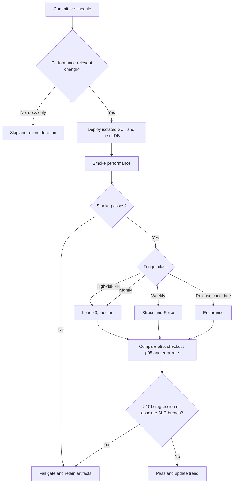

# HW05 — AI-assisted Performance Testing Report

**Nguyễn Anh Khoa — 23127209**  
**System under test:** EShop backend (Node.js, Express, SQLite)  
**Execution date:** 16 August 2026

## Executive summary

Bốn official runs hoàn thành không có HTTP failure hoặc assertion failure. Load ở 20 VU đạt 8.70 HTTP requests/s; Stress đạt tối đa quan sát được 49.40 HTTP requests/s tại pha 75–100 VU và hold; Spike từ 10 lên 100 VU không làm tăng error rate; Endurance 80 VU trong 12 phút đạt 38.22 HTTP requests/s, p95 15 ms. Tất cả ngưỡng khởi tạo đều đạt. Tuy vậy, Stress chưa đi qua breakpoint nên chỉ có thể kết luận công suất ổn định **ít nhất** bằng mức cao nhất quan sát, không được gọi đó là capacity limit. Memory endurance có đỉnh 181.12 MB rồi kết thúc ở 75.76 MB; dữ liệu không chứng minh tăng đơn điệu hoặc memory leak.

## 1. Scope, environment and method

Workflow dùng chung cho cả ba test plan:

`POST /api/login` (FR-02, auth-heavy) → `GET /api/categories` (FR-14) → `GET /api/products?search=` → `GET /api/products/{id}` (read-heavy) → `POST /api/cart` → `POST /api/checkout` (FR-08, transactional).

CSV cung cấp `search_keyword`, `expected_category`, `quantity` và `shipping_address`. SetUp Thread Group tạo tối đa 100 tài khoản `perf001`–`perf100`; thread number ánh xạ ổn định đến một tài khoản. Token JWT được trích từ login rồi gửi bằng `Authorization: Bearer`; product ID/name/price và order ID được correlation từ response. Assertions kiểm tra HTTP status, token, cấu trúc JSON, danh mục mong đợi, cart acknowledgement và order ID. Timeout là 30 giây; Gaussian think-time có khoảng thực dụng 1–3 giây. Raw JTL lưu timestamp, elapsed, label, response code, success, bytes, latency, connect time, active threads và failure message.

Official test chạy non-GUI để listener không làm méo kết quả. JMX vẫn chứa ba listener riêng biệt và tắt mặc định: Load–Summary Report, Stress–Aggregate Report, Spike–View Results Tree. Backend/database được reset từ baseline trước từng run. Do official workload chỉ dùng credential hợp lệ và tài khoản cô lập, lockout ba lần không bị kích hoạt; reset runtime vẫn loại bỏ state contamination giữa các run. Bản SUT gốc chỉ được đọc, mọi thực thi diễn ra trên bản sao trong HW5.

Ba ảnh same-frame được chụp từ các complete confirmation rerun dùng đúng final JMX và workload: Load 240.349 giây, Stress 480.474 giây và Spike 250.453 giây. Cả ba rerun có 0 HTTP failure và 0 assertion failure; ảnh hiển thị JMeter terminal, backend terminal và Task Manager trong cùng khung. Metrics chính của báo cáo vẫn lấy từ raw JTL official đính kèm, không trộn với confirmation rerun.

Máy chạy là `DESKTOP-DIFF80D`, Windows 11, Ryzen 7 6800H (16 logical processors), RAM 16 GB, Java 25.0.3, JMeter 5.6.3. Load generator và backend ở cùng máy; vì vậy số CPU là phần trăm trên toàn bộ 16 logical processors và không đại diện production capacity.

### Acceptance gates

| Gate | Threshold |
|---|---:|
| Overall HTTP p95 | < 800 ms |
| FR-08 Checkout p95 | < 1,200 ms |
| HTTP error rate | < 1% |
| Assertion success | > 99% |

Percentile trong bảng kiểm toán dùng nearest-rank. `Recorded samples/s` gồm cả transaction tổng hợp; `HTTP requests/s` chỉ đếm dòng có URL thật; `journeys/s` chỉ đếm `E2E Shopping Journey` hoàn tất.

## 2. Human review of AI-generated test design

| AI omission / error | Correction | Rationale |
|---|---|---|
| Dùng chung account cho concurrent login | Tạo tối đa 100 user và ánh xạ theo thread | Ngăn lockout và cart/order state giao thoa |
| Chưa tách sample throughput và journey throughput | Transaction Controller ghi parent cùng child; analyzer báo ba loại throughput | Một journey tạo sáu HTTP request nên các đại lượng không hoán đổi |
| Assertions chỉ dựa status code | Thêm JSON/JWT/category/cart/order assertions | Response nhanh nhưng sai nghiệp vụ vẫn phải fail |
| Chấp nhận `total_amount` từ client | Payload checkout không gửi total; vẫn correlate price để audit | Bám oracle FR-08 và không tin dữ liệu tính tiền từ client |
| Listener bật trong official run | Listener tồn tại nhưng disabled; sinh HTML sau run | Giảm observer effect và memory overhead |
| Property CLI có dấu chấm gây parse sai | Dùng property name không có dấu chấm | Smoke test đã phát hiện sai số thread/duration |
| Resource monitor bị PowerShell ExecutionPolicy chặn ở lượt đầu | Chạy script qua `-ExecutionPolicy Bypass`, rồi chạy lại Load chính thức | Bảo đảm evidence đồng bộ với official JTL |

## 3. Load testing

**Plan:** `23127209_Load_20260816.jmx`; 20 VU, ramp-up 60 giây, tổng 240 giây. Listener: Summary Report.

| Metric | Result | Verdict |
|---|---:|---|
| HTTP requests / completed journeys | 2,087 / 341 | Complete |
| HTTP RPS / journey RPS | 8.70 / 1.42 | Stable |
| Overall p95 / E2E p95 | 19 / 23 ms | Pass |
| Checkout p95 | 12 ms | Pass |
| HTTP / assertion failures | 0 / 0 | Pass |
| Backend CPU average / peak | 0.110% / 0.447% | Low |
| Backend memory start / peak / end | 64.64 / 71.84 / 71.43 MB | Bounded in run |

Load duy trì throughput và không có error. Chênh lệch 341 journey so với số sample từng endpoint ở đầu/cuối là do thread được dừng đúng thời lượng trong khi đang ở các bước khác nhau, không phải mất dữ liệu.

## 4. Stress testing

**Plan:** `23127209_Stress_20260816.jmx`; ramp 0→100 VU trong 360 giây, hold 120 giây. Listener: Aggregate Report.

| Window | HTTP RPS | Journey RPS | p95 | Error rate |
|---|---:|---:|---:|---:|
| 0–25 VU ramp | 8.45 | 1.58 | 20 ms | 0% |
| 25–50 VU ramp | 25.13 | 4.37 | 18 ms | 0% |
| 50–75 VU ramp | 41.50 | 7.06 | 16 ms | 0% |
| 75–100 VU + hold | 49.40 | 7.56 | 16 ms | 0% |

Toàn run có 14,927 HTTP request, 2,466 journey, HTTP RPS 31.10, overall p95 17 ms và checkout p95 11 ms. Backend memory 65.06/120.74/76.91 MB (start/peak/end); CPU average/peak 0.350%/1.355%. Không thấy latency knee, timeout, error, crash hay giảm throughput trong phạm vi 100 VU. Vì vậy breakpoint **không được tìm thấy**; mức ổn định cao nhất quan sát được là ≥100 VU và 49.40 HTTP RPS. Việc p95 thấp hơn ở pha tải cao không chứng minh tải làm hệ thống nhanh hơn; warm-up và sample mix là các biến nhiễu hợp lý.

Recovery được chứng minh gián tiếp bởi backend tiếp tục phục vụ Spike và Endurance sau reset mà không crash; Stress riêng không có pha ramp-down được đo, nên không suy diễn recovery latency từ dữ liệu không tồn tại.

## 5. Spike testing

**Plan:** `23127209_Spike_20260816.jmx`; baseline 10 VU trong 60 giây, thêm 90 VU trong 10 giây, giữ đến giây 130, sau đó baseline recovery đến giây 250. Listener: View Results Tree.

| Phase | HTTP RPS | Journey RPS | p95 | HTTP / assertion failures |
|---|---:|---:|---:|---:|
| Baseline | 4.43 | 0.87 | 23 ms | 0 / 0 |
| Surge | 45.97 | 7.36 | 17 ms | 0 / 0 |
| Recovery | 5.06 | 0.78 | 18 ms | 0 / 0 |

Toàn run có 4,087 HTTP request, 660 journey, overall p95 18 ms, checkout p95 11 ms. Backend CPU average/peak 0.199%/1.734%; memory 65.02/96.58/96.25 MB. Sau surge, HTTP RPS trở về cùng bậc với baseline và p95 recovery không vượt baseline; đây là evidence phục hồi trong cửa sổ quan sát. Không có performance issue đủ điều kiện mở GitHub Issue.

## 6. Endurance threshold

Endurance dùng Load JMX với property override 80 VU, ramp 60 giây, tổng 720 giây—80% mức VU ổn định cao nhất quan sát ở Stress. Run hoàn thành 27,517 HTTP request và 4,570 journey; HTTP RPS 38.22, journey RPS 6.35, overall p95 15 ms, checkout p95 11 ms, không có failure. Backend CPU average/peak 0.390%/1.709%. Memory start/peak/end là 64.97/181.12/75.76 MB. Đỉnh memory thoáng qua rồi giảm gần baseline; thay đổi cuối–đầu +10.79 MB chưa đủ chứng minh leak hoặc `userCarts` tăng đơn điệu. Kết luận thận trọng: **sustained level đã xác nhận là 80 VU, 38.22 HTTP RPS trong 12 phút**; maximum short-window stable observed là **ít nhất 100 VU, 49.40 HTTP RPS**. Muốn tìm giới hạn thật phải stress trên 100 VU hoặc giảm think-time trong một experiment riêng.

## 7. AI analysis and misinterpretation hunt

| Risk of misreading | AI first interpretation | Ground truth from raw JTL | Correction |
|---|---|---|---|
| Sample RPS vs journey rate | Dùng 36.2379 sample/s làm HTTP RPS Stress | 14,927 HTTP / 479.967 s = 31.1001 HTTP RPS; 2,466 / 479.967 = 5.1379 journey/s | Transaction parent không phải HTTP request |
| URL null handling | Xem chuỗi `null` là URL hợp lệ | Endurance: 32,087 recorded samples nhưng 27,517 HTTP request | Loại cả empty và literal `null` |
| HTTP error vs assertion | Gom mọi unsuccessful thành HTTP error | Cả bốn run: HTTP failures 0; assertion failures 0 | Báo riêng status ≥400 và assertion/non-HTTP failure |
| Endpoint vs overall p95 | Dùng overall p95 cho checkout | Endurance overall 15 ms; checkout 11 ms; E2E 22 ms | Threshold phải đối chiếu đúng label |
| ms vs seconds | Dễ đọc 15 như 15 s | `elapsed` của JMeter CSV là millisecond: 15 ms = 0.015 s | Ghi đơn vị ở mọi bảng |
| Correlation vs causation | p95 thấp hơn khi VU tăng ⇒ tải cải thiện hệ thống | Stress p95 20→16 ms nhưng không có experiment kiểm soát warm-up | Không tuyên bố nhân quả |
| Fast response vs correctness | 0 error ⇒ checkout đúng hoàn toàn | Chỉ các assertions hiện có đạt; bug chức năng FR-08 đã có issue riêng | Performance result không thay functional oracle |

Đánh giá optimization theo mã nguồn Node.js/SQLite thật:

| Recommendation | Verdict | Reason |
|---|---|---|
| Xóa cart phía server sau checkout và giới hạn lifecycle `userCarts` | Feasible | Phù hợp state hiện tại; giảm retention và đúng FR-08, nhưng bug chức năng không báo lại |
| Transaction/batch cho chuỗi ghi order và order_items | Feasible after regression test | Giảm partial write và overhead; cần giữ semantics |
| Index cho truy vấn order theo `user_id` | Feasible after `EXPLAIN QUERY PLAN` | Chỉ triển khai nếu query plan/benchmark chứng minh lợi ích |
| SQLite WAL | Conditional, benchmark first | Có thể giúp read/write concurrency nhưng raw run không có lock contention |
| Generic SQL connection pool | Unsupported for current evidence | Single SQLite handle không tương đương remote DB pool; chưa có bottleneck kết nối |
| Redis cache, sharding hoặc Kubernetes autoscaling | Hallucinated / out of scope | Kiến trúc hiện tại và metrics không chứng minh nhu cầu |

## 8. Continuous Performance Testing proposal

Trigger model:

- Backend, database schema hoặc dependency commit: chạy smoke performance.
- Pull request có thay đổi rủi ro cao ở auth/cart/checkout/query: chạy Load gate ba lần và lấy median.
- Nightly: Load ba lần; scheduled weekly: Stress và Spike; endurance theo release candidate.
- Documentation-only change: không chạy, tránh chi phí và noise không cần thiết.
- Flag regression nếu median p95 tăng >10% so với baseline cùng môi trường **hoặc** vượt SLO tuyệt đối; error gate vẫn ưu tiên tuyệt đối.
- Lưu raw JTL, summary JSON, HTML report và trend history làm CI artifacts.

Ba lần chạy và median giảm false alarm do shared-runner variance, nhưng tăng runtime và compute cost. Dedicated runner giảm noise nhưng tốn máy duy trì; nightly/weekly scheduling cân bằng feedback với chi phí. Baseline phải version theo hardware, JMeter/Java, dataset và SUT commit để tránh drift. Không tự động “học” baseline từ run lỗi; chỉ cập nhật sau human approval. Với metric sát gate, hệ thống nên rerun một lần trước khi fail PR. Stress/Spike không chạy mọi commit vì thời gian dài và ảnh hưởng shared runner; raw artifacts vẫn được giữ để phân biệt regression thật với network jitter, warm-up và background workload.

## 9. Agent Skill

`jmeter-performance-analyzer` đã được `skill-creator/scripts/quick_validate.py` xác nhận **Skill is valid!**. Script chuẩn-library-only đọc CSV JTL, tính nearest-rank percentiles, throughput, error rate, tách HTTP failure khỏi assertion failure, lập bảng theo endpoint/thread group và so claims AI với raw log. Demo end-to-end trên FR-08 dùng Endurance JTL cho checkout p95 11 ms, 4,552 samples, 0 HTTP failure và 0 assertion failure. Khi nạp claims sai, skill phát hiện recorded sample 32,087 bị dùng nhầm thay HTTP request 27,517, chênh 4,570—đúng bằng số synthetic journeys.

## 10. Conclusion

Trong phạm vi workload và máy local, cả ba scenario cùng endurance đều đạt SLO khởi tạo và không tạo performance issue xác nhận được. Bằng chứng mạnh nhất là raw JTL đầy đủ, resource time series và phép tính độc lập; ảnh dashboard chỉ hỗ trợ trình bày. Kết luận capacity được giới hạn ở “ít nhất mức đã quan sát”, không ngoại suy quá dữ liệu. Các bug chức năng đã có trên GitHub được xem là known constraints và không bị báo trùng.
