# HOMEWORK 01

## Requirement 1 – QA/QC Job Market 2026+
### Job #1: Quality Assurance (QA) – Call Center | Concentrix

* **Đường dẫn (Link):** https://www.linkedin.com/jobs/view/4420416095
* **Ảnh chụp minh chứng:** 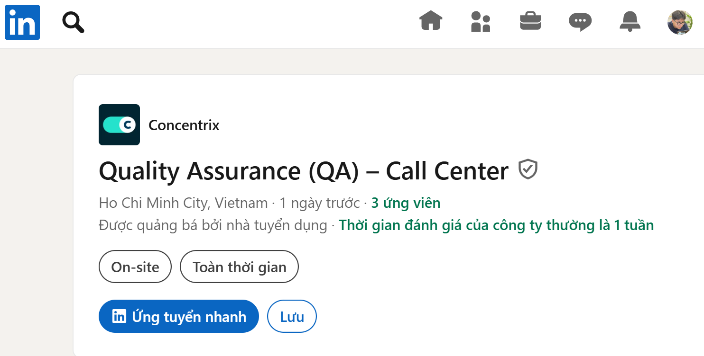
* **Mức lương (Salary):** Thỏa thuận / Không hiển thị
* **Mô tả công việc (Job Description):**

  * Theo dõi, đánh giá và audit các cuộc gọi, chat và email.
  * Monitor, evaluate, and audit inbound/outbound calls, chats, and emails.
  * Báo cáo kết quả đánh giá đến các bộ phận liên quan.
  * Report evaluation results to stakeholders (Quality, Operations, Client, Account Management, Resource Unit).
  * Tham gia các buổi calibration để đảm bảo tính nhất quán khi chấm điểm.
  * Participate in calibration sessions to ensure scoring consistency.
  * Thực hiện audit nội bộ và đề xuất cải tiến quy trình.
  * Conduct internal quality audits and recommend process improvements.
  * Nắm vững kiến thức dự án và sản phẩm/dịch vụ khách hàng.
  * Maintain strong program knowledge and understanding of client products/services.
  * Tham gia các hoạt động cải tiến chất lượng cùng các phòng ban.
  * Join quality initiatives with cross-functional stakeholders.
  * Đảm bảo chỉ tiêu công việc (số lượng đánh giá hàng tháng).
  * Meet productivity targets (e.g., number of evaluations per month).
  * Hỗ trợ xử lý cuộc gọi khi cần thiết.
  * Support phone handling when required.
  * Cập nhật tài liệu, biểu mẫu QA.
  * Maintain QA forms and guideline documents.
  * Hỗ trợ phân tích chỉ số và tối ưu vận hành.
  * Support management in reviewing metrics and operational processes.

* **Kỹ năng yêu cầu (Required Skills):**

  * Có ít nhất 1 năm kinh nghiệm QA/QC trong Call Center.
  * At least 1 year of QA/QC experience in a call center environment.
  * Sẵn sàng làm ca đêm.
  * Willing to work night shifts.
  * Tiếng Anh giao tiếp tốt (nghe, nói, đọc, viết).
  * Good English communication skills (verbal and written).
  * Tư duy dịch vụ khách hàng tốt.
  * Strong customer service mindset.
* **Phân tích tác động của AI (AI Impact Analysis):**
  * AI có thể hỗ trợ phân tích cuộc gọi, chat và email để phát hiện lỗi dịch vụ, xu hướng phàn nàn và các điểm cần cải tiến nhanh hơn. Tuy nhiên việc calibration, audit nội bộ và đánh giá chất lượng cuối cùng vẫn cần QA trực tiếp kiểm soát để đảm bảo tính chính xác và phù hợp với tiêu chuẩn dự án.

### Job #2: Quality Assurance Specialist - Thundersoft Vietnam

* **Đường dẫn (Link):** https://www.linkedin.com/jobs/view/4419023385
* **Ảnh chụp minh chứng:** 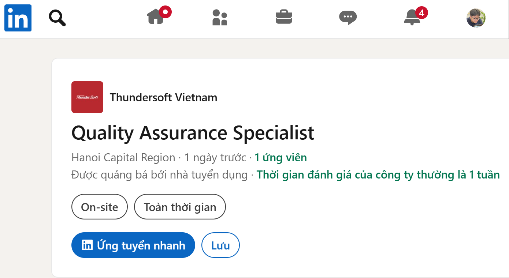

* **Mức lương (Salary):** Thỏa thuận / Không hiển thị
* **Mô tả công việc (Job Description):**

  * Responsible for researching and establishing the life cycle model and application method of Product Research & Development according to business requirements, and promoting the implementation of the system.
  * Responsible for the implementation of improvement and evaluation work based on CMMI, Agile and ASPICE, and responsible for the system improvement of the entire organization.
  * Audit the work products during the review process, manage and control the quality of the whole life cycle, and timely put forward, formulate countermeasures to prevent and solve, and track the improvement of the potential or existing quality risks and problems to relevant parties.
  * Monitor the implementation of the project, evaluate the compliance of the project process, and report the project status regularly.
  * Establish a project and process measurement framework and indicators, measure and analyze project results and process data, and track the closed loop of analysis results.
  * Provide process-related consulting and training to project members.
  * Participate in the formulation and decomposition of the R & D team's performance appraisal indicators.
* **Kỹ năng yêu cầu (Required Skills):**

  * More than 3 years of project R & D or testing experience.
  * More than 2 years of QA or EPG experience.
  * PMP or equivalent qualification certificates are preferred.
  * Familiar with CMMI, Agile model, CMMI-ACQ.
  * Related quality tools, such as QC seven tools, FMEA.
  * ASQ or intermediate quality engineer certification are preferred.
  * Systematic quality concept and thinking.
  * Good at analyzing problems and improving.
  * Deep understanding of quality concepts of masters like Juran and Crosby.
  * Practical experience in continuous improvement work methods, such as TOP N, QCC.
  * Familiarity with the ASPICE model is preferred.
  * Experience in quality management in the automotive electronics industry is preferred.
  * Fluent in spoken English or Japanese is preferred.
  * Good communication, coordination, judgment ability and skills.
  * Have a strong sense of purpose, responsibility and a rigorous work attitude.
* **Phân tích tác động của AI (AI Impact Analysis):**

  * Vị trí này tập trung vào quản lý chất lượng quy trình R&D và cải tiến hệ thống theo CMMI, Agile và ASPICE, nên AI có thể hỗ trợ phân tích dữ liệu đo lường quy trình và phát hiện sớm rủi ro chất lượng. Tuy nhiên việc đánh giá tuân thủ, audit và đưa ra quyết định cải tiến vẫn cần chuyên môn và kiểm soát trực tiếp từ QA Specialist.

### Job #3: QA Intern - SCC Vietnam

* **Đường dẫn (Link):** https://www.linkedin.com/jobs/view/4417474682
* **Ảnh chụp minh chứng:** 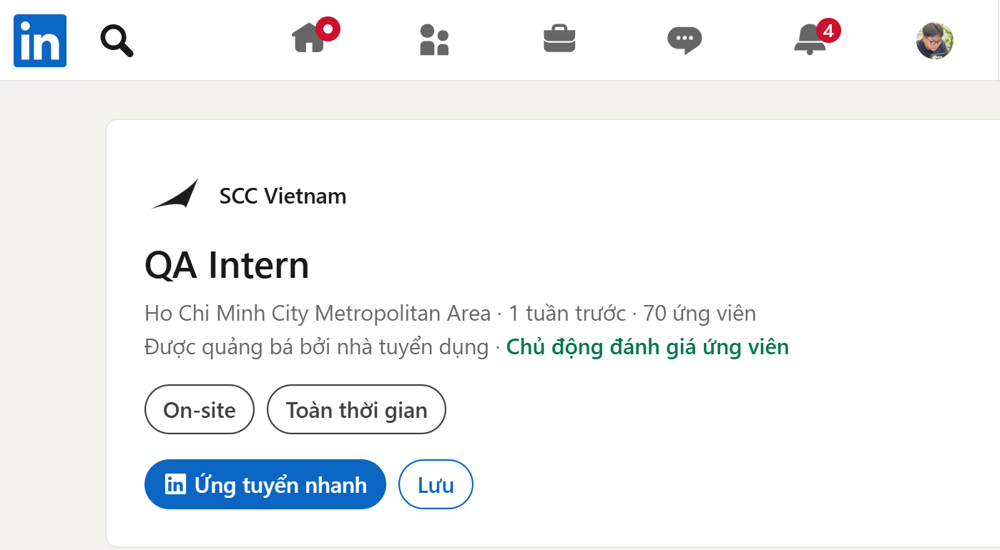
* **Mức lương (Salary):** Monthly training allowance: 4.000.000 VND
* **Mô tả công việc (Job Description):**

  * Position: Software Quality Control / Tester.
  * No. of positions: 4.
  * Training duration: 10 weeks.
  * Apply CV: [sccvn.talent@scc.com](mailto:sccvn.talent@scc.com).
  * Software Development Process.
  * Testing Process.
  * Test Cases, Test Plans and Bug Report.
  * Web application testing, Service Now platform/ Dynamic 365(HR, FinOps, ProOps).
  * Automation Frameworks, using in SCC’s Project.
  * Having knowledge of Database, how to create an efficient query.
  * Achieving a high level of presentation skills, how to make an interesting presentation.
* **Kỹ năng yêu cầu (Required Skills):**

  * IT Students of 3rd, 4th year, and graduated IT students.
  * A keen interest in developing a career as a Software Tester.
  * Previous work experience or a portfolio of projects you have worked on during your studies would be beneficial.
  * Understand the concept of testing and why testing is needed.
  * Can create and maintain test scripts using tools such WebDriver IO, Playwright, or similar.
  * Have knowledge in OOP programming.
  * Soft skills: Logical Thinker; Self Starter; Team Player; Creative.
  * Ability to read and understand technical English, and can speak French as a plus.
  * Effective verbal and written communication skills – essential for when you’re providing your ideas in project meetings.
* **Phân tích tác động của AI (AI Impact Analysis):**

  * Vị trí này không nêu yêu cầu trực tiếp về AI/LLM, nhưng automation testing bằng WebDriver IO, Playwright hoặc công cụ tương tự có thể được AI hỗ trợ trong việc tạo test scripts và bug report. AI có thể giúp tăng tốc quá trình học và viết test case, tuy nhiên intern vẫn cần hiểu testing process, OOP và web application testing để áp dụng đúng trong dự án.

### Job #4: QA Engineer (Manual + Automation) - DXC Technology

* **Đường dẫn (Link):** https://www.linkedin.com/jobs/view/4402370820
* **Ảnh chụp minh chứng:** 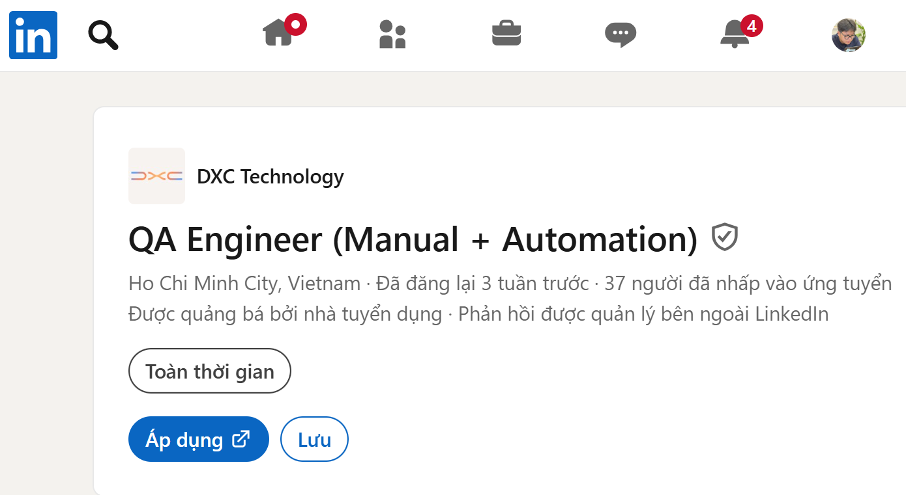
* **Mức lương (Salary):** Thỏa thuận / Không hiển thị
* **Mô tả công việc (Job Description):**

  * Analyze business requirements and create detailed test plans, test cases, and test scenarios.
  * Execute manual testing including functional, regression, smoke, and UAT for web and mobile applications.
  * Log, track, and manage defects in Jira with clear reproduction steps and proper prioritization.
  * Collaborate closely with developers, BAs, and Product Owners in an Agile/Scrum environment.
  * Maintaining and executing automated test scripts using Katalon Studio and/or TestComplete.
  * Updating object repositories / name mapping.
  * Creating small reusable keywords, functions, or scripts.
  * Conduct basic API testing using Postman or Katalon (REST).
  * Contribute to continuous improvement of QA processes, documentation, and test data management.
* **Kỹ năng yêu cầu (Required Skills):**

  * 3+ year of experience in QA testing, with strong exposure to manual testing (functional, regression, integration).
  * Solid understanding of SDLC/STLC and QA best practices.
  * Hands-on experience with Katalon Studio (Groovy/Java – basic custom keywords).
  * and/or TestComplete (JavaScript / VBScript / Python – small functions, name mapping).
  * Experience with API testing (Postman / REST).
  * Basic SQL knowledge is an advantage.
  * English Intermediate (INT).
  * Good communication and teamwork skills.
  * Detail-oriented, analytical.
  * Git.
  * Jenkins / Azure DevOps.
  * Test management & reporting tools (Xray, Zephyr).
* **Phân tích tác động của AI (AI Impact Analysis):**

  * DXC Technology là đối tác công nghệ hỗ trợ doanh nghiệp ứng dụng AI, nên vai trò QA Engineer cần đảm bảo chất lượng cho các sản phẩm trong bối cảnh AI được tích hợp ngày càng nhiều vào hệ thống phần mềm. AI cũng có thể hỗ trợ tăng hiệu quả regression testing và tối ưu quy trình kiểm thử thông qua automation tools như Katalon Studio và TestComplete.

### Job #5: Quality Engineer (Automation) - Fraud | NAB Innovation Centre Vietnam

* **Đường dẫn (Link):** https://www.linkedin.com/jobs/view/4416485965
* **Ảnh chụp minh chứng:** 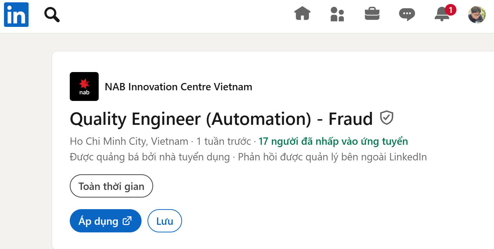
* **Mức lương (Salary):** Thỏa thuận / Không hiển thị
* **Mô tả công việc (Job Description):**

  * Implement shift-left testing, automation first to test early and often.
  * Code automated tests during build and regression test phases and integrate into the CI/CD pipeline.
  * Create test plans, execute test cases, and prepare test summary reports for features built-in your team.
  * Review solution documentation, and assist with the analysis, testing, and resolution of issues.
  * Support defining the user story acceptance criteria and ensuring stories meet the high level of quality.
  * Influence your team to think of Quality first, conduct training to empower developers to a level of sufficient testing skills.
  * Fulfil other tasks as assigned by your People Leader and/or authorized representative of NAB Vietnam from time to time.
* **Kỹ năng yêu cầu (Required Skills):**

  * Typically have 3+ years in a software testing role with at least 2 years of automation experience in Web and API testing.
  * Solid knowledge of testing methodologies covering test levels, static test, and dynamic testing.
  * Manage/ deliver test execution for the new features in different testing life cycles.
  * Strong at using testing frameworks and tools, at least one or more from this list: Selenium Webdriver automation framework (Java), Cypress (Javascript/ Typescript), Mobile Automation framework.
  * Experienced in implementing/ maintaining automation test scripts.
  * Develop/ improve existing automation framework.
  * Experience with Java or Javascript/Typescript programming (or similar languages).
  * QTest, JIRA, Confluence.
  * API: PACT, Postman, SoapUI, REST Assured.
  * UI: TestNG, Selenium, Cypress.
  * Mobile: Appium, Espresso.
  * Be able to carry testing independently in a cross-functional team following Agile process.
  * Strong English communication skills (both verbal & written), especially in the global software development environment.
  * Ability to work in a dynamic and continuously changing environment.
  * Ability to coach and motivate developers to ensure their features are of high test-ability.
  * ISTQB - Certified.
  * Experience in the Banking or Financial Services industry.
  * Exposure to AWS and cloud-native architecture.
  * Performance: JMeter, LoadRunner, Gatling.
  * Experienced testing on a Microservice-based system (Restful API, Event/ Message driven, Logging).
  * Familiar with CI/CD process and tools: Jenkins, Docker, AWS, Azure.
* **Phân tích tác động của AI (AI Impact Analysis):**

  * Vị trí này không nêu yêu cầu trực tiếp về AI/LLM, nhưng automation testing và CI/CD có thể được AI hỗ trợ trong việc tạo test script, phân tích lỗi và tối ưu regression testing. QA Engineer vẫn cần tự thiết kế test plan, kiểm soát chất lượng user story và duy trì automation framework trong môi trường Agile.

### Job #6: QA Engineer - Hasbro

* **Đường dẫn (Link):** https://www.linkedin.com/jobs/view/4343666455
* **Ảnh chụp minh chứng:** 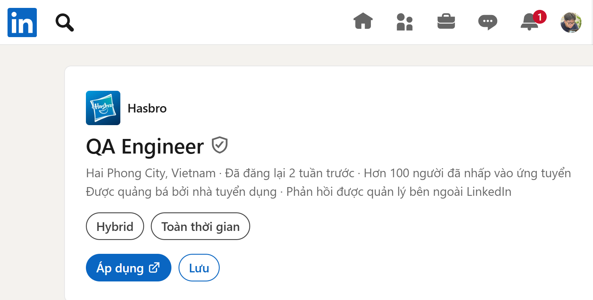
* **Mức lương (Salary):** Thỏa thuận / Không hiển thị
* **Mô tả công việc (Job Description):**

  * Participate early product design & development review to make sure we get it right first time.
  * Gatekeeper to ensure products are always safe, legal and in compliance with regulatory and Hasbro’s requirements during new product design and development.
  * Prepare Test plan for each individual product.
  * Review the test report and defect samples with engineering and vendors during the development cycles.
  * Follow up the corrective actions of vendors.
  * Perform the FEP or PRP line audit of the new product.
  * Review and disposition of PRP/QN reports.
  * Handle the customer complaints.
  * Perform the defect analysis and follow up the correction actions of vendors.
  * Initiate and follow up of the Corrective Action Request (CAR).
  * Monitoring of the vendor performance and improve the process control.
* **Kỹ năng yêu cầu (Required Skills):**

  * Graduate in Mechanical Engineering or Industrial Engineering.
  * Minimum of 5-6 years’ relevant experience in QA Engineering, preferably in toys industry.
  * Engineering skills.
  * Problem solving.
  * Statistical process control.
  * Manufacturing process control.
  * Detailed, analytical and logical thinker with the abilities in risk assessment, root cause analysis and risk management.
  * Persuasive communicator.
  * Good interpersonal skill and team player.
  * Good spoken and written English.
* **Phân tích tác động của AI (AI Impact Analysis):**

  * AI có thể hỗ trợ phân tích defect, theo dõi corrective actions và đánh giá dữ liệu vendor performance trong quy trình QA Engineering. Tuy nhiên vị trí này tập trung nhiều vào kiểm soát chất lượng sản phẩm vật lý, audit dây chuyền và tuân thủ quy định, nên quyết định cuối cùng vẫn cần chuyên môn kỹ thuật và đánh giá trực tiếp từ QA Engineer.

### Job #7: Junior QA Engineer - Hanoi - AvePoint

* **Đường dẫn (Link):** https://www.linkedin.com/jobs/view/4006057109
* **Ảnh chụp minh chứng:** 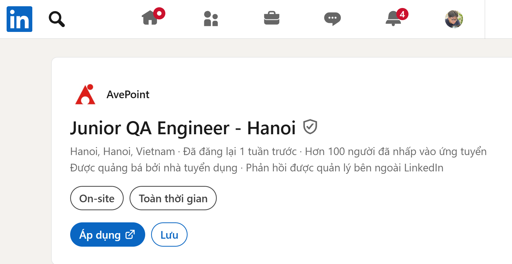
* **Mức lương (Salary):** Thỏa thuận / Không hiển thị
* **Mô tả công việc (Job Description):**

  * Participate in the requirements discovery, testing of the software product.
  * Using Waterfall model and Agile model in projects.
  * Build and execute test cases.
  * Use testing techniques such as black box testing, functional testing and regression testing.
* **Kỹ năng yêu cầu (Required Skills):**

  * Senior college or university student.
  * Able to work full-time.
  * Careful, good logical thinking, passionate about experimenting.
  * Have a sense of responsibility, persistence.
  * Able to work under pressure, hardworking, proactive, and responsible.
  * Good communication skills.
  * Proficiency in English is required, including speaking, listening, reading, and writing.
  * Having certification in testing courses is an advantage.
* **Phân tích tác động của AI (AI Impact Analysis):**

  * Vị trí này không nêu yêu cầu trực tiếp về AI/LLM, chủ yếu tập trung vào kiểm thử phần mềm, xây dựng và thực thi test cases theo Waterfall hoặc Agile. AI có thể hỗ trợ tạo test case, kiểm tra requirement và gợi ý lỗi tiềm năng, nhưng Junior QA Engineer vẫn cần hiểu kỹ thuật kiểm thử và tự đánh giá chất lượng sản phẩm.

### Job #8: Quality Assurance Engineer - MTI Technology

* **Đường dẫn (Link):** https://www.linkedin.com/jobs/view/4411873047
* **Ảnh chụp minh chứng:** 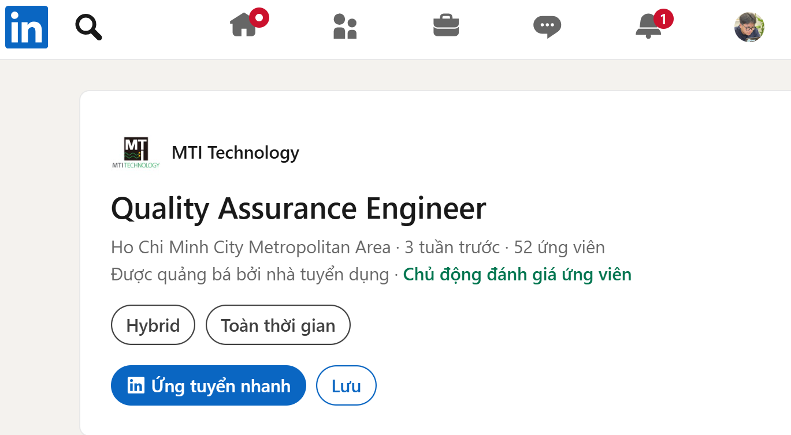
* **Mức lương (Salary):** Thỏa thuận / Không hiển thị
* **Mô tả công việc (Job Description):**

  * Analyze and clarify project issues and effectively communicate with planners and product owners.
  * Develop and implement checklists, test cases, test procedures, test reports, defect logs, and bug analysis reports.
  * Manage and execute tests according to the plan, including providing test results and comprehensive test reports.
  * Preparing test data as required.
  * Attending and contributing to Scrum events (Daily Stand up, Sprint Planning, Review, Retrospective).
  * As a Scrum team member, contributing to shape products by providing input on user stories and designs and by giving feedback on usability.
  * Collaborate with other teams on the QA process as needed.
  * Provide consultancy on QA processes and share knowledge with the team.
* **Kỹ năng yêu cầu (Required Skills):**

  * Good English communication skills with experience working in a matrix organization.
  * 5+ years of experience.
  * Solid understanding of various testing types and techniques (e.g., API testing, performance testing, web application testing).
  * Experience working with Agile methodology.
  * Project/test management tools (Jira, Confluence, TestRail).
  * Comfortable working with Desktop and Mobile browsers, including using browser inspector tools.
  * Positive and progressive mindset.
  * Logical thinking and strong business analysis skills.
  * Open-mindedness and flexibility in tailoring project processes.
  * Self-starter – willing to contribute wherever needed.
  * Experienced in automated testing using Playwright.
  * Ability to present ideas and demonstrate product increments to stakeholders.
  * Skills in SQL and scripting languages (MySQL/SQL Server/etc.).
  * Basic knowledge of HTML, CSS, and Client/Server architecture.
  * Leadership capabilities for managing 2-3 team members with strong collaboration and presentation skills.
  * Training skills.
  * **AI Requirement:** Leverage AI to enhance work efficiency and outcomes.
* **Phân tích tác động của AI (AI Impact Analysis):**

  * Vị trí này yêu cầu tận dụng AI để nâng cao hiệu quả công việc và kết quả kiểm thử, cho thấy AI được xem là một phần hỗ trợ trực tiếp trong quy trình QA. AI có thể hỗ trợ tạo test cases, phân tích lỗi và tăng tốc automated testing, nhưng QA Engineer vẫn chịu trách nhiệm đảm bảo chất lượng sản phẩm và phối hợp cùng Agile team.

### Job #9: LLM - AI Quality Analyst (Vietnam) | Crossing Hurdles

* **Đường dẫn (Link):** https://www.linkedin.com/jobs/view/4376712656
* **Ảnh chụp minh chứng:** 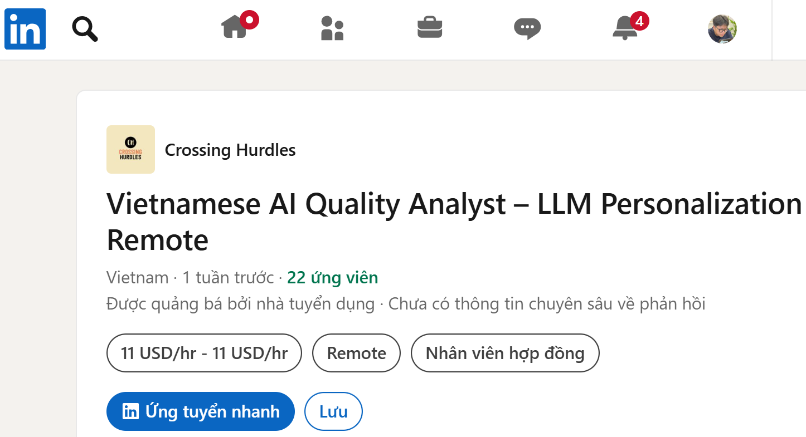
* **Mức lương (Salary):** 10 US$/Hr - 12 US$/Hr
* **Mô tả công việc (Job Description):**

  * Design multi-turn conversational prompts (1–5 turns) using personal context.
  * Evaluate personalized AI responses for grounding, integration, and helpfulness.
  * Assess correct usage of personal data and identify flawed inferences or hallucinations.
  * Review integration quality to ensure personalization feels natural and not over-narrated.
  * Conduct side-by-side (SxS) evaluation and ranking of model responses.
  * Identify personalization errors, reasoning gaps, and grounding issues.
  * Write clear, structured rationales referencing specific conversation turns.
  * Extract and verify “Debug Info” to confirm correct data source utilization.
  * Maintain strict data hygiene by deleting evaluation conversations.
* **Kỹ năng yêu cầu (Required Skills):**

  * Vietnamese proficiency (reading and writing).
  * Strong year experience in data annotation, AI quality evaluation, content moderation, or related roles.
  * Strong analytical skills for evaluating nuanced and ambiguous AI outputs.
  * Experience with creative prompt engineering and multi-turn conversations.
  * Understanding of personalization concepts and AI response evaluation.
  * High attention to detail for SxS comparisons.
  * Excellent written communication and feedback documentation skills.
  * BS/BA degree or equivalent experience in a relevant field.
  * Willingness to use a primary personal Google account with enabled personal data sources.
  * Self-motivated and able to work independently in a remote setup.
  * Desktop/laptop with reliable internet connection.
  * Desired Skills and Experience: Analytical Reasoning, Prompt Engineering, Content Quality Review.
  * **AI Requirement:** Design multi-turn conversational prompts, evaluate personalized AI responses, assess correct usage of personal data, identify hallucinations, conduct SxS evaluation and ranking of model responses, extract and verify “Debug Info”.
* **Phân tích tác động của AI (AI Impact Analysis):**

  * Vị trí này trực tiếp liên quan đến AI/LLM, tập trung vào đánh giá chất lượng phản hồi cá nhân hóa, phát hiện hallucinations và kiểm tra khả năng sử dụng dữ liệu cá nhân của mô hình. AI là đối tượng chính được kiểm thử, còn Quality Analyst đóng vai trò đánh giá, xếp hạng và cung cấp rationale để cải thiện chất lượng mô hình.

### Job #10: Middle/Senior Quality Assurance (AI-Assisted Development) - MTI Technology

* **Đường dẫn (Link):** https://www.linkedin.com/jobs/view/4418624053
* **Ảnh chụp minh chứng:** 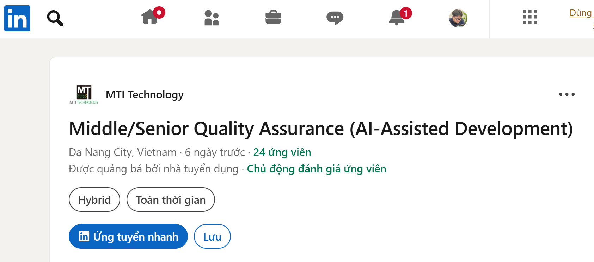
* **Mức lương (Salary):** Thỏa thuận / Không hiển thị
* **Mô tả công việc (Job Description):**

  * Understand requirements, clarify assumptions, and define quality expectations early.
  * Validate consistency, completeness, and clarity of Markdown specifications from a quality standpoint.
  * Use AI agents to generate and refine test plans, test scenarios, and test cases across functional, non-functional, and edge-case dimensions.
  * Identify and document quality-related risks during refinement and keep them updated throughout the product lifecycle.
  * Create, guide, or improve AI-generated automated tests (unit, integration, E2E, API, performance) in collaboration with the development team.
  * Review AI-generated test code to ensure accuracy, stability, maintainability, and alignment with requirements.
  * Execute test cases manually or through AI agents, ensuring defects are captured early and communicated clearly.
  * Act as the quality gate, validate that increments meet acceptance criteria before delivery to stakeholders.
  * Monitor and report product quality across iterations, ensuring consistent improvement in reliability and defect prevention.
  * Support UAT preparation and alignment with business expectations.
  * Ensure that non-functional requirements (security, performance, reliability, usability) are incorporated into the test plan.
  * Maintain and structure test documentation in Markdown as part of the Spec-Driven process.
  * Contribute to continuous improvement of AI-driven quality practices, tools, prompts, and workflows.
* **Kỹ năng yêu cầu (Required Skills):**

  * 3+ years of experience in QA, software testing, or a similar role in software development.
  * Solid understanding of testing principles, QA processes, and both functional and non-functional testing.
  * Ability to understand product specifications, business rules, and technical documentation, with familiarity in Markdown.
  * Familiarity with test automation, common scripting or programming languages, and API testing.
  * Able to communicate in English, both verbally and in writing.
  * Exposure to AI-assisted testing practices and willingness to continuously learn in AI-related areas.
  * Familiarity with Git, CI/CD, DevOps pipelines, and performance or exploratory testing.
  * Strong analytical, problem-solving, and collaboration skills.
  * Familiarity with Agile ways of working.
  * **AI Requirement:** AI-driven testing strategy, using AI agents to generate and refine test plans, test scenarios, and test cases; create, guide, or improve AI-generated automated tests; review AI-generated test code; execute test cases manually or through AI agents; contribute to AI-driven quality practices, tools, prompts, and workflows.
* **Phân tích tác động của AI (AI Impact Analysis):**

  * Vị trí này trực tiếp yêu cầu áp dụng AI vào quy trình QA thông qua AI agents để tạo test plan, test scenarios, test cases và automated tests. AI hỗ trợ tăng tốc hoạt động kiểm thử, nhưng QA vẫn đóng vai trò quality gate để kiểm tra độ chính xác, ổn định và mức độ phù hợp của test code cũng như increment trước khi giao cho stakeholders.

## Requirement 2 – 20 Software Defects 2022–2026

### Bug #1: ChatGPT rò rỉ lịch sử chat và thông tin thanh toán (2023)

- **Phân loại:** Hệ thống AI/LLM
- **Đường dẫn nguồn gốc:** [OpenAI – March 20 ChatGPT outage postmortem](https://openai.com/index/march-20-chatgpt-outage/?utm_source=chatgpt.com).
- **Mô tả lỗi:**
Sự cố xảy ra trong ChatGPT do bug trong thư viện mã nguồn mở liên quan đến Redis client. Bug này làm một số người dùng có thể thấy tiêu đề lịch sử chat của người dùng khác. Trong một số trường hợp, thông tin thanh toán của người dùng ChatGPT Plus cũng có thể bị lộ.
- **Độ nghiêm trọng:** High
- **Hậu quả:**
OpenAI phải đưa ChatGPT offline tạm thời để xử lý. Một số người dùng có thể nhìn thấy tiêu đề chat của người khác; một nhóm nhỏ người dùng Plus có thể bị lộ tên, email, địa chỉ thanh toán, ngày hết hạn thẻ và 4 số cuối của thẻ.
- **Giải pháp khắc phục:**
OpenAI vá lỗi trong thư viện liên quan, kiểm tra lại cơ chế cache/kết nối, đưa hệ thống hoạt động trở lại và thông báo cho người dùng bị ảnh hưởng.
- **Điểm AI bị ảo tưởng/thiên vị:**
    - **Bằng chứng từ AI:** Gemini ghi: “Tham chiếu chính thức: OpenAI Blog - March 2023 Outage Post-Mortem.”
    - **Phân tích phản biện**: Nội dung Gemini nhìn chung đúng, nhưng thiếu đường link thật. Khi làm báo cáo, cần dẫn trực tiếp postmortem chính thức của OpenAI thay vì chỉ ghi tên nguồn.

### Bug #2: Google Gemini sinh ảnh người sai lệch lịch sử (2024)

- **Phân loại:** Hệ thống AI/LLM
- **Đường dẫn nguồn gốc:** [Google Blog – Gemini image generation issue](https://blog.google/products-and-platforms/products/gemini/gemini-image-generation-issue/?utm_source=chatgpt.com).
- **Mô tả lỗi:**
Gemini tạo hình ảnh người trong các bối cảnh lịch sử không chính xác. Ví dụ, hệ thống có thể tạo hình ảnh nhân vật hoặc nhóm người lịch sử với đặc điểm nhân khẩu học không phù hợp.
- **Độ nghiêm trọng:** Medium
- **Hậu quả:**
Google phải tạm dừng tính năng tạo ảnh người của Gemini để cải thiện độ chính xác. Sự cố gây ảnh hưởng lớn đến uy tín của Google trong lĩnh vực AI tạo sinh.
- **Giải pháp khắc phục:**
Google tạm dừng tính năng tạo ảnh người, rà soát lại cách mô hình xử lý yêu cầu về đa dạng và độ chính xác lịch sử, sau đó cải thiện hệ thống trước khi mở lại.
- **Điểm AI bị ảo tưởng/thiên vị:**
    - **Bằng chứng từ AI:** Gemini ghi rằng mô hình “tự động chèn các yêu cầu về sắc tộc/giới tính vào prompt ẩn của người dùng”.
    - **Phân tích phản biện**: Đây là suy diễn quá mức. Nguồn chính thức của Google chỉ nói hệ thống được thiết kế để tạo đa dạng nhưng xử lý sai trong các ngữ cảnh cần độ chính xác lịch sử. Google không xác nhận cơ chế “tự động chèn prompt ẩn” như Gemini mô tả.

### Bug #3: LangChain LLMMathChain Prompt Injection dẫn đến Code Execution (2023)

- **Phân loại:** Hệ thống AI/LLM
- **Đường dẫn nguồn gốc:** [GitHub Advisory GHSA-fprp-p869-w6q2 / CVE-2023-29374](https://github.com/advisories/GHSA-fprp-p869-w6q2).
- **Mô tả lỗi:**
Trong LangChain phiên bản đến 0.0.131, thành phần `LLMMathChain` cho phép prompt injection khiến LLM sinh mã Python và thực thi mã tùy ý.
- **Độ nghiêm trọng:** Critical
- **Hậu quả:**
Nếu ứng dụng dùng `LLMMathChain` với input không tin cậy, attacker có thể điều khiển LLM sinh mã độc và thực thi trên môi trường chạy ứng dụng.
- **Giải pháp khắc phục:**
Không dùng `LLMMathChain` với dữ liệu không tin cậy, cô lập môi trường thực thi, sandbox các công cụ có khả năng chạy code và cập nhật/thiết kế lại chain để tránh thực thi mã tùy ý.
- **Điểm AI bị ảo tưởng/thiên vị:**
    - **Bằng chứng từ AI:** Gemini ghi: “LLMMathChain của LangChain sử dụng hàm eval() của Python...”
    - **Phân tích phản biện:** Sai kỹ thuật. GitHub Advisory và NVD ghi rõ lỗi liên quan đến Python exec() method, không phải eval(). Đây là lỗi quan trọng vì exec() và eval() có phạm vi thực thi khác nhau.

### Bug #4: Ollama Probllama Remote Code Execution CVE-2024-37032 (2024)

- **Phân loại:** Hệ thống AI/LLM
- **Đường dẫn nguồn gốc:** [Wiz Research – Probllama CVE-2024-37032; NVD](https://www.wiz.io/blog/probllama-ollama-vulnerability-cve-2024-37032?utm_source=chatgpt.com).
- **Mô tả lỗi:**
Ollama trước phiên bản 0.1.34 có lỗi xử lý đường dẫn/digest khi tải model. Attacker có thể lợi dụng vấn đề path traversal để ghi file ngoài ý muốn và tiến tới thực thi mã từ xa.
- **Độ nghiêm trọng:** Critical
- **Hậu quả:**
Máy chủ chạy Ollama có thể bị chiếm quyền nếu dịch vụ bị expose hoặc bị cấu hình không an toàn. Attacker có thể truy cập model, dữ liệu hoặc tài nguyên nội bộ.
- **Giải pháp khắc phục:**
Cập nhật Ollama lên phiên bản đã vá, không expose API ra Internet, giới hạn bind address, dùng firewall/VPN và kiểm soát quyền truy cập.
- **Điểm AI bị ảo tưởng/thiên vị:**
    - **Bằng chứng từ AI:** Gemini mô tả lỗi nằm ở API `/api/pull` và path traversal.
    - **Phân tích phản biện:** Nội dung chính đúng hướng. Tuy nhiên Gemini chỉ ghi “Wiz Security Research” mà không cung cấp link thật. Khi báo cáo cần dẫn Wiz hoặc NVD để xác thực CVE và phiên bản bị ảnh hưởng.

### Bug #5: Microsoft 365 Copilot EchoLeak CVE-2025-32711 (2025)

- **Phân loại:** Hệ thống AI/LLM
- **Đường dẫn nguồn gốc:** [Microsoft MSRC / NVD CVE-2025-32711](https://msrc.microsoft.com/update-guide/vulnerability/CVE-2025-32711?utm_source=chatgpt.com).
- **Mô tả lỗi:**
Đây là lỗi AI command injection trong Microsoft 365 Copilot. Theo NVD, lỗi này có thể cho phép attacker không được ủy quyền tiết lộ thông tin qua mạng.
- **Độ nghiêm trọng:** Critical
- **Hậu quả:**
Về mặt rủi ro, attacker có thể lợi dụng prompt/command injection để khiến Copilot xử lý nội dung độc hại và làm lộ dữ liệu nhạy cảm.
- **Giải pháp khắc phục:**
Microsoft vá lỗi phía dịch vụ, tăng kiểm soát với prompt injection, giảm khả năng exfiltration và cập nhật lớp bảo vệ cho Copilot.
- **Điểm AI bị ảo tưởng/thiên vị:**
    - **Bằng chứng từ AI:** Gemini ghi: “Tham chiếu chính thức: CVE-2025-32711 - SentinelOne Vulnerability Database / Checkmarx Zero Research.”
    - **Phân tích phản biện:** SentinelOne và Checkmarx không phải nguồn chính thức của Microsoft. Nguồn chính thức nên là Microsoft MSRC hoặc NVD. Các bài phân tích bên thứ ba có thể dùng bổ sung, nhưng không nên gọi là “nguồn chính thức”.

### Bug #6: CrowdStrike Falcon update gây BSOD Windows toàn cầu (2024)

- **Phân loại:** Phần mềm truyền thống
- **Đường dẫn nguồn gốc:** [CrowdStrike Root Cause Analysis – Channel File 291](https://www.crowdstrike.com/wp-content/uploads/2024/08/Channel-File-291-Incident-Root-Cause-Analysis-08.06.2024.pdf?utm_source=chatgpt.com).
- **Mô tả lỗi:**
CrowdStrike phát hành bản cập nhật Rapid Response Content cho Falcon Sensor. Channel File 291 chứa dữ liệu không phù hợp với cách Content Interpreter xử lý input, dẫn đến lỗi truy cập bộ nhớ và làm Windows bị crash/BSOD.
- **Độ nghiêm trọng:** Critical
- **Hậu quả:**
Khoảng 8,5 triệu thiết bị Windows bị ảnh hưởng trên toàn cầu. Nhiều ngành như hàng không, ngân hàng, bệnh viện, truyền thông và doanh nghiệp bị gián đoạn.
- **Giải pháp khắc phục:**
CrowdStrike rollback/cập nhật nội dung lỗi, hướng dẫn xóa file gây lỗi trên máy bị ảnh hưởng, bổ sung runtime input array bounds check và kiểm tra số lượng input trước khi xử lý.
- **Điểm AI bị ảo tưởng/thiên vị:**
    - **Bằng chứng từ AI:** Gemini ghi nguyên nhân là “dữ liệu không hợp lệ (lỗi logic/con trỏ vùng nhớ)” và “unhandled memory exception”.
    - **Phân tích phản biện:** Ý chính đúng nhưng còn mơ hồ. RCA của CrowdStrike chỉ rõ hơn: cần bổ sung kiểm tra bounds cho input array trong Content Interpreter và kiểm tra kích thước input array khớp với số input kỳ vọng.

### Bug #7: Atlassian Cloud outage do maintenance script (2022)

- **Phân loại:** Phần mềm truyền thống
- **Đường dẫn nguồn gốc:** [Atlassian Post-Incident Review April 2022](https://www.atlassian.com/blog/atlassian-engineering/post-incident-review-april-2022-outage?utm_source=chatgpt.com).
- **Mô tả lỗi:**
Một script bảo trì nội bộ của Atlassian bị chạy sai phạm vi, làm ảnh hưởng nhầm đến site production của khách hàng thay vì chỉ xử lý dữ liệu/app cần dọn dẹp.
- **Độ nghiêm trọng:** Critical
- **Hậu quả:**
775 khách hàng Atlassian mất quyền truy cập vào sản phẩm. Sự cố kéo dài tới 14 ngày đối với một số khách hàng.
- **Giải pháp khắc phục:**
Atlassian khôi phục site theo từng khách hàng, cải thiện quy trình bảo trì, quy trình backup/restore, kiểm soát script production và quy trình phản ứng sự cố.
- **Điểm AI bị ảo tưởng/thiên vị:**
    - **Bằng chứng từ AI:** Gemini ghi script thực hiện “lệnh xóa ‘mềm’ (soft-delete) vĩnh viễn”.
    - **Phân tích phản biện:** Cụm “soft-delete vĩnh viễn” mâu thuẫn và dễ gây hiểu sai. Nên viết chính xác hơn là script đã ảnh hưởng/xóa nhầm site khách hàng trong production, khiến Atlassian phải khôi phục thủ công từng site.

### Bug #8: Cloudflare outage do network configuration change (2022)

- **Phân loại:** Phần mềm truyền thống
- **Đường dẫn nguồn gốc:** [Cloudflare Blog – June 21, 2022 outage](https://blog.cloudflare.com/cloudflare-outage-on-june-21-2022/?utm_source=chatgpt.com).
- **Mô tả lỗi:**
Cloudflare gặp outage do một thay đổi cấu hình mạng trong dự án tăng khả năng chịu lỗi cho các địa điểm có lưu lượng lớn. Thay đổi này ảnh hưởng tới traffic tại 19 data center lớn.
- **Độ nghiêm trọng:** High
- **Hậu quả:**
Nhiều website và dịch vụ dùng Cloudflare bị lỗi truy cập. 19 data center bị ảnh hưởng, trong khi đây là các địa điểm xử lý tỷ lệ lớn lưu lượng toàn cầu của Cloudflare.
- **Giải pháp khắc phục:**
Cloudflare rollback/sửa cấu hình mạng, rà soát lại quy trình thay đổi network configuration và bổ sung kiểm soát để hạn chế lỗi diện rộng.
- **Điểm AI bị ảo tưởng/thiên vị:**
    - **Bằng chứng từ AI:** Gemini ghi “chuyển đổi cơ sở hạ tầng lõi tiền đầu ra (AFTM)” và “quảng bá các dải IP sai khiến traffic vào blackhole”.
    - **Phân tích phản biện:** “AFTM” không phải thuật ngữ trong postmortem chính thức. Cloudflare mô tả sự cố liên quan dự án tăng resilience ở các location bận rộn và thay đổi network configuration; cách Gemini diễn giải BGP/blackhole là quá cụ thể và không bám sát nguồn chính thức.

### Bug #9: FAA NOTAM outage làm tạm dừng bay tại Mỹ (2023)

- **Phân loại:** Phần mềm truyền thống
- **Đường dẫn nguồn gốc:** [FAA NOTAM Statement / U.S. Department of Transportation testimony](https://www.faa.gov/newsroom/faa-notam-statement?utm_source=chatgpt.com).
- **Mô tả lỗi:**
Hệ thống Notice to Air Missions của FAA gặp sự cố do nhân sự hợp đồng vô tình xóa file trong lúc sửa lỗi đồng bộ giữa database chính và database dự phòng.
- **Độ nghiêm trọng:** Critical
- **Hậu quả:**
FAA phải ra lệnh ground stop toàn quốc tại Mỹ vào ngày 11/01/2023. Hàng nghìn chuyến bay bị trì hoãn hoặc hủy.
- **Giải pháp khắc phục:**
FAA sửa hệ thống, bổ sung cơ chế trì hoãn đồng bộ để dữ liệu xấu từ database chính không ảnh hưởng ngay đến database dự phòng, đồng thời tiếp tục điều tra và tăng tính chống chịu của hệ thống.
- **Điểm AI bị ảo tưởng/thiên vị:**
    - **Bằng chứng từ AI:** Gemini ghi nguyên nhân là “một file bị lỗi cấu trúc dữ liệu thô”.
    - **Phân tích phản biện:** Nguồn chính thức của FAA nói nhân sự hợp đồng vô tình xóa file khi xử lý đồng bộ database chính và backup. Cụm “lỗi cấu trúc dữ liệu thô” là chi tiết Gemini tự thêm, không có trong statement chính thức.

### Bug #10: MOVEit Transfer SQL Injection CVE-2023-34362 (2023)

- **Phân loại:** Phần mềm truyền thống
- **Đường dẫn nguồn gốc:** [Progress MOVEit Advisory / NVD](https://community.progress.com/s/article/MOVEit-Transfer-Critical-Vulnerability-31May2023?utm_source=chatgpt.com).
- **Mô tả lỗi:**
MOVEit Transfer có lỗ hổng SQL Injection trong web application, cho phép attacker chưa xác thực truy cập trái phép vào database của MOVEit Transfer.
- **Độ nghiêm trọng:** Critical
- **Hậu quả:**
Lỗ hổng bị khai thác trong chiến dịch đánh cắp dữ liệu quy mô lớn, ảnh hưởng nhiều tổ chức sử dụng MOVEit để truyền file nhạy cảm.
- **Giải pháp khắc phục:**
Progress phát hành bản vá, khuyến nghị vô hiệu hóa truy cập HTTP/HTTPS tạm thời nếu chưa vá, kiểm tra dấu hiệu xâm nhập và rà soát dữ liệu bị truy cập.
- **Điểm AI bị ảo tưởng/thiên vị:**
    - **Bằng chứng từ AI:** Gemini ghi web shell có tên mã “LEMPOOT”.
    - **Phân tích phản biện:** Tên thường được cộng đồng bảo mật ghi nhận là LEMURLOOT, không phải “LEMPOOT”. Đây là lỗi sai tên mã độc/web shell. Ngoài ra, Gemini ghi “hàng terabyte dữ liệu” nhưng không đưa nguồn định lượng cụ thể.

### Bug #11: Atlassian Confluence OGNL Injection RCE CVE-2022-26134 (2022)

- **Phân loại:** Phần mềm truyền thống
- **Đường dẫn nguồn gốc:** [Atlassian Security Advisory](https://confluence.atlassian.com/doc/confluence-security-advisory-2022-06-02-1130377146.html?utm_source=chatgpt.com).
- **Mô tả lỗi:**
Confluence Server và Data Center có lỗi OGNL injection cho phép attacker chưa xác thực thực thi mã tùy ý trên instance bị ảnh hưởng.
- **Độ nghiêm trọng:** Critical
- **Hậu quả:**
Attacker có thể chiếm quyền server Confluence, cài web shell, truy cập hoặc đánh cắp tài liệu nội bộ của doanh nghiệp. Atlassian xác nhận lỗi đã bị khai thác thực tế.
- **Giải pháp khắc phục:**
Atlassian phát hành các phiên bản vá và hướng dẫn khách hàng nâng cấp ngay. Với trường hợp chưa thể nâng cấp, Atlassian cung cấp workaround tạm thời.
- **Điểm AI bị ảo tưởng/thiên vị:**
    - **Bằng chứng từ AI:** Gemini mô tả “chuỗi OGNL trong URI nhận vào... được biên dịch trực tiếp bởi máy chủ Java.”
    - **Phân tích phản biện:** Ý chính đúng nhưng diễn đạt “biên dịch trực tiếp” hơi đơn giản hóa. Nguồn chính thức chỉ xác nhận lỗI OGNL injection cho phép unauthenticated RCE; phần cơ chế xử lý chi tiết cần dẫn nguồn phân tích kỹ thuật riêng nếu muốn ghi sâu hơn.

### Bug #12: Microsoft Exchange ProxyNotShell CVE-2022-41040 và CVE-2022-41082 (2022)

- **Phân loại:** Phần mềm truyền thống
- **Đường dẫn nguồn gốc:** [Microsoft MSRC guidance / Microsoft Security Blog](https://www.microsoft.com/en-us/msrc/blog/2022/09/customer-guidance-for-reported-zero-day-vulnerabilities-in-microsoft-exchange-server?utm_source=chatgpt.com).
- **Mô tả lỗi:**
Đây là chuỗi hai lỗ hổng trong Microsoft Exchange Server. CVE-2022-41040 liên quan SSRF, có thể kích hoạt CVE-2022-41082 để thực thi mã từ xa qua Exchange PowerShell backend.
- **Độ nghiêm trọng:** High
- **Hậu quả:**
Attacker có tài khoản xác thực có thể khai thác để chạy mã trên Exchange Server, triển khai web shell, ransomware hoặc truy cập email doanh nghiệp.
- **Giải pháp khắc phục:**
Microsoft khuyến nghị cài security updates cho Exchange Server. Các mitigation tạm thời như URL Rewrite và disable Remote PowerShell không còn được khuyến nghị thay cho bản vá.
- **Điểm AI bị ảo tưởng/thiên vị:**
    - **Bằng chứng từ AI:** Gemini ghi “kế thừa cơ chế của ProxyShell” và mô tả attacker gửi request qua Autodiscover.
    - **Phân tích phản biện:** Ý chính gần đúng nhưng cần nhấn mạnh điều kiện khai thác: Microsoft nói attacker cần authenticated access để khai thác thành công. Nếu bỏ chi tiết này, người đọc có thể hiểu sai là unauthenticated RCE.

### Bug #13: LastPass breach làm lộ encrypted password vaults (2022)

- **Phân loại:** Phần mềm truyền thống
- **Đường dẫn nguồn gốc:** [LastPass Notice of Security Incident](https://blog.lastpass.com/posts/notice-of-recent-security-incident?utm_source=chatgpt.com).
- **Mô tả lỗi:**
LastPass bị attacker truy cập vào dịch vụ cloud storage bên thứ ba dùng để lưu trữ backup dữ liệu production. Dữ liệu bị đánh cắp bao gồm thông tin khách hàng và bản sao vault đã mã hóa.
- **Độ nghiêm trọng:** Critical
- **Hậu quả:**
Encrypted password vaults bị đánh cắp. Dù mật khẩu trong vault được mã hóa, người dùng có master password yếu vẫn có nguy cơ bị brute-force offline. Một số dữ liệu không mã hóa như URL website cũng có thể bị lộ.
- **Giải pháp khắc phục:**
LastPass xoay vòng credential/key, tăng cường bảo mật môi trường cloud/development, khuyến nghị người dùng kiểm tra master password, bật MFA và đổi mật khẩu quan trọng nếu cần.
- **Điểm AI bị ảo tưởng/thiên vị:**
    - **Bằng chứng từ AI:** Gemini khẳng định attacker khai thác “Plex Media Server đã lỗi thời” trên máy cá nhân của kỹ sư DevOps.
    - **Phân tích phản biện:** LastPass official notice không mô tả cụ thể là Plex. Chi tiết Plex chủ yếu xuất hiện trong các nguồn bên thứ ba. Vì vậy không nên trình bày Plex như thông tin chính thức nếu không dẫn nguồn phù hợp

### Bug #14: Cisco IOS XE Web UI Privilege Escalation CVE-2023-20198 (2023)

- **Phân loại:** Phần mềm truyền thống
- **Đường dẫn nguồn gốc:** [Cisco Security Advisory](https://sec.cloudapps.cisco.com/security/center/content/CiscoSecurityAdvisory/cisco-sa-iosxe-webui-privesc-j22SaA4z?utm_source=chatgpt.com).
- **Mô tả lỗi:**
Lỗ hổng trong Web UI của Cisco IOS XE cho phép attacker chưa xác thực tạo tài khoản local với quyền cao trên thiết bị nếu Web UI được bật và expose ra Internet.
- **Độ nghiêm trọng:** Critical
- **Hậu quả:**
Thiết bị mạng có thể bị attacker chiếm quyền quản trị, thay đổi cấu hình, cài implant hoặc dùng làm bàn đạp tấn công mạng nội bộ. Cisco xác nhận có exploitation được quan sát.
- **Giải pháp khắc phục:**
Cisco phát hành bản vá, khuyến nghị tắt HTTP Server feature nếu không cần, kiểm tra tài khoản lạ và dấu hiệu compromise trên thiết bị.
- **Điểm AI bị ảo tưởng/thiên vị:**
    - **Bằng chứng từ AI:** Gemini ghi “hàng chục nghìn thiết bị... bị cài cắm mã độc”.
    - **Phân tích phản biện:** Cisco advisory xác nhận observed exploitation, nhưng con số “hàng chục nghìn” cần nguồn scan/báo cáo bên thứ ba. Không nên gán con số này cho Cisco nếu nguồn chính thức không nêu rõ.

### Bug #15: Apache ActiveMQ OpenWire RCE CVE-2023-46604 (2023)

- **Phân loại:** Phần mềm truyền thống
- **Đường dẫn nguồn gốc:** [Apache ActiveMQ Security Advisory](https://activemq.apache.org/security-advisories.data/CVE-2023-46604-announcement.txt?utm_source=chatgpt.com).
- **Mô tả lỗi:**
Java OpenWire protocol marshaller trong Apache ActiveMQ có thể bị lợi dụng để thực thi mã từ xa. Attacker có network access đến broker/client có thể thao tác serialized class types để khiến hệ thống khởi tạo class nguy hiểm.
- **Độ nghiêm trọng:** Critical
- **Hậu quả:**
Attacker có thể chạy lệnh shell tùy ý trên hệ thống ActiveMQ bị ảnh hưởng. Lỗ hổng này rất nguy hiểm vì ActiveMQ thường nằm trong hạ tầng backend/message broker.
- **Giải pháp khắc phục:**
Apache khuyến nghị nâng cấp broker và client lên 5.15.16, 5.16.7, 5.17.6 hoặc 5.18.3. Ngoài ra nên giới hạn network access tới broker.
- **Điểm AI bị ảo tưởng/thiên vị:**
    - **Bằng chứng từ AI:** Gemini ghi lỗi do “giải tuần tự hóa một lớp ngoại lệ Exception Response Class”.
    - **Phân tích phản biện:** Ý chính đúng hướng nhưng hơi cụ thể hóa. Advisory của Apache mô tả vấn đề là thao tác serialized class types trong OpenWire protocol để khởi tạo class trên classpath. Nếu ghi chi tiết hơn về “Exception Response Class”, cần thêm nguồn phân tích kỹ thuật riêng.

### Bug #16: GitLab account takeover qua password reset CVE-2023-7028 (2024)

- **Phân loại:** Phần mềm truyền thống
- **Đường dẫn nguồn gốc:** [GitLab Critical Security Release](https://docs.gitlab.com/releases/patches/patch-release-gitlab-16-7-2-released/?utm_source=chatgpt.com).
- **Mô tả lỗi:**
GitLab CE/EE có lỗi trong luồng password reset khiến email reset password có thể được gửi tới địa chỉ email chưa được xác minh.
- **Độ nghiêm trọng:** Critical
- **Hậu quả:**
Attacker có thể chiếm quyền tài khoản GitLab trong điều kiện phù hợp. Tài khoản có 2FA được giảm rủi ro chiếm đoạt hoàn toàn, nhưng lỗi vẫn rất nghiêm trọng vì GitLab thường chứa source code và CI/CD secrets.
- **Giải pháp khắc phục:**
GitLab phát hành bản vá 16.7.2, 16.6.4, 16.5.6 và các phiên bản liên quan. Admin self-managed GitLab cần nâng cấp ngay.
- **Điểm AI bị ảo tưởng/thiên vị:**
    - **Bằng chứng từ AI:** Gemini ghi “API của GitLab cho phép người dùng truyền vào một danh sách mảng chứa nhiều email...”
    - **Phân tích phản biện:** Ý này phù hợp với các phân tích kỹ thuật phổ biến, nhưng trong báo cáo nên bám vào mô tả chính thức: “password reset emails could be delivered to an unverified email address”. Không nên mô tả sâu hơn nếu không dẫn thêm nguồn kỹ thuật

### Bug #17: Ivanti Connect Secure Authentication Bypass và Command Injection CVE-2023-46805 / CVE-2024-21887 (2024)

- **Phân loại:** Phần mềm truyền thống
- **Đường dẫn nguồn gốc:** [Ivanti Advisory / CSA Singapore](https://hub.ivanti.com/s/article/CVE-2023-46805-Authentication-Bypass-CVE-2024-21887-Command-Injection-for-Ivanti-Connect-Secure-and-Ivanti-Policy-Secure-Gateways?language=en_US&utm_source=chatgpt.com).
- **Mô tả lỗi:**
Ivanti Connect Secure và Ivanti Policy Secure có chuỗi lỗi gồm authentication bypass và command injection. Khi kết hợp, attacker có thể bypass xác thực và thực thi lệnh trên appliance bị ảnh hưởng.
- **Độ nghiêm trọng:** Critical
- **Hậu quả:**
Thiết bị VPN/security gateway có thể bị chiếm quyền, tạo bàn đạp xâm nhập sâu vào mạng nội bộ doanh nghiệp hoặc cơ quan chính phủ.
- **Giải pháp khắc phục:**
Ivanti phát hành mitigation và bản vá, khuyến nghị khách hàng chạy Integrity Checker Tool, kiểm tra dấu hiệu compromise và nâng cấp phiên bản.
- **Điểm AI bị ảo tưởng/thiên vị:**
    - **Bằng chứng từ AI:** Gemini ghi attacker có thể thực thi lệnh “với quyền root”.
    - **Phân tích phản biện:** Rủi ro chiếm quyền appliance là đúng, nhưng “quyền root” cần được dẫn từ nguồn kỹ thuật cụ thể. Nguồn official/CSA mô tả khả năng execute arbitrary commands trên appliance; khi viết báo cáo nên dùng cách diễn đạt này để tránh khẳng định quá mức.

### Bug #18: Fortinet FortiOS / FortiProxy SSL-VPN heap buffer overflow CVE-2023-27997 (2023)

- **Phân loại:** Phần mềm truyền thống
- **Đường dẫn nguồn gốc:** [Fortinet PSIRT FG-IR-23-097 / NVD](https://www.fortiguard.com/psirt/FG-IR-23-097?utm_source=chatgpt.com).
- **Mô tả lỗi:**
FortiOS và FortiProxy có lỗi heap-based buffer overflow trong thành phần SSL-VPN pre-authentication. Attacker từ xa có thể gửi request được thiết kế đặc biệt để thực thi mã hoặc lệnh tùy ý.
- **Độ nghiêm trọng:** Critical
- **Hậu quả:**
Thiết bị firewall/VPN public-facing có thể bị chiếm quyền, từ đó attacker có thể truy cập hoặc di chuyển ngang trong mạng nội bộ.
- **Giải pháp khắc phục:**
Fortinet phát hành bản vá cho các phiên bản bị ảnh hưởng. Nếu chưa vá được ngay, tổ chức nên tắt SSL-VPN hoặc hạn chế truy cập tới giao diện VPN.
- **Điểm AI bị ảo tưởng/thiên vị:**
    - **Bằng chứng từ AI:** Gemini ghi lỗi xảy ra khi “xử lý quá trình bắt tay xác thực SSL-VPN” và liên quan “phần mã hóa dữ liệu dạng Hex”.
    - **Phân tích phản biện:** Fortinet official chỉ xác nhận heap-based buffer overflow trong SSL-VPN cho phép RCE qua crafted requests. Các chi tiết “handshake” và “Hex” là quá cụ thể, cần nguồn phân tích kỹ thuật riêng nếu muốn giữ lại

### Bug #19: xz Utils backdoor CVE-2024-3094 (2024)

- **Phân loại:** Phần mềm truyền thống
- **Đường dẫn nguồn gốc:** [Openwall oss-security disclosure](https://www.openwall.com/lists/oss-security/2024/03/29/4?utm_source=chatgpt.com).
- **Mô tả lỗi:**
Upstream xz/liblzma bị chèn backdoor trong các release tarball. Mã độc được thiết kế để tác động đến quá trình build và có thể ảnh hưởng tới các phần mềm liên kết với `liblzma`, đặc biệt trong một số cấu hình liên quan đến OpenSSH.
- **Độ nghiêm trọng:** Critical
- **Hậu quả:**
Đây là sự cố supply chain cực kỳ nghiêm trọng. Nếu không được phát hiện sớm, backdoor có thể lan vào nhiều bản phân phối Linux và tạo rủi ro truy cập trái phép từ xa.
- **Giải pháp khắc phục:**
Các distro rollback/downgrade xz về phiên bản an toàn, loại bỏ bản 5.6.0/5.6.1 bị ảnh hưởng, kiểm tra hệ thống build và rà soát chuỗi cung ứng phần mềm.
- **Điểm AI bị ảo tưởng/thiên vị:**
    - **Bằng chứng từ AI:** Gemini ghi attacker “sở hữu một private key đặc biệt có thể vượt qua xác thực để truy cập hệ thống từ xa dưới quyền root”.
    - **Phân tích phản biện:** Câu này mô tả quá chắc chắn về cơ chế khai thác cuối cùng. Nguồn disclosure chính thức nhấn mạnh upstream xz/liblzma bị backdoor và có dấu hiệu ảnh hưởng tới SSH; khi viết báo cáo nên diễn đạt thận trọng hơn: backdoor có khả năng cho phép truy cập trái phép trong một số điều kiện, thay vì khẳng định chắc chắn “vào root bằng private key đặc biệt”.

### Bug #20: AWS DynamoDB / US-EAST-1 outage do DNS race condition (2025)

- **Phân loại:** Phần mềm truyền thống
- **Đường dẫn nguồn gốc:** [AWS Post-Event Summary](https://aws.amazon.com/vi/message/101925/).
- **Mô tả lỗi:**
AWS DynamoDB tại region Northern Virginia / US-EAST-1 gặp sự cố do latent race condition trong hệ thống quản lý DNS tự động. Race condition tạo ra DNS record rỗng cho endpoint `dynamodb.us-east-1.amazonaws.com`, khiến hệ thống không thể tự sửa và cần can thiệp thủ công.
- **Độ nghiêm trọng:** Critical
- **Hậu quả:**
DynamoDB tăng lỗi API; các dịch vụ phụ thuộc như EC2 launch, Network Load Balancer, Lambda, ECS, EKS và Fargate bị ảnh hưởng trong nhiều khung giờ ngày 19–20/10/2025.
- **Giải pháp khắc phục:**
AWS khôi phục DNS thủ công, sửa logic DNS Planner/DNS Enactor, bổ sung kiểm soát để tránh plan cũ ghi đè plan mới và ngăn DNS record rỗng gây lỗi tương tự.
- **Điểm AI bị ảo tưởng/thiên vị:**
    - **Bằng chứng từ AI:** Gemini ghi sự cố “kéo dài gần 15 giờ” và “làm tê liệt một phần giao diện AWS Management Console trên toàn cầu”.
    - **Phân tích phản biện:** Cần diễn đạt chính xác hơn. AWS mô tả sự cố ở region US-EAST-1 với ba giai đoạn ảnh hưởng khác nhau: DynamoDB, EC2 launch và NLB/Lambda/ECS/EKS/Fargate. Không nên ghi chung là “toàn cầu” nếu không giải thích rõ dịch vụ nào, region nào và khoảng thời gian nào bị ảnh hưởng.

## Requirement 3 – Test cases for ONE physical product

### 1. Thông tin thiết bị vật lý
* **Thiết bị:** Bàn phím cơ gaming 75% (80 phím + núm xoay)
* **Hãng sản xuất (Brand):** DAREU
* **Dòng máy (Model):** EK75 Pro
* **Năm sản xuất (Year):** 2024
* **Số Serial (Serial Number):** EK75ProBD****101765

### 2. Minh chứng hình ảnh thiết bị và Thẻ sinh viên
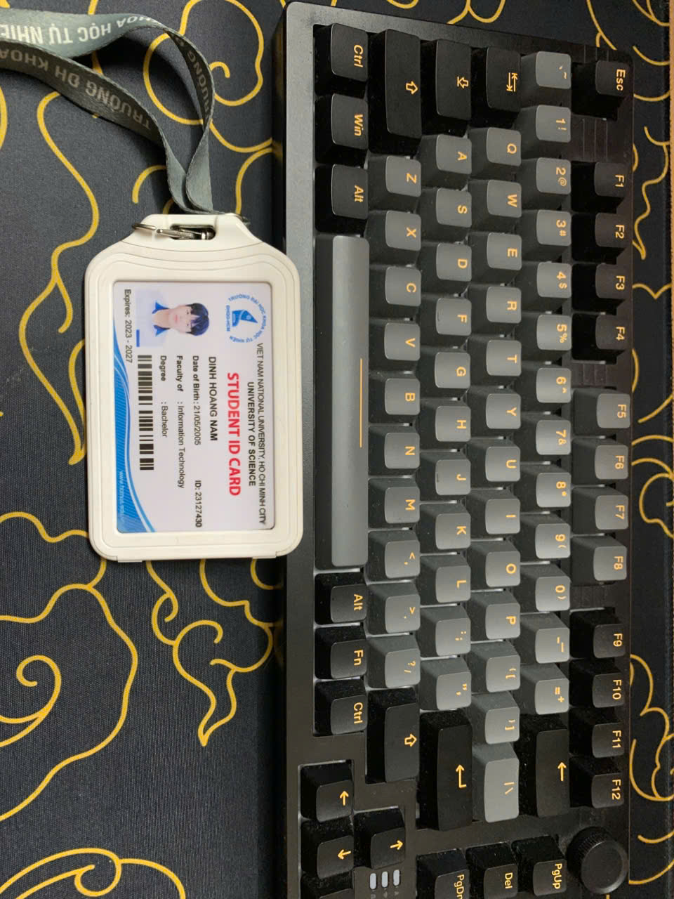

### 3. Danh sách 15 Test Cases chi tiết

| Test Case ID | Objective | Input / Pre-condition | Steps | Expected Result | Actual Result | Verdict |
| --- | --- | --- | --- | --- | --- | --- |
| **TC01** | Kiểm tra bàn phím kết nối thành công với máy tính bằng dây USB | Bàn phím có dây USB, máy tính đang bật | 1. Cắm đầu USB của bàn phím vào cổng USB máy tính.2. Chờ hệ điều hành nhận thiết bị.3. Mở ứng dụng nhập văn bản như Notepad/Word.4. Nhấn thử một vài phím chữ. | Máy tính nhận bàn phím. Khi nhấn phím, ký tự tương ứng hiển thị trên màn hình. | Máy tính nhận được tín hiệu và hiện chữ trên màn hình khi nhấn phím | PASSED |
| **TC02** | Kiểm tra bàn phím kết nối thành công qua Bluetooth | Bàn phím Bluetooth còn pin, máy tính có Bluetooth | 1. Bật nguồn bàn phím.2. Chuyển bàn phím sang chế độ pairing.3. Trên máy tính, mở Bluetooth settings.4. Chọn tên bàn phím và kết nối.5. Mở ứng dụng nhập văn bản và nhấn thử phím. | Bàn phím kết nối thành công. Ký tự được nhập lên màn hình khi nhấn phím. | Chưa kiểm tra | 
| **TC03** | Kiểm tra nhập ký tự chữ cái thường | Bàn phím đã kết nối, Caps Lock đang tắt | 1. Mở ứng dụng nhập văn bản.2. Nhấn lần lượt các phím chữ: `a`, `b`, `c`, `d`, `e`.3. Quan sát nội dung hiển thị. | Các ký tự `a b c d e` hiển thị chính xác trên màn hình. | Chưa kiểm tra |
| **TC04** | Kiểm tra nhập ký tự chữ hoa bằng phím Shift | Bàn phím đã kết nối, Caps Lock đang tắt | 1. Mở ứng dụng nhập văn bản.2. Nhấn giữ phím `Shift`.3. Nhấn phím `a`.4. Thả các phím.5. Quan sát ký tự hiển thị. | Ký tự `A` hiển thị trên màn hình. Phím Shift hoạt động đúng chức năng. | Chưa kiểm tra |
| **TC05** | Kiểm tra chức năng Caps Lock và đèn LED chỉ báo | Bàn phím có đèn Caps Lock, đã kết nối máy tính | 1. Mở ứng dụng nhập văn bản.2. Nhấn phím `Caps Lock` một lần.3. Quan sát đèn Caps Lock.4. Nhấn phím `a`.5. Nhấn lại `Caps Lock`.6. Nhấn phím `a` lần nữa. | Khi bật Caps Lock, đèn LED sáng và ký tự nhập là `A`. Khi tắt Caps Lock, đèn LED tắt và ký tự nhập là `a`. | Có đèn phản hồi khi nhấn Caps Lock và chữ viết hoa khi đang Caps Lock | PASSED |
| **TC06** | Kiểm tra nhập số bằng hàng phím số phía trên | Bàn phím đã kết nối | 1. Mở ứng dụng nhập văn bản.2. Nhấn lần lượt các phím số `1`, `2`, `3`, `4`, `5` trên hàng phím phía trên.3. Quan sát màn hình. | Các số `1 2 3 4 5` hiển thị chính xác trên màn hình. | Chưa kiểm tra |
| **TC07** | Kiểm tra chức năng Num Lock và cụm phím số bên phải | Bàn phím có cụm Numpad và đèn Num Lock | 1. Nhấn phím `Num Lock` để bật.2. Quan sát đèn Num Lock.3. Nhấn các phím số trên Numpad: `1`, `2`, `3`.4. Nhấn lại `Num Lock` để tắt.5. Quan sát đèn Num Lock. | Khi Num Lock bật, đèn LED sáng và các số từ Numpad nhập được lên màn hình. Khi tắt, đèn LED tắt. | Chưa kiểm tra |
| **TC08** | Kiểm tra phím Spacebar | Bàn phím đã kết nối, ứng dụng nhập văn bản đang mở | 1. Gõ từ `Hello`.2. Nhấn phím `Spacebar`.3. Gõ từ `World`.4. Quan sát nội dung hiển thị. | Nội dung hiển thị là `Hello World`, có một khoảng trắng giữa hai từ. | Chưa kiểm tra |
| **TC09** | Kiểm tra phím Enter | Bàn phím đã kết nối, ứng dụng nhập văn bản đang mở | 1. Gõ dòng chữ `Line 1`.2. Nhấn phím `Enter`.3. Gõ dòng chữ `Line 2`.4. Quan sát bố cục văn bản. | Con trỏ xuống dòng mới sau khi nhấn Enter. `Line 2` nằm ở dòng tiếp theo. | Con trỏ trên màn hình có xuống dòng | PASSED |
| **TC10** | Kiểm tra phím Backspace | Bàn phím đã kết nối, ứng dụng nhập văn bản đang mở | 1. Gõ chuỗi `Testt`.2. Nhấn phím `Backspace` một lần.3. Quan sát nội dung còn lại. | Ký tự cuối cùng bị xóa. Nội dung còn lại là `Test`. | Chưa kiểm tra |
| **TC11** | Kiểm tra các phím điều hướng mũi tên | Bàn phím đã kết nối, có sẵn văn bản trong ứng dụng nhập liệu | 1. Gõ chuỗi `abcd`.2. Nhấn phím mũi tên trái 2 lần.3. Quan sát vị trí con trỏ.4. Nhấn phím mũi tên phải 1 lần.5. Quan sát vị trí con trỏ. | Con trỏ di chuyển sang trái và sang phải đúng theo số lần nhấn phím. | Con trỏ trên màn hình có xuống dòng | PASSED |
| **TC12** | Kiểm tra phím chức năng cơ bản F5 | Bàn phím đã kết nối, trình duyệt web đang mở | 1. Mở một trang web bất kỳ trên trình duyệt.2. Nhấn phím `F5`.3. Quan sát phản hồi của trình duyệt. | Trang web được tải lại. Phím F5 thực hiện đúng chức năng refresh. | Chưa kiểm tra |
| **TC13** | Kiểm tra tổ hợp phím Ctrl + C và Ctrl + V | Bàn phím đã kết nối, ứng dụng nhập văn bản đang mở | 1. Gõ chuỗi `Keyboard Test`.2. Bôi đen chuỗi vừa nhập.3. Nhấn `Ctrl + C`.4. Đặt con trỏ ở vị trí mới.5. Nhấn `Ctrl + V`. | Chuỗi `Keyboard Test` được sao chép và dán chính xác tại vị trí mới. | Con trỏ có di chuyển theo hướng mũi tên | PASSED |
| **TC14** | Kiểm tra độ nảy và phản hồi cơ học của phím | Bàn phím ở trạng thái bình thường, không bị kẹt phím | 1. Nhấn lần lượt một số phím đại diện như `A`, `S`, `D`, `Space`, `Enter`.2. Thả từng phím sau khi nhấn.3. Quan sát cảm giác nhấn và trạng thái phím sau khi thả. | Phím có độ nảy ổn định, không bị kẹt, không lún bất thường. Sau khi thả, phím trở về vị trí ban đầu. | Chưa kiểm tra |
| **TC15** | Kiểm tra phản hồi nhập liệu khi nhấn phím liên tục ở tốc độ bình thường | Bàn phím đã kết nối, ứng dụng nhập văn bản đang mở | 1. Chọn một phím chữ, ví dụ `a`.2. Nhấn phím `a` liên tục 5 lần với tốc độ bình thường.3. Quan sát số ký tự hiển thị trên màn hình. | Màn hình hiển thị đúng 5 ký tự `aaaaa`. Không bị mất ký tự hoặc nhập sai ký tự. | Chưa kiểm tra |
| **TC16** | Kiểm tra trạng thái LED RGB khi chuyển nhanh nhiều chế độ hiệu ứng | Bàn phím cơ gaming có LED RGB, đã kết nối máy tính | 1. Bật bàn phím.2. Nhấn tổ hợp phím đổi hiệu ứng LED RGB.3. Chuyển liên tục qua nhiều chế độ LED như breathing, wave, static, reactive.4. Quan sát màu sắc và hiệu ứng LED trên toàn bộ bàn phím. | LED chuyển đúng hiệu ứng, không bị đứng màu, nhấp nháy bất thường, mất vùng sáng hoặc tắt LED ngoài ý muốn. | Chưa kiểm tra |
| **TC17** | Kiểm tra hành vi khi chuyển đổi kết nối giữa USB, Bluetooth hoặc 2.4GHz Wireless | Bàn phím hỗ trợ nhiều chế độ kết nối, máy tính đã từng pair Bluetooth hoặc receiver 2.4GHz | 1. Kết nối bàn phím bằng USB và nhập thử văn bản.2. Chuyển sang Bluetooth hoặc 2.4GHz bằng công tắc/tổ hợp phím.3. Nhập lại văn bản.4. Chuyển ngược lại USB.5. Kiểm tra phản hồi nhập liệu. | Bàn phím chuyển đúng chế độ kết nối. Thiết bị không bị treo, không nhập trùng ký tự, không mất kết nối kéo dài bất thường. | Chưa kiểm tra |
| **TC18** | Kiểm tra Gaming Mode / khóa phím Windows trong lúc sử dụng | Bàn phím gaming có chế độ Gaming Mode hoặc Windows Lock | 1. Mở một ứng dụng hoặc game ở chế độ toàn màn hình.2. Bật Gaming Mode hoặc Windows Lock.3. Nhấn phím Windows.4. Tắt Gaming Mode hoặc Windows Lock.5. Nhấn lại phím Windows. | Khi Gaming Mode bật, phím Windows bị khóa và không làm thoát game/mở Start Menu. Khi tắt Gaming Mode, phím Windows hoạt động lại bình thường. | Chưa kiểm tra |
|  |  |  |  |  |  |  |

### 4. Phân tích Ca biên (Edge Cases) bỏ sót bởi AI
* **Minh chứng cuộc hội thoại:** 
  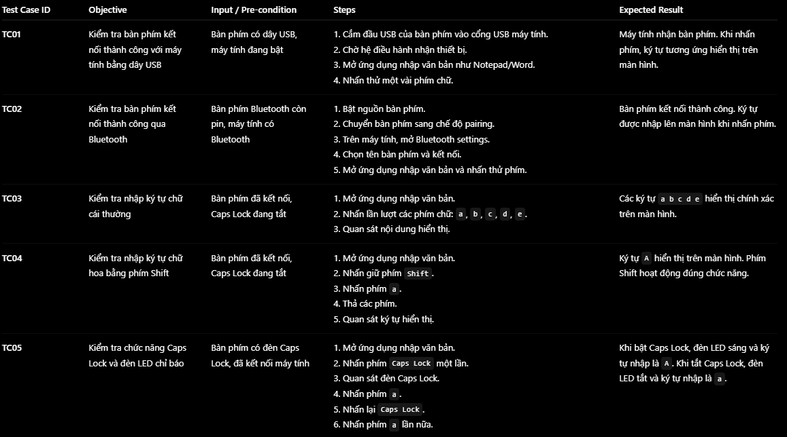

  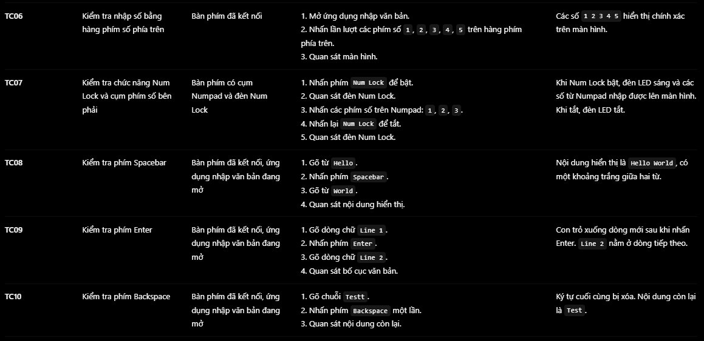

  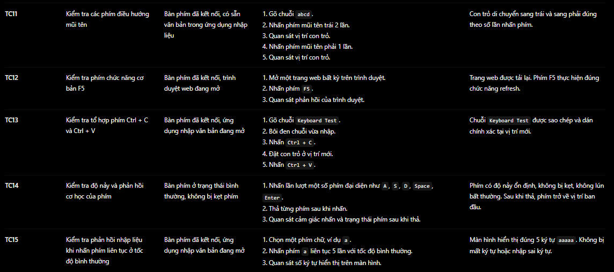

* **3 Edge case bị bỏ sót:**

| Test Case ID | Objective | Input / Pre-condition | Steps | Expected Result |
| --- | --- | --- | --- | --- |
| **TC16** | Kiểm tra trạng thái LED RGB khi chuyển nhanh nhiều chế độ hiệu ứng | Bàn phím cơ gaming có LED RGB, đã kết nối máy tính | 1. Bật bàn phím.2. Nhấn tổ hợp phím đổi hiệu ứng LED RGB.3. Chuyển liên tục qua nhiều chế độ LED như breathing, wave, static, reactive.4. Quan sát màu sắc và hiệu ứng LED trên toàn bộ bàn phím. | LED chuyển đúng hiệu ứng, không bị đứng màu, nhấp nháy bất thường, mất vùng sáng hoặc tắt LED ngoài ý muốn. |
| **TC17** | Kiểm tra hành vi khi chuyển đổi kết nối giữa USB, Bluetooth hoặc 2.4GHz Wireless | Bàn phím hỗ trợ nhiều chế độ kết nối, máy tính đã từng pair Bluetooth hoặc receiver 2.4GHz | 1. Kết nối bàn phím bằng USB và nhập thử văn bản.2. Chuyển sang Bluetooth hoặc 2.4GHz bằng công tắc/tổ hợp phím.3. Nhập lại văn bản.4. Chuyển ngược lại USB.5. Kiểm tra phản hồi nhập liệu. | Bàn phím chuyển đúng chế độ kết nối. Thiết bị không bị treo, không nhập trùng ký tự, không mất kết nối kéo dài bất thường. |
| **TC18** | Kiểm tra Gaming Mode / khóa phím Windows trong lúc sử dụng | Bàn phím gaming có chế độ Gaming Mode hoặc Windows Lock | 1. Mở một ứng dụng hoặc game ở chế độ toàn màn hình.2. Bật Gaming Mode hoặc Windows Lock.3. Nhấn phím Windows.4. Tắt Gaming Mode hoặc Windows Lock.5. Nhấn lại phím Windows. | Khi Gaming Mode bật, phím Windows bị khóa và không làm thoát game/mở Start Menu. Khi tắt Gaming Mode, phím Windows hoạt động lại bình thường. |

* **Lý do AI bỏ sót:** AI bị giới hạn test case theo thông tin đầu vào và phạm vi “basic functional & physical happy path”. Các edge case như RGB, đổi kết nối nhanh và Gaming Mode thuộc nhóm tính năng nâng cao/đặc thù của bàn phím gaming, nên chưa được đưa vào bộ test case ban đầu.

### 5. Minh chứng báo cáo lỗi (Defects Log trên GitHub)
* **Tổng số lỗi tìm thấy từ thiết bị:** 5 lỗi.
* **Link mục Issues trên GitHub:** https://github.com/namdin05/software-testing/issues
* **Ảnh chụp màn hình trang GitHub Issues:** 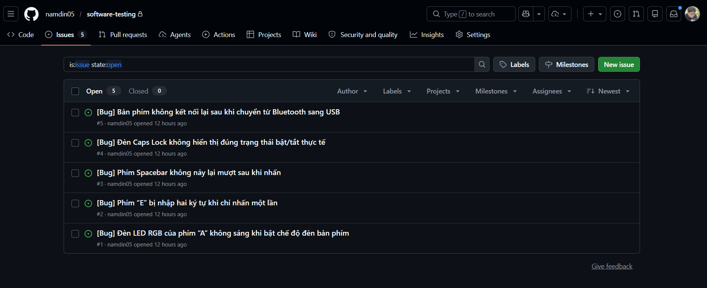

## AI Collaboration Protocol (Mandatory)

### 3. AI Audit

- [See details](./[AI-02]%20-%20FIT@HCMUS%20-%20AI%20Audit%20Report_En.pdf)

### 4. AI Critique

The AI response was useful as a starting point, but it contained several technical inaccuracies, overconfident claims, and incomplete source validation. For example, in the LangChain case, the AI said the issue came from Python eval(), while the official advisory describes the dangerous execution path as exec(). In the MOVEit case, it wrote the web shell name as “LEMPOOT,” although the commonly documented name is “LEMURLOOT.” It also over-explained some incidents without enough evidence, such as claiming Google Gemini inserted hidden diversity prompts or saying Fortinet’s bug specifically involved SSL-VPN handshake data and Hex encoding. These details may sound technical, but they are not confirmed by the official sources. The AI also sometimes treated third-party analysis as official documentation, such as using SentinelOne or Checkmarx as “official” references for Microsoft Copilot EchoLeak instead of Microsoft MSRC or NVD. I think the AI failed because it prioritized producing a complete and confident answer over carefully distinguishing verified facts from assumptions. It likely relied on pattern matching from cybersecurity articles and filled missing details with plausible explanations. From this homework, I learned that AI should be used as a research assistant, not as a final authority. When collaborating with AI, I need to verify CVEs, source links, root causes, affected versions, and technical terms through official advisories or trusted postmortems before submitting the final work.

### 5. Mandatory Disclosure

Test cases and report were initially generated by ChatGPT; I reviewed and modified Requirement 1: QA/QC Job Market Analysis, add AI Impact for each job, Requirement 2: Software Defects Analysis and Requirement 3: Test cases basic steps, added edge cases TC16 (Kiểm tra trạng thái LED RGB khi chuyển nhanh nhiều chế độ hiệu ứng), TC17 (Kiểm tra hành vi khi chuyển đổi kết nối giữa USB, Bluetooth hoặc 2.4GHz Wireless), and TC18 (Kiểm tra Gaming Mode / khóa phím Windows trong lúc sử dụng); Requirement 1: QA/QC Job Market Analysis was written entirely by me (except AI Impact). The detailed AI Audit Report is attached as Appendix A. I confirm I did not use AI to generate any artifact listed in the prohibited category below.

## Assessment & Self-Assessment Template

| No. | Criteria | Grade | Self-Assessed Grade |
|---|---|---:|---:|
| 1 | Job Market 2026+ (10 jobs × 3 pts + AI Impact) | 40 | 40 |
| 2 | Software Defects 2022–2026 (20 defects) | 20 | 20 |
| 3 | Physical-product test design (15 TCs + 5 videos) | 25 | 25 |
| AI-1 | [AI-02] AI Audit Report (5-section) attached | 8 | 8 |
| AI-2 | AI Critique 200–300 words + [AI-03] Disclosure attached | 4 | 4 |
| AI-3 | [AI-05] Checklist signed + anti-cheat artifacts | 3 | 3 |
|  | **Total** | **100** | **100** |