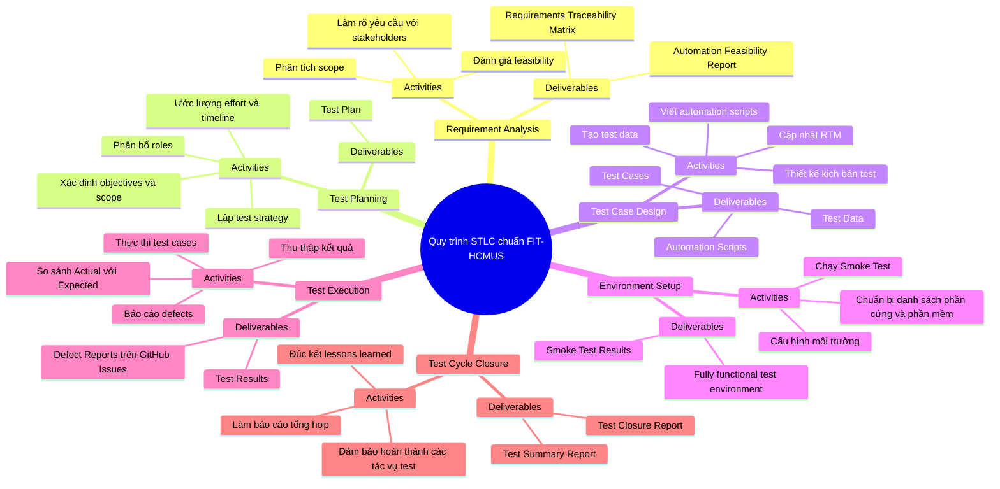

# QA / QC role mind map

### 1. Đánh giá và sửa lỗi sơ đồ tư duy

* **Minh chứng sơ đồ thô từ AI:**

```mermaid
mindmap
  root((Quy trình kiểm thử phần mềm chuẩn ISTQB Foundation Level))
    1. Test Planning - Lập kế hoạch kiểm thử
      Mục tiêu
        Xác định mục tiêu kiểm thử
        Xác định phạm vi kiểm thử
        Xác định cách tiếp cận kiểm thử
        Xác định nguồn lực, lịch trình và rủi ro
      Tác vụ cốt lõi
        Phân tích bối cảnh dự án và sản phẩm
        Xác định test objectives
        Xác định test scope
        Lựa chọn test approach hoặc test strategy
        Xác định test levels
          Component Testing
          Integration Testing
          System Testing
          Acceptance Testing
        Xác định test types
          Functional Testing
          Non-functional Testing
          White-box Testing
          Change-related Testing
        Xác định entry criteria và exit criteria
        Ước lượng effort, timeline và nhân sự kiểm thử
        Lập kế hoạch môi trường kiểm thử
        Lập kế hoạch dữ liệu kiểm thử
        Xác định rủi ro sản phẩm và rủi ro dự án
        Xác định công cụ hỗ trợ kiểm thử
        Xác định cách báo cáo tiến độ và chất lượng
      Vai trò QA/QC
        QA Lead hoặc Test Manager
          Lập test plan
          Phân bổ nguồn lực
          Xác định chiến lược kiểm thử
          Quản lý rủi ro kiểm thử
        QA Engineer hoặc QC Tester
          Đóng góp estimation
          Đề xuất phạm vi kiểm thử
          Đề xuất loại kiểm thử phù hợp
          Góp ý khả năng kiểm thử của yêu cầu
      Artifacts - Deliverables
        Test Plan
        Test Strategy hoặc Test Approach
        Test Estimation
        Test Schedule
        Risk Register
        Entry Criteria
        Exit Criteria
        Test Environment Plan
        Test Data Plan
        Tool Selection Notes

    2. Test Monitoring and Control - Giám sát và kiểm soát kiểm thử
      Mục tiêu
        Theo dõi tiến độ kiểm thử
        So sánh tiến độ thực tế với kế hoạch
        Phát hiện sai lệch và điều chỉnh kịp thời
        Cung cấp thông tin chất lượng cho stakeholders
      Tác vụ cốt lõi
        Theo dõi số lượng test cases đã thiết kế
        Theo dõi số lượng test cases đã thực thi
        Theo dõi pass rate và fail rate
        Theo dõi defect status
        Theo dõi defect severity và priority
        Theo dõi test coverage
        Theo dõi rủi ro còn tồn tại
        Đánh giá mức độ đáp ứng exit criteria
        Báo cáo tiến độ kiểm thử định kỳ
        Đề xuất hành động điều chỉnh khi lệch kế hoạch
        Điều chỉnh phạm vi kiểm thử khi có thay đổi
        Điều chỉnh thứ tự ưu tiên kiểm thử theo rủi ro
      Vai trò QA/QC
        QA Lead hoặc Test Manager
          Theo dõi tiến độ tổng thể
          Báo cáo test status
          Điều phối nhân sự kiểm thử
          Ra quyết định điều chỉnh kế hoạch
        QA Engineer hoặc QC Tester
          Cập nhật kết quả test execution
          Cập nhật trạng thái defect
          Báo cáo blocker và rủi ro
          Cung cấp dữ liệu thực tế cho test report
      Artifacts - Deliverables
        Test Progress Report
        Test Status Report
        Defect Report
        Test Metrics Dashboard
        Updated Risk Register
        Updated Test Plan
        Coverage Report
        Decision Log

    3. Test Analysis - Phân tích kiểm thử
      Mục tiêu
        Xác định cần kiểm thử cái gì
        Phân tích test basis để tìm test conditions
        Phát hiện điểm thiếu, mơ hồ hoặc không nhất quán trong yêu cầu
      Tác vụ cốt lõi
        Đọc và phân tích test basis
          Requirement Specification
          User Story
          Acceptance Criteria
          Use Case
          Business Rule
          Design Document
          Interface Specification
          Risk Analysis
        Xác định testable features
        Xác định test conditions
        Phân tích rủi ro sản phẩm
        Xác định các điều kiện kiểm thử theo mức độ ưu tiên
        Phát hiện requirement không rõ ràng
        Phát hiện requirement thiếu tính kiểm thử
        Trao đổi với BA, PO, Developer và stakeholders
        Xác định traceability giữa requirement và test conditions
      Vai trò QA/QC
        QA Engineer hoặc QC Tester
          Phân tích requirement
          Đặt câu hỏi làm rõ
          Xác định test conditions
          Đề xuất edge cases
          Ghi nhận rủi ro chất lượng
        Business Analyst hoặc Product Owner
          Giải thích nghiệp vụ
          Làm rõ acceptance criteria
        Developer
          Làm rõ thiết kế kỹ thuật
          Làm rõ giới hạn hệ thống
      Artifacts - Deliverables
        Reviewed Requirements
        Clarification Questions
        Test Conditions
        Requirement Review Notes
        Product Risk List
        Requirement Traceability Matrix - RTM
        Initial Test Coverage Map

    4. Test Design - Thiết kế kiểm thử
      Mục tiêu
        Xác định cách kiểm thử
        Chuyển test conditions thành test cases
        Thiết kế dữ liệu kiểm thử và expected results
      Tác vụ cốt lõi
        Thiết kế test cases
        Xác định preconditions
        Xác định test steps
        Xác định test data
        Xác định expected results
        Áp dụng test design techniques
          Equivalence Partitioning
          Boundary Value Analysis
          Decision Table Testing
          State Transition Testing
          Use Case Testing
          Error Guessing
          Checklist-based Testing
          Exploratory Testing
        Thiết kế positive test cases
        Thiết kế negative test cases
        Thiết kế edge cases
        Thiết kế regression test cases
        Thiết kế test cases cho non-functional requirements
          Performance
          Security
          Usability
          Reliability
          Compatibility
        Duy trì traceability giữa test cases và requirement
        Review test cases với team
      Vai trò QA/QC
        QA Engineer hoặc QC Tester
          Viết test cases
          Chọn kỹ thuật thiết kế test phù hợp
          Xác định expected results
          Chuẩn bị test data logic
          Review test cases
        QA Lead
          Review coverage
          Review chất lượng test cases
          Đảm bảo test design phù hợp test strategy
        BA hoặc PO
          Xác nhận expected behavior
          Xác nhận acceptance criteria
        Developer
          Góp ý technical constraints
          Hỗ trợ xác định integration points
      Artifacts - Deliverables
        Test Cases
        Test Scenarios
        Test Data Specification
        Expected Results
        Updated RTM
        Test Design Specification
        Regression Test Suite Draft
        Review Comments

    5. Test Implementation - Chuẩn bị và hiện thực kiểm thử
      Mục tiêu
        Chuẩn bị mọi thứ cần thiết để có thể thực thi kiểm thử
        Sắp xếp test cases thành test procedures hoặc test suites
        Chuẩn bị môi trường, dữ liệu và automation scripts
      Tác vụ cốt lõi
        Sắp xếp test cases theo thứ tự thực thi
        Tạo test suites
        Tạo test procedures
        Chuẩn bị test environment
        Chuẩn bị test data
        Tạo hoặc cấu hình test accounts
        Chuẩn bị test scripts cho automation
        Chuẩn bị test harness, stubs hoặc drivers nếu cần
        Thiết lập công cụ test management
        Thiết lập công cụ defect tracking
        Thiết lập CI/CD cho automated tests nếu có
        Smoke test môi trường kiểm thử
        Kiểm tra readiness trước khi test execution
      Vai trò QA/QC
        QA Engineer hoặc QC Tester
          Chuẩn bị test suite
          Chuẩn bị test data
          Cấu hình môi trường test
          Kiểm tra readiness
        Automation QA Engineer
          Viết automation scripts
          Cấu hình framework
          Tích hợp automated tests vào CI/CD
        DevOps hoặc Developer
          Hỗ trợ deployment test environment
          Hỗ trợ build và configuration
        QA Lead
          Xác nhận test execution readiness
      Artifacts - Deliverables
        Test Suites
        Test Procedures
        Test Execution Schedule
        Test Data
        Test Environment
        Test Automation Scripts
        Test Harness
        CI/CD Test Configuration
        Smoke Test Result
        Test Readiness Checklist

    6. Test Execution - Thực thi kiểm thử
      Mục tiêu
        Chạy test cases hoặc test scripts
        So sánh actual results với expected results
        Ghi nhận kết quả và báo cáo defect
      Tác vụ cốt lõi
        Thực thi manual test cases
        Thực thi automated test scripts
        Thực hiện exploratory testing nếu cần
        Ghi nhận actual results
        So sánh actual results với expected results
        Đánh dấu trạng thái test case
          Pass
          Fail
          Blocked
          Not Run
          Retest
        Ghi nhận evidence
          Screenshot
          Video
          Log file
          API response
          Database record
        Tạo defect report khi phát hiện lỗi
        Phân tích lỗi ban đầu
        Gán severity và priority đề xuất
        Retest defect sau khi developer fix
        Regression testing sau khi thay đổi
        Cập nhật traceability và coverage
      Vai trò QA/QC
        QA Engineer hoặc QC Tester
          Execute test cases
          Log defects
          Cung cấp evidence rõ ràng
          Retest bug fixes
          Thực hiện regression testing
        Automation QA Engineer
          Chạy automation suite
          Phân tích failed scripts
          Phân biệt lỗi script và lỗi sản phẩm
        Developer
          Fix defects
          Hỗ trợ phân tích nguyên nhân kỹ thuật
        QA Lead
          Theo dõi test execution progress
          Ưu tiên defect xử lý
          Báo cáo rủi ro chất lượng
      Artifacts - Deliverables
        Test Execution Results
        Test Logs
        Defect Reports
        Evidence Files
        Updated Defect Status
        Retest Results
        Regression Test Results
        Updated Coverage Report
        Daily Test Report

    7. Defect Management - Quản lý lỗi
      Mục tiêu
        Ghi nhận, theo dõi và kiểm soát vòng đời defect
        Đảm bảo defect được xử lý minh bạch và có thể truy vết
      Tác vụ cốt lõi
        Ghi nhận defect
        Mô tả bước tái hiện lỗi
        Ghi actual result và expected result
        Đính kèm evidence
        Phân loại severity
        Đề xuất priority
        Gán defect cho người xử lý
        Theo dõi trạng thái defect
          New
          Assigned
          Open
          Fixed
          Retest
          Reopened
          Closed
          Rejected
          Deferred
        Tham gia defect triage
        Retest sau khi defect được fix
        Đóng defect khi đạt yêu cầu
        Phân tích xu hướng defect
      Vai trò QA/QC
        QA Engineer hoặc QC Tester
          Log bug rõ ràng
          Theo dõi bug lifecycle
          Retest và close bug
        QA Lead
          Tổ chức defect triage
          Ưu tiên lỗi nghiêm trọng
          Theo dõi defect metrics
        Developer
          Phân tích root cause
          Fix defect
        Product Owner hoặc Business
          Quyết định priority theo business impact
          Quyết định accept hoặc defer defect
      Artifacts - Deliverables
        Bug Report
        Defect Log
        Defect Lifecycle Status
        Defect Triage Notes
        Root Cause Notes
        Defect Metrics
        Reopened Defect Report

    8. Test Completion - Kết thúc kiểm thử
      Mục tiêu
        Tổng kết hoạt động kiểm thử
        Đánh giá mức độ hoàn thành
        Lưu trữ testware
        Rút kinh nghiệm cho các vòng sau
      Tác vụ cốt lõi
        Kiểm tra exit criteria
        Tổng hợp test execution results
        Tổng hợp defect còn mở
        Đánh giá rủi ro còn lại
        Xác nhận các deliverables đã hoàn tất
        Bàn giao testware có giá trị tái sử dụng
        Lưu trữ test cases, scripts, data và reports
        Đóng hoặc chuyển trạng thái test environment
        Phân tích lessons learned
        Đề xuất cải tiến quy trình kiểm thử
        Tạo test completion report
        Truyền đạt kết quả kiểm thử cho stakeholders
      Vai trò QA/QC
        QA Lead hoặc Test Manager
          Chuẩn bị test completion report
          Đánh giá exit criteria
          Báo cáo chất lượng release
          Đề xuất go hoặc no-go
        QA Engineer hoặc QC Tester
          Cập nhật trạng thái test cases
          Tổng hợp evidence
          Đóng các task kiểm thử
          Đóng góp lessons learned
        Stakeholders
          Review kết quả kiểm thử
          Ra quyết định release
      Artifacts - Deliverables
        Test Summary Report
        Test Completion Report
        Final Defect Report
        Open Defect List
        Residual Risk Report
        Archived Testware
        Lessons Learned
        Process Improvement Suggestions
        Release Quality Assessment

    9. Traceability - Truy vết trong kiểm thử
      Mục tiêu
        Đảm bảo mọi yêu cầu đều có kiểm thử tương ứng
        Đảm bảo mọi test case đều liên kết với test basis
        Hỗ trợ đánh giá coverage và impact analysis
      Tác vụ cốt lõi
        Liên kết requirement với test condition
        Liên kết test condition với test case
        Liên kết test case với test result
        Liên kết defect với requirement hoặc test case
        Cập nhật RTM khi requirement thay đổi
        Dùng traceability để đánh giá coverage
        Dùng traceability để phân tích ảnh hưởng khi có change request
      Vai trò QA/QC
        QA Engineer hoặc QC Tester
          Duy trì traceability trong test management tool
          Kiểm tra requirement coverage
          Xác định test cases bị ảnh hưởng khi có thay đổi
        QA Lead
          Theo dõi coverage tổng thể
          Báo cáo gap trong kiểm thử
      Artifacts - Deliverables
        Requirement Traceability Matrix - RTM
        Coverage Report
        Impact Analysis Report
        Linked Defect Records
        Change Impact Notes

    10. Vai trò QA/QC theo ISTQB
      Test Management Role
        Trách nhiệm chính
          Chịu trách nhiệm tổng thể về test process
          Quản lý test team
          Lãnh đạo hoạt động kiểm thử
        Tập trung vào
          Test Planning
          Test Monitoring
          Test Control
          Test Completion
        Tác vụ điển hình
          Lập kế hoạch
          Ước lượng
          Quản lý rủi ro
          Theo dõi tiến độ
          Báo cáo chất lượng
          Điều phối nhân sự
          Đề xuất quyết định release
      Testing Role
        Trách nhiệm chính
          Chịu trách nhiệm kỹ thuật kiểm thử
          Phân tích, thiết kế, chuẩn bị và thực thi test
        Tập trung vào
          Test Analysis
          Test Design
          Test Implementation
          Test Execution
        Tác vụ điển hình
          Phân tích requirement
          Thiết kế test case
          Chuẩn bị test data
          Thực thi test
          Log defect
          Retest
          Regression testing
          Cập nhật test evidence
      Trong Agile Team
        Whole-team approach
          QA phối hợp cùng Developer, BA, PO
          Một số tác vụ test management có thể do cả team cùng đảm nhận
          Chất lượng là trách nhiệm chung của toàn đội
```

* **3 Lỗi sai kiến thức được phát hiện:**
  1. **Lỗi phân đoạn quy trình:** AI tự chế ra giai đoạn 7 (Defect Management) và giai đoạn 9 (Traceability) thành các bước độc lập trong Main Test Process. *Căn cứ ISTQB FL v4.0:* Quy trình kiểm thử chuẩn chỉ có đúng 7 giai đoạn cốt lõi, Quản lý lỗi và Truy vết là các hoạt động hỗ trợ chạy xuyên suốt chứ không phải giai đoạn tuần tự.
  2. **Sai lệch Artifact đầu ra:** Đưa Ma trận truy vết (RTM) làm deliverable của khâu Test Analysis. *Căn cứ ISTQB FL §1.4.3:* RTM chỉ hoàn thiện khi có liên kết giữa Test Case (khâu Design) và Test Script (khâu Implementation) ngược về Test Basis.
  3. **Nhầm lẫn phân cấp vai trò:** Đưa BA, PO, Dev vào cấu trúc nhánh "Vai trò QA/QC" của hoạt động phân tích/thiết kế. *Căn cứ ISTQB:* Đây là các Stakeholders cung cấp Test Basis, không nằm trong phân hệ vai trò chịu trách nhiệm của Test Team.

* **Chuẩn hóa:**

