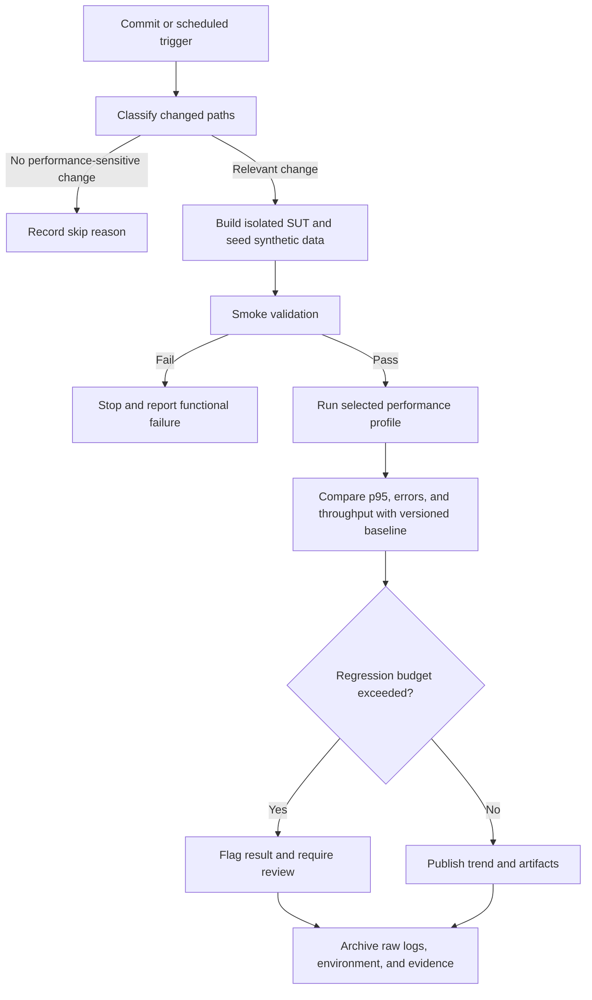

# Analysis and Reporting Guide

Use this guide for raw-result analysis, AI critique, recommendations, continuous testing, and handoff.

## Establish provenance

Before interpreting numbers, record:

- file path, size, and timestamp;
- plan/run ID and whether it is dry, rerun, or canonical;
- full or interrupted execution;
- tool version and exit code;
- source revision, target, dataset, scenario stages, and known caps.

Prefer immutable raw data. Derived tables and charts must name their inputs and method.

## Metric hierarchy

Read metrics in this order:

1. **Validity:** Was the intended workflow executed with valid identities and state?
2. **Completeness:** Did all stages finish, and was the result truncated?
3. **Functional correctness:** Which checks failed, and at what steps?
4. **Transport health:** HTTP/network failure rate and response codes.
5. **Latency distribution:** median, p90, p95, p99, max; use averages only as supporting context.
6. **Throughput:** request rate and completed business-iteration rate.
7. **Load shape:** VUs/arrival rate by stage and time.
8. **Resources:** backend CPU, memory, I/O, database locks, and client saturation.
9. **Recovery:** time and metrics after Stress/Spike load drops.

Never call `http_reqs` completed checkouts. Never equate a passed HTTP request with a passed business workflow.

## Exact versus derived values

- Cite k6 aggregate values from summary JSON using keys such as `metrics.http_req_duration.values.p(95)`.
- Cite raw k6 stream points with tag/time ranges for phase analysis.
- Cite JTL columns and filtered row counts for JMeter analysis.
- Label percentiles recomputed from raw samples as derived; different interpolation methods can differ slightly from tool-native aggregates.
- Cite `checks`, `http_req_failed`, and custom functional-failure metrics independently.
- Confirm threshold verdict with console output and process exit code; exported threshold boolean conventions can differ across tool versions or custom summaries.

## Scenario questions

### Load

- Are latency, throughput, and errors stable during the hold?
- Is warm-up separated from steady state?
- Does backend resource evidence explain or contradict client latency?

### Stress

- At what stage does latency or error behavior materially change?
- Did the SUT break, or did accounts, client capacity, a safety abort, or duration cap stop the test?
- Is the claimed maximum stable throughput supported by a completed stable stage?

### Spike

- What changed at the peak?
- How long did latency, errors, throughput, and resources take to recover?
- Did queued work make post-spike metrics worse than peak metrics?

### Endurance

- Are p95 and throughput stable across equal time windows?
- Does memory plateau, drift, or grow monotonically?
- What concrete stable RPS and observed memory ceiling are supported?
- Is the run long enough to justify the stated conclusion?

## AI misinterpretation hunt

Create a table with one row per important claim:

| AI claim | Raw source and exact value | Verdict | Human correction | Why AI missed it |
| --- | --- | --- | --- | --- |

Common failure modes include unit confusion, averaging away a spike, reading request count as iteration count, combining HTTP and functional failures, ignoring a truncated stage, treating a data cap as a server limit, and inferring a backend bottleneck without resource evidence.

The `Human correction` column must reflect the student's explicit review. The agent may propose candidate corrections but cannot authoritatively label them Human Review without approval.

## Optimization classification

For every proposed optimization, inspect the source/config and classify:

- **Feasible:** the relevant component exists, the change is technically compatible, and the expected metric mechanism is plausible.
- **Unsupported/Hallucinated:** the recommendation assumes a component or bottleneck contradicted by the source/evidence.
- **Needs experiment:** plausible but unproven; state the controlled experiment and success metric.

Examples such as adding an index, changing a connection pool, or enabling SQLite WAL are not automatically valid. Confirm the query, driver, database mode, contention evidence, and deployment constraints.

## Continuous-performance proposal

Adapt this flow instead of presenting it as already implemented:

Discuss trigger accuracy, runner cost, environment variance, warm-up, baseline drift, data isolation, test duration, false alarms, retry policy, artifact retention, and who may approve a new baseline. Avoid heavyweight Stress/Endurance tests on every commit; justify scheduled or risk-based routing.

## Mandatory AI critique

Write 200–300 words in the student's voice only after explicit student input/review. Address:

1. a concrete AI error, bias, or omission;
2. why the model or prompt failed to catch it;
3. the principle learned about human-AI collaboration.

Count words mechanically. Do not pad the paragraph with invented experience.

## Handoff quality

Use verdict language precisely:

- `PASS`: completed reviewed profile and passed stated checks/thresholds.
- `FAIL`: completed or validly stopped run violated a stated condition.
- `INCONCLUSIVE`: artifact is invalid, incomplete, capped, or insufficient for the claim.
- `NOT RUN`: no genuine execution exists.

Pair every verdict with the plan, raw result, summary/console, HTML view, resource evidence, and limitation. A completeness validator can find files; only human inspection can establish authenticity and review quality.
