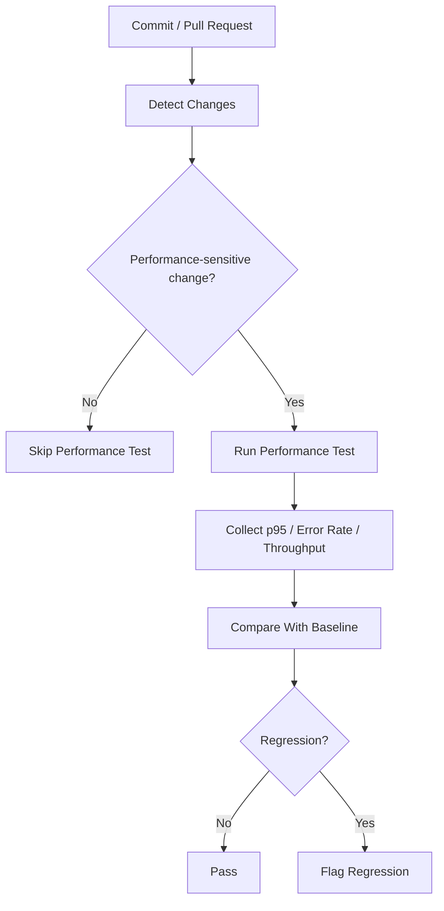

# Continuous Performance Testing Proposal

## Goal

TODO

## Trigger Strategy

TODO

## Pipeline Flow

## Regression Rule

TODO

## Trade-offs

### Cost

TODO

### False Alarms

TODO

### Environment Variability

TODO

