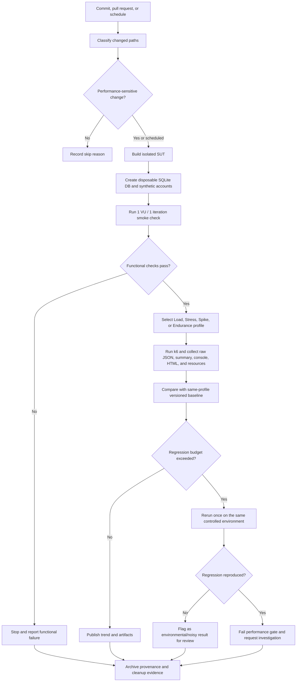

# Continuous Performance Testing Proposal

## Status and Goal

**Proposal only — not yet implemented in CI.** The goal is to detect performance regressions in WF01 after performance-sensitive commits while keeping ordinary pull-request cost and false alarms under control.

The pipeline compares only runs with the same k6 profile, test data, hardware class, SUT configuration, and warm-up policy. The current local Load result is the first versioned baseline, not a production SLO.

## Trigger Strategy

| Trigger | Selected test | Rationale |
| --- | --- | --- |
| Pull request changes backend routes, database schema/queries, authentication, cart/checkout, k6 helpers, or dependencies | Dry run, then short reviewed Load profile | Fast feedback on code most likely to change WF01 latency/correctness |
| Pull request changes documentation or unrelated UI only | Skip with recorded reason | Avoid spending runner time when backend performance cannot change |
| Nightly on the main branch | Full Load profile | Detect gradual dependency/environment regressions |
| Weekly or before release | Stress and Spike | Observe scaling and recovery without charging every commit |
| Weekly/manual on a controlled machine | Endurance 10–15 minutes | Detect sustained memory/latency drift with stable hardware |

## Pipeline Flow

## Baseline and Regression Rule

The versioned Load Option A baseline is:

| Metric | Baseline source | Value |
| --- | --- | ---: |
| HTTP p95 | `results/raw/23127430_Load_20260814_summary.json` → `http_req_duration.p(95)` | 33.00548 ms |
| HTTP request rate | same file → `http_reqs.rate` | 2.0254036635 req/s |
| HTTP failures | same file → `http_req_failed.value` | 0% |
| Functional failures | same file → `functional_failures.value` | 0% |
| Checks | same file → `checks` | 3,197 passed / 0 failed |

Provisional regression gate for the same Load profile:

- fail immediately on any functional failure or failed critical check;
- flag HTTP failure rate `>= 1%`;
- flag p95 when it is more than 20% above the rolling approved baseline in two comparable runs;
- flag throughput when it falls more than 15% while the same iteration pacing and duration are used;
- never compare Stress/Spike aggregates directly with Load thresholds;
- require a human to approve baseline replacement and record the reason, source revision, hardware, and raw artifacts.

These percentages are engineering proposal values, not stakeholder-backed SLOs. They must be recalibrated after several controlled runs.

## Artifact and Environment Controls

- Pin Node.js, k6, OS image/hardware runner, dependency lockfiles, and scenario plan.
- Use a clean disposable database and deterministic synthetic accounts per run.
- Preserve source revision, dirty state, command, environment overrides, tool versions, timestamps, exit code, and test-plan hash.
- Archive raw JSON/JTL-equivalent stream, summary, console log, HTML report, resource samples, and cleanup result.
- Keep baseline updates in version control; do not silently accept a slower baseline.

## Trade-offs

### Cost and Duration

Running Stress, Spike, and Endurance for every commit would consume substantial runner time and create many orders in the disposable database. Risk-based pull-request Load tests plus nightly/weekly heavy profiles reduce cost but delay detection of some scaling regressions.

### False Alarms

The current SUT and k6 share one Windows host, so background processes, power management, thermal state, and disk activity can move p95 even when code is unchanged. A same-environment rerun and a relative budget reduce noise, but also slow feedback and can hide intermittent defects if misused.

### Baseline Drift

A rolling baseline adapts to intentional changes but can normalize gradual regressions. Baseline replacement therefore needs Human Review, a documented reason, and side-by-side raw evidence.

### Shared-runner Variability

Cloud/shared runners are inexpensive but noisy. A dedicated or self-hosted performance runner gives better comparisons at higher maintenance cost. Production-capacity claims still require a production-like environment, not the current laptop baseline.

### Trigger Accuracy

Path filters lower cost but can miss indirect performance effects from dependencies or configuration. The nightly full Load run provides a backstop, while weekly Stress/Spike/Endurance runs cover behavior too expensive for pull requests.
