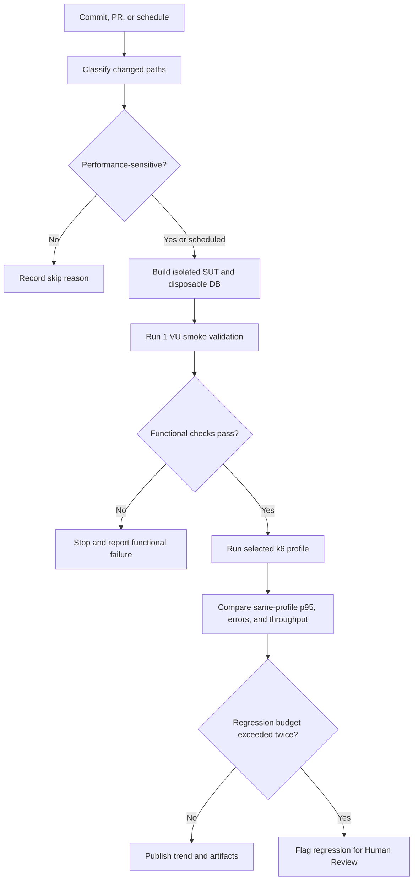

# HW05 — Performance Testing

## 1. General Information

| Field | Value |
| --- | --- |
| Student | Đinh Hoàng Nam |
| Student ID | 23127430 |
| Exercise | HW05-AI — Performance Testing, Version 2.0 |
| SUT | EShop REST backend |
| Selected workflow | WF01 — Search & Single-item Purchase |
| Tool | k6 v2.0.0 |
| Local base URL | `http://127.0.0.1:3000` |
| Repository | [namdin05/ST-Group — branch 23127430-HW05](https://github.com/namdin05/ST-Group/tree/23127430-HW05/23127430/HW05) |
| Last committed source revision used by the workspace | `4a2ac401a12c7853557c8a735f1711d4d94c5b50` |
| Execution dates | Load: 2026-08-14; Stress, Spike, and Endurance: 2026-08-15 |

The performance backend used the exact repository `server.js` and `database.js` from an OS temporary runtime with a fresh disposable SQLite database. The persistent source database was not used for performance-test writes.

## 2. Executive Summary and Human Review

Load, Stress, Spike, and Endurance executed the same seven-request WF01 with CSV-driven users and products. All four completed their authorized local profiles with zero HTTP failures, zero functional failures, and zero failed checks.

On 2026-08-15, the student completed Human Review for Load, Stress, and Spike and confirmed that those measured results met expectations and that no abnormal behavior was observed. Endurance was authorized afterward; it passed the same workflow assertions and its provisional guardrails, and the genuine evidence is ready for final student acceptance. The interpretation limits remain strict: Stress did not find a breaking point, the lower Stress p95 is not an optimization result, the slowest endpoint is not automatically a defect, and the Endurance point is a demonstrated lower bound rather than maximum capacity.

| Scenario | Verdict | Max VUs | Iterations | Requests | p95 | Throughput | HTTP / functional failures |
| --- | --- | ---: | ---: | ---: | ---: | ---: | ---: |
| Load | PASS | 5 | 139 | 973 | 33.01 ms | 2.0254 req/s | 0% / 0% |
| Stress | PASS within data cap | 50 | 613 | 4,291 | 25.10 ms | 12.4393 req/s | 0% / 0% |
| Spike | PASS | 25 | 130 | 910 | 30.22 ms | 6.3095 req/s | 0% / 0% |
| Endurance | PASS | 20 | 1,081 | 7,567 | 19.49 ms | 8.9541 req/s | 0% / 0% |

These are local guarded-profile verdicts, not production-capacity claims.

## 3. Workflow Selection and API Analysis

The workflow covers all three required endpoint groups in every iteration:

```text
POST /api/login                         Auth-heavy
  → GET /api/products?search=...        Read-heavy
  → GET /api/products/{productId}       Read-heavy
  → POST /api/cart                      Transactional
  → GET /api/cart                       Transactional assertion
  → POST /api/checkout                  Transactional
  → GET /api/orders/my-orders           Transactional assertion
```

JWT, user ID, product fields, and order ID are correlated between requests. Cart and order read-backs prevent an HTTP 200 response from being mistaken for successful state mutation. Full source analysis and the isolated functional verification are documented in [WF01 workflow](docs/workflow/WF01_workflow.md) and [WF01 verification](docs/workflow/WF01_verification.md).

Source inspection also established important limitations:

- backend startup drops and reseeds the colocated SQLite tables;
- backend Cart is process-local while the Web UI also maintains client-only cart state;
- Checkout trusts client-supplied total/address and does not consume cart items or decrement stock;
- Product Detail can return HTTP 200 with an empty object for a missing ID.

The test assertions account for these behaviors without treating them as measured latency failures.

## 4. Environment, Hardware, and Safety

| Field | Verified value |
| --- | --- |
| Device / hostname | MSI Thin GF63 12VE / `NamUS` (`NAMUS` in dxdiag) |
| OS | Windows 11 Home Single Language 64-bit, version 25H2, build 26200.9168 |
| CPU | 12th Gen Intel(R) Core(TM) i5-12450H; 2.00 GHz displayed |
| RAM | 16.0 GB at 3200 MT/s |
| Storage | 477 GB capacity shown |
| Graphics memory | 6 GB shown; GPU model not inferred |
| Topology | k6, Node.js, and disposable SQLite on the same Windows host |

Hardware evidence: [System About](evidence/hardware/01_system_about.png), [dxdiag](evidence/hardware/02_dxdiag_system.png), and [hardware/resource index](evidence/hardware/README.md).

Each evidence rerun followed this safety pattern:

1. copy the exact backend source to an OS temporary directory;
2. start it with a new disposable database;
3. provision synthetic users only after startup;
4. execute a dry run before the full profile;
5. preserve raw/summary/console/HTML and resource evidence;
6. stop backend/k6 processes, verify protected source data, and remove the temporary runtime.

Spike, Stress, and Endurance verified source database SHA-256 `BF10B050CA374146DDF22A54B8BF4FCD45858A35F4CEF366D63992F31CAAABE1` before and after cleanup. Endurance additionally reconciled 1,081 disposable orders to 1,081 completed iterations and removed its OS-temporary runtime.

## 5. Data-Driven Test Data

| File | Rows | Use |
| --- | ---: | --- |
| [`test-data/users.csv`](test-data/users.csv) | 50 | Synthetic email, password, and shipping address; one unique account per concurrent VU |
| [`test-data/products.csv`](test-data/products.csv) | 5 | Deterministic search-keyword rotation |

The plans fail preflight when maximum VUs exceed available user rows; concurrent VUs never silently recycle stateful accounts. Product IDs are extracted from Search responses rather than hard-coded. Provisioning, validation, lockout/reset behavior, and cleanup are documented in [test-data/README.md](test-data/README.md).

## 6. AI-Assisted Design and Human Corrections

AI first analyzed source routes, proposed the workflow, data correlation, pacing, thresholds, evidence moments, and safe database strategy. Human Review selected k6 and the conservative Load Option A, retained one account per VU, required Cart/Order read-backs, and rejected unsupported capacity/SLO claims.

Important corrections were:

- tool/report configuration could not remain conditional after k6 was selected;
- threshold values without stakeholder SLOs are provisional guardrails only;
- higher concurrency could not exceed the 50-account stateful dataset;
- source/database safety required a disposable runtime, not an in-place backend start;
- aggregate p95, shared-host CPU, and the slowest endpoint could not independently prove a bottleneck;
- Stress completion at 50 VUs could not be labeled system capacity.

The detailed proposal-to-decision table is in [AI Test Plan Review](docs/human-review/ai_test_plan_review.md).

## 7. Scenario Designs and Results

### 7.1 Load Test

The accepted plan was `1 → 5 VUs`, two-minute ramp-up, five-minute hold, one-minute ramp-down, workflow transition think times of 1–5 seconds, and a 3–6 second inter-iteration pause. It is implemented in [`23127430_Load_20260814.js`](test-plans/load/23127430_Load_20260814.js).

| Metric | Result |
| --- | ---: |
| Completed iterations / requests | 139 / 973 |
| Checks | 3,197 passed / 0 failed |
| HTTP / functional failure rate | 0% / 0% |
| HTTP average / p90 / p95 / max | 12.51 / 24.34 / 33.01 / 87.28 ms |
| Request / iteration rate | 2.0254 req/s / 0.2893 iter/s |
| Iteration average / p95 | 14.50 / 16.95 s |
| Total CPU average / max | 16.13% / 59.91% |
| Minimum available memory | 3,840 MB |

Checkout was the slowest endpoint at 49.28 ms p95, but no SLO, error, or saturation evidence makes it a performance bug. See the [Load report](results/23127430_Load_20260814_report.md).

### 7.2 Stress Test

The reviewed staircase used 5, 10, 20, 35, and 50 VUs with a 60-second 50-VU hold and 30-second ramp-down. It is implemented in [`23127430_Stress_20260815.js`](test-plans/stress/23127430_Stress_20260815.js).

| Metric | Result |
| --- | ---: |
| Completed / interrupted iterations | 613 / 0 |
| HTTP requests | 4,291 |
| Checks | 14,099 passed / 0 failed |
| HTTP / functional failure rate | 0% / 0% |
| HTTP average / p90 / p95 / max | 8.71 / 18.27 / 25.10 / 140.49 ms |
| Request / iteration rate | 12.4393 req/s / 1.7770 iter/s |
| Maximum VUs | 50 |

Point-in-time resource evidence recorded Node/k6 working sets of 47.64/45.44 MB near 5 VUs, 54.36/50.34 MB at 20 VUs, and 70.00/55.94 MB at 50 VUs. This short run cannot establish a memory leak. No breaking point was found before reaching the 50-account dataset ceiling. See the [Stress report](results/23127430_Stress_20260815_report.md).

### 7.3 Spike Test

The bounded profile used a 30-second 1-VU baseline, a five-second jump to 25 VUs, a 60-second peak, a five-second return to 1 VU, a 30-second recovery observation, and a ten-second final ramp-down. It is implemented in [`23127430_Spike_20260815.js`](test-plans/spike/23127430_Spike_20260815.js).

| Metric | Result |
| --- | ---: |
| Completed / interrupted iterations | 130 / 0 |
| HTTP requests | 910 |
| Checks | 2,990 passed / 0 failed |
| HTTP / functional failure rate | 0% / 0% |
| HTTP average / p90 / p95 / max | 10.90 / 24.99 / 30.22 / 73.49 ms |
| Request / iteration rate | 6.3095 req/s / 0.9014 iter/s |
| Maximum VUs | 25 |

The HTML time series and progress evidence show the request-rate burst followed by a return toward the low-rate region with no interrupted iterations. See the [Spike report](results/23127430_Spike_20260815_report.md).

### 7.4 Endurance Test

The selected profile ramped from 1 to 20 VUs in one minute, held 20 VUs for 12 minutes, and ramped down for one minute. Twenty VUs was chosen because Stress had already passed that band and the value remains well below the 50-account stateful data ceiling. It is implemented in [`23127430_Endurance_20260815.js`](test-plans/endurance/23127430_Endurance_20260815.js).

| Metric | Result |
| --- | ---: |
| Completed / interrupted iterations | 1,081 / 0 |
| HTTP requests | 7,567 |
| Checks | 24,863 passed / 0 failed |
| HTTP / functional failure rate | 0% / 0% |
| HTTP average / p90 / p95 / max | 7.84 / 15.93 / 19.49 / 134.02 ms |
| Request / iteration rate | 8.9541 req/s / 1.2792 iter/s |
| Maximum VUs | 20 |

The exact 12-minute hold contained 6,907 requests and 985 completed iterations, sustaining 9.5931 requests/s with p95 19.34 ms and 22,687/22,687 checks passing. Backend working set averaged 56.69 MB and did not exceed 58.54 MB; host available memory remained at or above 5,354 MB. See the [Endurance report](results/23127430_Endurance_20260815_report.md).

## 8. Raw Results, Report Views, and Screenshots

Every completed scenario has a full k6 raw metric stream, summary JSON, console log, HTML dashboard export, dry-run artifacts, and an indexed screenshot set. Endurance also has an exact-hold summary and an 83-point resource series. Canonical artifacts are indexed in [results/README.md](results/README.md) and [evidence/screenshots/README.md](evidence/screenshots/README.md).

The three declared k6-equivalent primary perspectives are:

| Scenario | Primary perspective |
| --- | --- |
| Load | steady-state aggregate and per-endpoint percentiles |
| Stress | stage progression with 5/20/50-VU resource bands |
| Spike | peak and recovery time series |
| Endurance | exact-hold stability and memory trend |

The mapping and source links are in [results/views/README.md](results/views/README.md). Endurance includes both clean Overview and Summary captures. If “three distinct outputs” is interpreted as three different renderer products rather than scenario-specific k6 analytical views, this remains a grading risk and requires a new reviewed export step.

## 9. Endurance / Soak Test

Endurance completed the selected 14-minute profile and produced a genuine raw stream, HTML report, 83 resource samples, checkpoint screenshots, and an exact-hold analysis.

The demonstrated local threshold is **20 VUs sustaining 9.5931 requests/s for 12 minutes, with 19.34 ms p95, zero HTTP/functional failures, 100% checks, and a 58.54 MB observed Node.js working-set ceiling**. k6 working set stayed at or below 50.07 MB and available host memory stayed at or above 5,354 MB.

Backend working set moved from 53.66 to 58.54 MB across sampled hold endpoints. Its fitted slope was 0.177 MB/minute with a weak `R² = 0.135`, including a 49.50 MB garbage-collected minimum, so this short series does not show a strong monotonic leak pattern. The threshold is a demonstrated lower bound for the exact workload and local shared-host topology, not maximum capacity or a long-term no-leak guarantee. Full traceability is in the [Endurance Test Design and Result](docs/test-design/endurance_test_design.md) and [Endurance run report](results/23127430_Endurance_20260815_report.md).

## 10. AI Result Analysis and Misinterpretation Hunt

The final AI values were checked against the native k6 summary keys. Human Review found no arithmetic discrepancy:

| Metric | Load raw value | Stress raw value | Spike raw value | Endurance raw value |
| --- | ---: | ---: | ---: | ---: |
| `http_req_duration.p(95)` | 33.00548 ms | 25.09635 ms | 30.216435 ms | 19.49256 ms |
| `http_reqs.rate` | 2.0254036635 | 12.4393143621 | 6.3095385084 | 8.9541085630 req/s |
| `http_req_failed.value` | 0 | 0 | 0 | 0 |
| `functional_failures.value` | 0 | 0 | 0 | 0 |
| Failed checks | 0 | 0 | 0 | 0 |

Human Review corrected five interpretation risks:

1. Fifty VUs is the dataset cap reached, not measured SUT capacity.
2. Lower Stress p95 than Load p95 is cross-profile variability, not an optimization result.
3. Checkout's highest endpoint p95 is an observation, not a defect without SLO/saturation evidence.
4. Host CPU point samples include k6, Node, and unrelated activity; they are not server-only utilization.
5. The Endurance threshold is the demonstrated 20-VU stable point, not maximum hardware or production capacity.

Full traceability is in [AI Performance Result Analysis](docs/ai-analysis/result_analysis.md).

## 11. Optimization Recommendation Review

| Recommendation | Classification | Decision |
| --- | --- | --- |
| Preserve the current plans/results as a local versioned baseline | Feasible | Keep raw provenance and compare only identical profiles/environments |
| Define stakeholder p95 and throughput objectives | Feasible with stakeholder input | Current guardrails remain provisional |
| Add an index on `orders(user_id, id)` | Needs experiment | Source queries orders by `user_id` and orders by descending ID, but current evidence shows no violation or saturation |
| Enable SQLite WAL | Needs experiment | Technically plausible, but no lock error or write-contention evidence justifies changing it yet |
| Add a connection pool | Unsupported for the current architecture | The backend uses embedded `sqlite3`, not a remote pooled database service |
| Optimize Checkout immediately | Rejected at this stage | Highest observed endpoint latency alone is insufficient evidence |
| Fix Checkout/cart/stock semantics | Feasible functional improvement outside performance scope | Source correctness issue; benchmark before/after separately if changed |

## 12. Continuous Performance Testing Proposal

The proposed model applies risk-based pull-request tests, nightly Load, weekly/pre-release Stress and Spike, and controlled weekly/manual Endurance. It uses the current Load Option A result as a versioned local baseline and flags only comparable same-profile regressions.



The provisional same-profile rule flags any functional failure, HTTP failures at or above 1%, p95 more than 20% above the approved rolling baseline in two comparable runs, or throughput more than 15% below baseline with unchanged pacing. Cost, shared-runner noise, false alarms, baseline drift, trigger accuracy, and artifact controls are discussed in [Continuous Performance Testing Proposal](docs/continuous-performance/continuous_performance_testing.md).

## 13. Bugs and Performance Issues

No reproducible performance failure, crash, HTTP error, failed k6 check, or violated stakeholder SLO was found in the four completed profiles. Therefore no GitHub performance issue was created.

Traceability review did confirm three functional requirement mismatches: repeated products create duplicate cart rows, Checkout persists a client-controlled total, and a successful Checkout does not clear the cart. The existing k6 assertions do not cover these negative/state-transition cases, so their presence does not contradict the passing performance results. Evidence and reproduction steps are in [docs/bug-reports/bug_report.md](docs/bug-reports/bug_report.md); the reporting policy is in [docs/bug-reports/README.md](docs/bug-reports/README.md).

## 14. Reusable Agent Skill

The repository includes the reusable [`$run-api-performance-tests` skill](agent-skill/run-api-performance-tests/SKILL.md), with a compatibility entrypoint at [`agent-skill/SKILL.md`](agent-skill/SKILL.md). It provides:

- authorized-target and disposable-data safety controls;
- source-grounded endpoint/workflow analysis;
- data-driven Load, Stress, Spike, and Endurance design;
- explicit AI Proposal → Human Review → Reviewed Final gates;
- genuine raw/evidence collection and anti-fabrication rules;
- k6/JMeter result summarization and HW05 artifact validation;
- AI misinterpretation, optimization, CI proposal, critique, and audit guidance.

Both skill entrypoints pass the official `quick_validate.py` structural validator. The required end-to-end skill demonstration video has not been recorded/uploaded, so that external deliverable remains incomplete.

## 15. Conclusion

The instrumented WF01 path completed within the reviewed provisional guardrails for Load to 5 VUs, bounded Spike to 25 VUs, bounded Stress to 50 VUs, and a 12-minute Endurance hold at 20 VUs on the local MSI/Windows host. Across 1,963 completed iterations and 13,741 requests, all 45,149 configured checks passed and no HTTP or instrumented functional failure occurred. This result is limited to the assertions implemented by the plans and does not override the three functional requirement mismatches in Section 13.

The student reviewed Load, Stress, and Spike and found no abnormal behavior. The later Endurance execution likewise showed no machine-evidenced anomaly and established a local demonstrated threshold of 20 VUs and 9.5931 sustained requests/s over 12 minutes, with 19.34 ms p95 and a 58.54 MB Node working-set ceiling; final student acceptance of that new evidence remains the last Human Review step. The valid conclusion remains limited to these profiles: no breaking point, maximum production capacity, long-term memory-leak guarantee, or stakeholder SLO was established. Before submission, the YouTube demonstration, PDF exports, final Git commits/log export, and complete AI-audit coverage still require completion.

## Appendix A — AI Critique (200–300 words)

During HW05, AI was useful for turning source analysis into a repeatable seven-request k6 workflow, but its main weakness was incompleteness. In the initial proposal, the performance tool and hardware evidence were still unknown, the report-view mapping was conditional, and latency thresholds had no stakeholder SLO. Without human review, it would have been easy to describe 50 VUs as system capacity, interpret the Stress p95 of 25.10 ms being lower than the Load p95 of 33.01 ms as an optimization, call Checkout a bottleneck merely because its Load p95 was the highest at 49.28 ms, or present the 20-VU Endurance point as maximum capacity. The raw evidence does not support those conclusions. Stress stopped at the 50-account data ceiling, profiles differed, and Endurance proves only its exact 12-minute stable point.

I checked the final AI values against the k6 summary files and derived the Endurance hold separately from timestamped raw points. Request counts, iteration counts, p95, throughput, HTTP failures, functional failures, and check totals all matched, and my final review found no abnormal behavior in the four completed runs. The remaining weakness was interpretation, not arithmetic. AI sees plausible patterns in static source and aggregate output, but it does not automatically understand test-data limits, shared-host noise, business side effects, or whether a measured threshold is a lower bound or an actual requirement.

The main lesson is to treat AI output as a hypothesis rather than evidence. Effective collaboration requires raw-log traceability, explicit separation of HTTP and functional failures, comparable profiles, genuine resource screenshots, source inspection before optimization advice, and Human Review before execution or capacity claims. Endurance is now supported by genuine execution evidence; the missing video must remain visibly incomplete instead of being filled with assumptions.

## Appendix B — AI Audit Report

Declaration: **I use AI tools for source/workflow analysis, performance-test design, execution assistance, evidence organization, raw-result analysis, report completion, and Agent Skill creation.**

The genuine audit file is [ai-audit/AI_Audit.md](ai-audit/AI_Audit.md). It currently contains four verbatim Codex interactions dated 2026-08-14. It does not cover every later Load/Stress/Spike/Endurance/reporting interaction, and no audit PDF has been generated. Missing historical verbatim output must not be reconstructed from memory; future interactions should be captured through the audit skill as they occur.

## Appendix C — Submission Readiness

| Deliverable | Status |
| --- | --- |
| Main report Markdown | Complete |
| Main report PDF | Not generated |
| GitHub repository link | Configured above; public accessibility should be verified before submission |
| Load / Stress / Spike / Endurance canonical plans | Complete |
| Four raw k6 streams and summaries | Complete |
| Four HTML dashboard exports | Complete |
| Four scenario screenshot sets | Complete |
| Hardware screenshots/specification | Complete |
| Endurance run and empirical threshold | Complete: 20 VUs, 9.5931 hold req/s, 58.54 MB Node ceiling |
| Demo video and skill demonstration link | Missing |
| AI Critique Markdown | Complete; PDF not generated |
| AI Audit Markdown | Present but incomplete coverage; PDF not generated |
| Git commit log text | Exported for committed history; re-export required after final commits |
| Genuine performance issues | None found; no issue required |
| Functional cart/checkout defects | Three source-confirmed requirement mismatches; documented locally |
| README summary and self-assessment | Complete |
| Reusable Agent Skill | Complete and structurally validated |
