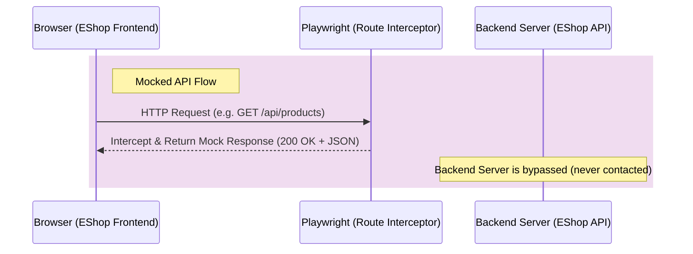
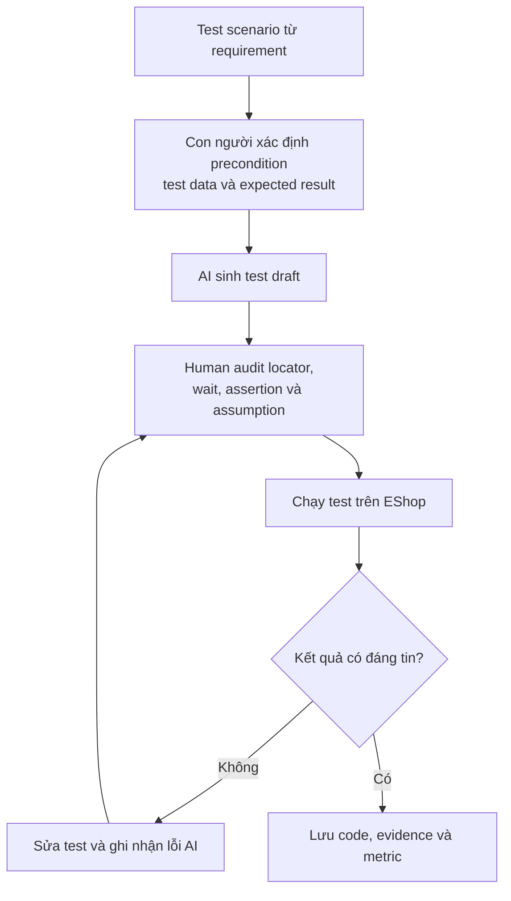

# T02 — Web Automation Testing

> **SUT:** EShop — <https://github.com/ttbhanh/eshop-sut>  
> **Mục đích tài liệu:** Trình bày cơ sở lý thuyết của kiểm thử tự động, từ đó xây dựng tiêu chí khảo sát và đề xuất công cụ phù hợp cho seminar T02.

---

## 1. Cơ sở lý thuyết về kiểm thử tự động

### 1.1 Khái niệm và mục tiêu

**Test automation** là việc sử dụng phần mềm để:

- thiết lập điều kiện kiểm thử;
- điều khiển System Under Test;
- cung cấp test data;
- quan sát kết quả;
- so sánh actual result với expected result;
- ghi nhận bằng chứng và báo cáo kết quả.

Kiểm thử tự động phù hợp nhất với các kiểm thử có tính lặp lại, có expected result xác định và cần phản hồi nhanh, ví dụ:

- smoke test;
- regression test;
- data-driven test;
- kiểm thử nhiều trình duyệt hoặc nhiều cấu hình;
- các luồng nghiệp vụ quan trọng cần chạy thường xuyên.

Test automation **không thay thế hoàn toàn manual testing**. Exploratory testing, usability testing, đánh giá trải nghiệm và các tình huống chưa có test oracle rõ ràng vẫn cần con người tham gia.

### 1.2 Vòng đời triển khai test automation

Một quy trình automation cơ bản gồm:

1. **Feasibility analysis:** xác định mục tiêu, phạm vi và test case phù hợp để tự động hóa.
2. **Tool evaluation and selection:** lựa chọn công cụ dựa trên yêu cầu kỹ thuật, chi phí và khả năng tích hợp.
3. **Architecture and framework design:** thiết kế cấu trúc test, data, fixture, abstraction và reporting.
4. **Test implementation:** xây dựng locator, action, assertion và test data.
5. **Execution:** chạy local, cross-browser, lặp lại, song song hoặc trong CI/CD.
6. **Result analysis:** phân tích pass/fail, trace, screenshot, log và nguyên nhân lỗi.
7. **Maintenance and improvement:** cập nhật test khi SUT thay đổi, loại bỏ flaky test và giảm duplication.

### 1.3 Các thành phần cốt lõi của một giải pháp Web Automation

| Mã | Nội dung lý thuyết | Yêu cầu đối với công cụ |
|---|---|---|
| **R1** | Test execution và browser interaction | Có test runner hoặc cơ chế điều khiển trình duyệt, chạy được luồng end-to-end |
| **R2** | Locator / object identification | Xác định đúng phần tử UI bằng role, label, test-id, CSS hoặc cơ chế object repository |
| **R3** | Synchronization | Chờ đúng trạng thái của UI/network, hạn chế race condition và hard wait |
| **R4** | Test oracle và assertion | So sánh actual với expected bằng assertion có khả năng retry hoặc báo lỗi rõ |
| **R5** | Test data, fixture và isolation | Quản lý account, dữ liệu đầu vào, setup/teardown và trạng thái độc lập giữa các lần chạy |
| **R6** | Reuse và maintainability | Hỗ trợ Page Object, component abstraction, keyword/module hoặc cấu trúc tái sử dụng |
| **R7** | Cross-browser, repeat và parallel execution | Chạy nhiều browser, lặp lại và có thể thực thi song song |
| **R8** | Observability và failure analysis | Có report, screenshot, video, log, trace hoặc dashboard để điều tra lỗi |
| **R9** | CI/CD integration | Chạy được qua CLI/API và tích hợp pipeline |
| **R10** | AI augmentation và human control | AI có thể hỗ trợ sinh test, locator, assertion hoặc healing nhưng phải audit được |

### 1.4 Các thuộc tính chất lượng cần đánh giá

Một automation suite tốt không chỉ có nhiều test case mà còn cần:

- **Correctness:** test phản ánh đúng requirement và assertion kiểm tra đúng hành vi.
- **Reliability:** cùng điều kiện thì kết quả ổn định; không fail ngẫu nhiên.
- **Maintainability:** dễ đọc, sửa và mở rộng khi UI hoặc requirement thay đổi.
- **Reusability:** giảm duplication bằng fixture, helper, Page Object hoặc component.
- **Portability:** có thể chạy trên các browser/môi trường cần thiết.
- **Scalability:** hỗ trợ chạy nhiều test, song song hoặc trong CI.
- **Diagnosability:** khi fail có đủ evidence để xác định nguyên nhân.
- **Security:** không hard-code secret hoặc để lộ dữ liệu nhạy cảm trong log/report.

### 1.5 Các rủi ro thường gặp

| Rủi ro | Biểu hiện | Hướng kiểm soát |
|---|---|---|
| Brittle locator | UI đổi nhẹ làm test fail | Ưu tiên role, label, test-id hoặc locator ổn định |
| Synchronization issue | Test lúc pass lúc fail do UI/network chưa sẵn sàng | Dùng auto-wait, explicit condition, web-first assertion |
| Weak test oracle | Test pass dù nghiệp vụ sai | Assertion theo requirement và state nghiệp vụ |
| Test data pollution | Lần chạy sau bị ảnh hưởng bởi dữ liệu cũ | Fixture, setup/teardown, dữ liệu độc lập |
| High maintenance cost | Sửa một UI phải sửa nhiều test | Abstraction, Page Object, reusable helper |
| False positive/negative | Kết quả automation không phản ánh lỗi thật | Review test, trace và đối chiếu manual |
| Self-healing masks defect | Tool tự chọn phần tử khác và vẫn pass | Ghi nhận healing, review evidence, thêm assertion nghiệp vụ/visual |
| AI hallucination | AI sinh route, locator hoặc assertion không tồn tại | Human review, chạy thực tế và ghi số lần chỉnh sửa |

### 1.6 Test Doubles in Automation Testing

#### Why Test Doubles Exist
In software testing, the system under test (SUT) often depends on other components, services, or databases (collaborators). During execution, these collaborators might be:
- Slow (causing slow tests).
- Unreliable or unavailable (network issues, external server downtime).
- Hard to configure (requiring complex database states).
- In development (not finished yet).

To solve this, we replace the real collaborator with a simplified version. This replacement is called a **Test Double** (similar to a stunt double in movies).

#### Why Automation Needs Them
Test automation requires tests to be fast, reliable, and run automatically. Real dependencies introduce network latency, database state conflicts, and external API rate limits, which lead to test failures. Test doubles remove these external dependencies.

#### Relationship with Test Isolation
Test isolation ensures that a test is independent of other tests and its environment. By using test doubles, we isolate the SUT. A failure in a test then indicates a bug in the SUT itself, not in the external collaborator.

#### Relationship with Deterministic Tests
A deterministic test gives the same result every time it runs with the same code. Real systems have non-deterministic elements (like current time, network traffic, dynamic product inventories). Test doubles provide predictable, pre-configured responses, making tests stable and deterministic.

#### Difference between Unit Testing and Web Automation
- **Unit Testing**: Test doubles (often mocks/stubs) are implemented in the programming language (e.g., using frameworks like Jest or Mockito) to isolate a single class or function.
- **Web Automation**: Test doubles operate at the network level or database level. Web browsers load the frontend UI, and Playwright intercepts HTTP requests to return mock JSON data, decoupling the frontend from the backend API.

#### The Five Types of Test Doubles

##### Dummy
- **Definition**: Objects that are passed around but never actually used or accessed. They are usually just placeholders to fill parameter lists.
- **Purpose**: To satisfy compiler or function signature requirements when an argument is mandatory but its value is irrelevant to the test scenario.
- **Example**: Passing an empty user object or `null` to a constructor because the test only verifies a method that does not use the user profile.
- **When NOT to use**: Do not use if the SUT actually reads or calls methods on the object. In that case, use a Stub or a Mock.

##### Stub
- **Definition**: Stubs provide prepared, hardcoded answers to calls made during the test. They do not respond to anything outside what is programmed for the test.
- **Purpose**: To supply database queries or network responses to the SUT so that it has the data it needs to execute.
- **Example**: In a login test, the stub always returns `{ status: 200, role: "user" }` whenever any username is sent.
- **Advantages**: Simple to implement, fast, and makes the test independent of the real database.
- **Limitations**: Stubs do not verify how many times they were called or what arguments were passed. They cannot verify behavioral actions.

##### Fake
- **Definition**: Fakes have working implementations, but they use shortcut methods which make them unsuitable for production.
- **Purpose**: To replace a heavy or complex external system with a lightweight local version.
- **Example**: Using an in-memory SQLite database instead of a real PostgreSQL database, or using a local file system instead of Amazon S3.
- **Advantages**: Behaves like the real system, allowing complex integration flows without external dependencies.
- **Limitations**: Fakes require development and maintenance effort. They might not perfectly match production behavior.

##### Spy
- **Definition**: Spies are stubs that also record information about how they were called (e.g., arguments passed, number of invocations).
- **Purpose**: To verify that the SUT calls the dependency with the correct arguments when direct state assertion is not possible.
- **Example**: A spy wraps the email service to verify that the SUT sent an email to `test@eshop.com` with the subject "Order Confirmed".
- **Advantages**: Allows verification of outgoing side effects without using a full mock framework.
- **Limitations**: Increases test code complexity because the test must verify the internal call logs.

##### Mock
- **Definition**: Mocks are pre-programmed objects with expectations. They form a specification of the calls they are expected to receive.
- **Purpose**: To verify the behavior of the SUT by asserting that specific calls were made to the dependency in the expected order with the expected parameters.
- **Example**: Expecting that `paymentGateway.charge(100)` is called exactly once, and throwing an assertion failure if it was never called or called twice.
- **Advantages**: Excellent for behavior verification and checking collaboration.
- **Limitations**: Tests become tightly coupled to the implementation details of the SUT. If the code is refactored, tests can break even if the behavior remains correct.
- **Common Misconceptions**: Many developers call any test double a "mock". However, a mock specifically focuses on **behavior verification** (verifying calls), whereas a stub focuses on **state verification** (returning data).

#### Summary of Test Double Types

| Type | Returns data | Records calls | Verifies behaviour | Typical usage |
|---|:---:|:---:|:---:|---|
| **Dummy** | No | No | No | Parameter filler to satisfy compiler/signatures |
| **Stub** | Yes (Hardcoded) | No | No | Providing inputs/responses to the SUT |
| **Fake** | Yes (Dynamic) | No | No | Lightweight database or service replacement |
| **Spy** | Yes (Optional) | Yes | No | Recording metrics/arguments for verification |
| **Mock** | Yes (Optional) | Yes | Yes (Via expectations) | Verifying interactions and calls to collaborators |

#### 1.6.6 Origin of the Test Double Concept
The term "Test Double" was first formally introduced by Gerard Meszaros in the context of writing his book *xUnit Test Patterns: Refactoring Test Code* (published in 2007). Meszaros wanted to create a clear, unifying vocabulary for the different kinds of mock-like objects that developers were using in xUnit patterns. This terminology became widely adopted after Martin Fowler popularized it in his influential 2007 article *"Mocks Aren't Stubs"*. By grouping similar utilities under one standard concept, it helped software engineers discuss and design test isolation components with precise meaning.

#### 1.6.7 Test Doubles in Playwright
Unlike traditional unit testing libraries (such as Mockito or Jest), Playwright does not perform object-level mocking. Object-level mocking operates inside the application's runtime memory, replacing class instances or functions with mocked implementations. Because Playwright is a browser automation framework running out-of-process, it cannot directly modify code variables or class instances running inside the browser or backend server.

Instead, Playwright implements test doubles using network interception at the HTTP/HTTPS protocol layer. It intercepts network traffic sent by the browser before it reaches the network card, redirecting or fulfilling calls.



The core Playwright API methods for network interception include:
- **`page.route(url_pattern, handler)`**: Registers a wildcard pattern or glob to capture network requests. The matching request is paused, and the handler decides its outcome.
- **`route.fulfill(options)`**: Directs Playwright to intercept the request and respond immediately with simulated payload, headers, and status code (serving as a Stub or Mock).
- **`route.continue(options)`**: Allows the request to pass through to the real backend server, with options to override HTTP headers, request body, or method.
- **`route.abort(errorCode)`**: Intentionally fails the request (simulating conditions like network disconnects, time-outs, or DNS failures).

#### 1.6.8 API Mocking
API Mocking is the practice of simulating backend services at the network level by intercepting HTTP requests and returning predefined JSON/HTML payloads. Frontend web automation frequently relies on API mocking because it completely decouples the browser interface from database states and server deployments.

##### Benefits:
- **Deterministic Tests**: Bypasses dynamic server logic and database state changes, producing the exact same test outcome on every run.
- **Faster Execution**: Eliminates server-side processing, database queries, and internet latency, reducing test run times from minutes to seconds.
- **Backend Independence**: Allows frontend tests to run even if the backend database is offline, in-development, or undergoing maintenance.
- **Testing Error Scenarios**: Simulates difficult-to-trigger server responses (like `503 Service Unavailable` or `401 Unauthorized`) cleanly.

##### Limitations:
- **No System Integration Verification**: Passes successfully even if the backend is down or the actual database schema is corrupted in production.
- **Maintenance Overhead**: Hardcoded JSON mock structures inside test scripts require manual updates whenever backend developers change API payloads.

##### Playwright Code Example (TypeScript):
The following example intercepts a GET request for products on the EShop homepage and returns a mocked response:
```typescript
import { test, expect } from '@playwright/test';

test('should display mocked products list', async ({ page }) => {
  // Intercept any GET request matching the products API endpoint
  await page.route('**/api/products', async (route) => {
    await route.fulfill({
      status: 200,
      contentType: 'application/json',
      body: JSON.stringify([
        { id: 1, name: 'Mocked Product A', price: 99000 },
        { id: 2, name: 'Mocked Product B', price: 150000 }
      ]),
    });
  });

  // Navigate to the EShop homepage
  await page.goto('http://localhost:5173/');

  // Assert that the page displays the mocked products
  await expect(page.getByText('Mocked Product A')).toBeVisible();
  await expect(page.getByText('Mocked Product B')).toBeVisible();
});
```

#### 1.6.9 Best Practices
- **Mock only external dependencies**: Intercept payment gateways (e.g., Stripe, PayPal) or third-party mailing systems. Avoid mocking the core application unless necessary.
- **Keep mock responses synchronized with production APIs**: Regularly check that mock payload schemas align with active backend formats.
- **Avoid mocking every endpoint**: If every network call is mocked, the test becomes a unit test, failing to check actual integration. Keep core business flows (like checkout writes) real.
- **Verify real backend periodically**: Run a small daily smoke test suite against live databases on a staging environment.
- **Use realistic test data**: Ensure mocked prices, strings, and dates mimic actual data structures (e.g., incorporating Vietnamese Unicode characters for localized SUT testing).
- **Clearly document mocked scenarios**: Clearly tag or separate mock tests using descriptive blocks (e.g. `test.describe('Mocked API Scenarios', ...)`) to avoid confusing them with end-to-end integration tests.
- **Simulate network variability**: Test frontend error resilience by adding delay parameters (e.g. `route.fulfill({ delay: 3000 })`) or introducing abort codes.

#### 1.6.10 Risks and Limitations of Mocking

##### 1. False Confidence
- **Description**: Frontend tests pass successfully because the mock intercepts the API call and returns a mock success payload, but real users experience failures in production.
- **Example**: Frontend changes request payload keys from `email` to `userEmail`, but the mock endpoint still accepts `email`. The mock test passes, but the live server rejects real login attempts.
- **Mitigation**: Implement automated contract testing or include a core E2E staging smoke-test suite using live database verification.

##### 2. Hidden Backend Defects
- **Description**: Database locking errors, deadlocks, performance bottlenecks, or business logic bugs in the backend code are masked because the test runner never contacts the server.
- **Example**: The database fails to write order items due to type limits, but the E2E mock test reports checkout success.
- **Mitigation**: Run backend integration/API tests alongside frontend UI tests.

##### 3. Mock Drift (API Schema Mismatch)
- **Description**: The production API evolves (changing payload fields or validation constraints), but the hardcoded mocks inside test files are not updated, causing tests to verify obsolete constraints.
- **Example**: Backend database transitions from `userId` to `userUuid`, but the test suite mock still returns `userId`.
- **Mitigation**: Automatically validate mocked response schemas against the active OpenAPI/Swagger JSON document.

##### 4. Unrealistic Test Data
- **Description**: Mocks containing simplified data structures fail to catch SUT bugs triggered by actual production data complexities (e.g. long strings, special characters, or null fields).
- **Example**: A mocked product page accepts simple text names, failing to reveal text-wrapping or layout issues caused by long Vietnamese product names.
- **Mitigation**: Seed mock data using realistic database dumps or apply data generators.

##### 5. Increased Maintenance Cost
- **Description**: As the test suite scales, managing dozens of hardcoded network response JSON bodies within tests leads to redundant work and complex code refactoring.
- **Example**: Modifying the global user profile object schema requires updating mock payloads in twenty different test scripts.
- **Mitigation**: Extract mock payloads into shared fixture directories, or use record-and-replay tools (such as Playwright API mocks recording) to auto-update network snapshots.

#### 1.6.11 Practical Demonstration in This Seminar
The seminar group will demonstrate the concepts of API Mocking on the EShop SUT through the following structured flow:

```
[Run EShop SUT Locally]
          │
          ▼
[Execute Login Automation Tests]
 ├── Flow A: Real API Flow (Login -> Call Backend API Server -> Database Authentication)
 └── Flow B: Mock API Flow (Login -> Playwright Intercepts -> Returns Mock JWT -> Server is Offline)
          │
          ▼
[Compare Results & Performance]
 ├── Compare runtime speed and stability
 └── Observe that Flow B succeeds instantly even with the backend completely offline
          │
          ▼
[Group Discussion & Observations]
 └── Analyze browser console logs showing redirected requests, trace metrics, and discuss trade-offs
```

During this demonstration, students should observe:
1. **Network Interception**: Open the browser developer console network tab and view the intercepted request returning the mock response without hitting the real port `3000`.
2. **Speed differences**: The mock login completes in milliseconds compared to the live backend transaction.
3. **Resilience**: The mock login continues to work even if the backend process is manually terminated.

---


## 2. Tiêu chí dùng để khảo sát công cụ

Từ phần lý thuyết trên, nhóm đánh giá tool theo hai lớp tiêu chí.

### 2.1 Khả năng kỹ thuật bắt buộc

Một tool chính phải hỗ trợ phần lớn các yêu cầu **R1–R9**:

- chạy được E2E test;
- locator và synchronization ổn định;
- assertion rõ ràng;
- fixture/test data;
- kiến trúc dễ bảo trì;
- repeat, cross-browser và parallel khi cần;
- evidence khi test fail;
- chạy được trong CI/CD.

### 2.2 Tiêu chí lựa chọn trong bối cảnh seminar

Ngoài tính năng kỹ thuật, tool còn được đánh giá theo:

- licence và tổng chi phí;
- learning curve;
- mức độ phù hợp với EShop;
- khả năng cài đặt và tái hiện trên máy của sinh viên;
- khả năng hoàn thành hands-on activity trong 25 phút;
- tài liệu và community;
- khả năng AI;
- mức độ phụ thuộc cloud, trial hoặc enterprise plan.

---

## 3. Tool Survey Summary

| Tool | Type | Licence / Cost | Learning Curve | EShop Fit | AI Capability | Community / Ecosystem |
|---|---|---|---|---|---|---|
| **Playwright** | Traditional, code-first | Free, open-source | Medium | Very High: phù hợp kiểm thử E2E cho web app hiện đại | Có codegen/locator generator; AI cần công cụ ngoài | Strong: multi-browser, trace viewer, npm ecosystem |
| **Cypress** | Traditional, code-first | Free core; một số cloud features trả phí | Easy–Medium | High: dễ debug frontend và UI flow | Có thể kết hợp AI bên ngoài | Strong: cộng đồng frontend lớn |
| **Selenium 4** | Traditional, code-first | Free, open-source | Medium–Hard | High: browser support và ecosystem rộng | Không có AI tích hợp mặc định | Very Strong: tiêu chuẩn lâu năm |
| **GitHub Copilot** | AI coding assistant | Free/student hoặc paid tùy tài khoản | Easy–Medium | High khi kết hợp framework automation | Hỗ trợ sinh/review test, locator và assertion | Very Strong; tích hợp IDE và GitHub |
| **OpenAI Codex / Google Antigravity** | AI coding agent / agentic IDE | Phụ thuộc tài khoản và gói sử dụng | Medium | Có thể hỗ trợ tạo, chạy và chỉnh test qua repository/terminal | Agentic code generation và test assistance | Đang phát triển nhanh; cần kiểm soát quyền thực thi |
| **Testim AI** | AI-augmented platform | Commercial, có trial | Medium | High | Smart Locator, locator auto-improve/self-healing | Medium–Strong; phụ thuộc account/licence |
| **Katalon Studio** | Traditional + AI-augmented | Có free tier; một số execution/enterprise features trả phí | Easy–Medium | High: Web/API/Mobile/Desktop | Smart Locator và AI self-healing | Strong; tích hợp Selenium/Appium và CI/CD |
| **mabl** | AI-native, low-code SaaS | Commercial SaaS, có trial | Easy–Medium | High: Web/API/Mobile, CI/CD | Auto-healing, AI authoring/assertion và failure analysis | Medium–Strong; phụ thuộc cloud/licence |
| **Virtuoso QA** | AI-native, low-code SaaS | Commercial SaaS, có trial | Easy–Medium | High: UI/E2E/cross-browser | Natural-language authoring, self-healing và AI support | Medium; ít tài nguyên miễn phí hơn |
| **ACCELQ** | AI-native, no-code platform | Commercial SaaS, có trial | Easy–Medium | Very High cho flow end-to-end đa nền tảng | AI generation, object identification và self-healing | Medium; tập trung enterprise |

---

## 4. Ánh xạ tool với nội dung lý thuyết

### 4.1 Ký hiệu

- **●:** hỗ trợ native hoặc là chức năng chính.
- **◐:** hỗ trợ một phần, cần cấu hình, thư viện hoặc sản phẩm bổ sung.
- **△:** chủ yếu hỗ trợ gián tiếp.
- **—:** không phải chức năng của tool đó.

### 4.2 Capability Mapping

| Tool | R1 Execution | R2–R3 Locator & Sync | R4 Assertion | R5–R6 Data & Maintainability | R7 Cross-browser / Parallel | R8–R9 Report / CI | R10 AI |
|---|:---:|:---:|:---:|:---:|:---:|:---:|:---:|
| **Playwright** | ● | ● | ● | ● | ● | ● | ◐ |
| **Cypress** | ● | ● | ● | ● | ◐ | ● | ◐ |
| **Selenium 4** | ● | ◐ | ◐ | ◐ | ● | ◐ | — |
| **Katalon Studio** | ● | ● | ● | ● | ◐ | ◐ | ● |
| **Testim AI** | ● | ● | ● | ● | ● | ● | ● |
| **mabl** | ● | ● | ● | ● | ● | ● | ● |
| **Virtuoso QA** | ● | ● | ● | ● | ● | ● | ● |
| **ACCELQ** | ● | ● | ● | ● | ● | ● | ● |
| **Copilot / Codex / Antigravity** | — | △ | △ | △ | — | △ | ● |

### 4.3 Nhận xét từ bảng ánh xạ

1. **AI coding assistant không phải test automation framework.**  
   Copilot, Codex hoặc Antigravity có thể hỗ trợ tạo và chỉnh code, nhưng bản thân chúng không thay thế test runner, browser driver, assertion engine, report hoặc CI configuration. Vì vậy, AI assistant phải được ghép với Playwright, Cypress hoặc Selenium.

2. **Selenium là browser automation library mạnh nhưng cần hệ sinh thái bổ sung.**  
   Test runner, assertion, data management và reporting thường cần JUnit/TestNG/PyTest hoặc thư viện khác. Điều này tăng tính linh hoạt nhưng cũng làm setup và maintenance phức tạp hơn cho seminar ngắn.

3. **Các nền tảng AI-native hỗ trợ nhiều nội dung lý thuyết trong một sản phẩm.**  
   Testim, mabl, Virtuoso và ACCELQ có locator intelligence, dashboard, CI/CD và self-healing. Tuy nhiên, tính tái hiện có thể bị ảnh hưởng bởi trial, cloud, quota và licence.

4. **Playwright bao phủ tốt phần lõi của automation bằng code.**  
   Tool hỗ trợ test runner, locator, auto-wait, web-first assertion, fixture, multi-browser, parallel execution, report và trace. Các nội dung này phù hợp để giải thích trực tiếp lý thuyết automation thay vì che giấu phần lớn cơ chế bên dưới nền tảng low-code.

5. **Self-healing không đồng nghĩa với correctness.**  
   Self-healing có thể giảm lỗi locator nhưng vẫn phải kết hợp assertion nghiệp vụ, screenshot/trace và human review để tránh thao tác nhầm element.

### 4.4 Mapping Test Double Theory to Tool Capabilities

This section maps general Test Double theory directly to the specific capabilities of the surveyed tools, focusing on how they support network interception, request/response modification, and isolation.

#### Test Double Support Matrix

| Capability | Playwright | Cypress | Selenium | GitHub Copilot | Testim |
| :--- | :---: | :---: | :---: | :---: | :---: |
| **API Mocking** | ● | ● | ◐ | — | ● |
| **Network Interception** | ● | ● | ◐ | — | ● |
| **Request Modification** | ● | ● | ◐ | — | ◐ |
| **Response Mocking** | ● | ● | ◐ | — | ● |
| **Offline Testing** | ● | ● | ◐ | — | ● |
| **Error Simulation** | ● | ● | ◐ | — | ● |
| **Test Isolation** | ● | ◐ | ◐ | — | ● |
| **Deterministic Testing** | ● | ● | ◐ | — | ● |

*Legend: ● Full Native Support | ◐ Partial / Config Required | — No Support*

#### Mapping Analysis and Tool Selection Rationale

Based on the mapping above, **Playwright** was selected as the primary automation framework for the seminar because of its outstanding out-of-the-box support for Test Doubles:

1. **Native out-of-process network interception**: Playwright leverages browser debugging protocols (Chrome DevTools Protocol for Chromium) directly. This allows robust and fast interception of any network call at the HTTP layer, bypassing backend databases easily without altering SUT source code.
2. **Simplified request/response lifecycle controls**: Playwright provides four distinct, intuitive APIs (`page.route()`, `route.fulfill()`, `route.continue()`, and `route.abort()`) to simulate all 5 types of Test Doubles (Dummy, Stub, Fake, Spy, Mock).
3. **Strict test isolation via Browser Contexts**: Playwright context handles ensure that mock configurations, cookies, and local storage remain completely isolated. Unlike Cypress (which runs in the same browser window and can suffer from leaking intercept states), Playwright contexts are created and torn down in milliseconds, guaranteeing deterministic test execution.
4. **Contrast with other tools**:
   - **Selenium** requires configuring proxy servers (like BrowserMob Proxy) or writing verbose Chrome DevTools APIs to achieve the same result, making it too complex for a student seminar.
   - **GitHub Copilot** is a generative coding assistant, not a runtime tool, meaning it cannot intercept requests or execute mocks.
   - **Testim** supports mocking but hides the underlying execution engine behind a low-code UI, which prevents students from learning the core architectural concepts of web request lifecycle interception.

---


## 5. Proposed Direction

### 5.1 Main Stack

| Role | Proposed Tool |
|---|---|
| Traditional automation framework | **Playwright** |
| AI-augmented assistant chính | **GitHub Copilot** |
| AI assistant để khảo sát/backup | **OpenAI Codex hoặc Google Antigravity** |
| Traditional backup | **Cypress** |
| AI-native backup | **Testim AI hoặc mabl** |

### 5.2 Rationale dựa trên lý thuyết

1. **Bao phủ các thành phần cốt lõi R1–R9:**  
   Playwright có khả năng điều khiển browser, locator và synchronization, assertion, fixture, reusable structure, multi-browser, parallel execution, report, trace và CI.

2. **Phù hợp để nghiên cứu maintainability và flakiness:**  
   Nhóm có thể chủ động tạo locator tốt/xấu, thay đổi DOM, giảm tốc độ network, chạy lặp lại và sử dụng trace để phân tích failure mode.

3. **Phân tách rõ framework và AI layer:**  
   Playwright chịu trách nhiệm thực thi và xác minh; Copilot chịu trách nhiệm hỗ trợ sinh hoặc review code. Cách phân tách này giúp đánh giá đúng AI hỗ trợ phần nào và phần nào vẫn phải do framework/con người đảm nhiệm.

4. **Dễ tái hiện trong lớp:**  
   Playwright chạy local và open-source, giảm phụ thuộc vào commercial trial. Audience có thể cài bằng npm và chạy một flow trong thời gian hoạt động.

5. **Có đối chứng:**  
   Cypress được giữ làm traditional backup; Testim/mabl được giữ làm đối chứng AI-native/self-healing nếu tài khoản và trial cho phép.

---

## 6. Pilot trên EShop trước khi chốt tool

Nhóm dự kiến triển khai cùng một flow **Login → Add to Cart → Assert cart state** bằng:

1. Playwright viết thủ công.
2. Playwright có GitHub Copilot hỗ trợ.
3. Một tool đối chứng nếu khả thi: Cypress hoặc Testim/mabl.

### 6.1 Nội dung kiểm chứng

| Nhóm tiêu chí | Nội dung đo |
|---|---|
| Functional correctness | Test có kiểm tra đúng requirement và cart state không |
| Locator quality | Role/label/test-id hay CSS/XPath/index |
| Synchronization | Có dùng auto-wait/condition hay hard wait |
| Assertion quality | Có kiểm tra business result hay chỉ kiểm tra element visible |
| Repeatability | Pass rate qua 10 lần chạy |
| Flakiness | Số lần fail không do defect của SUT |
| Debuggability | Evidence từ report, screenshot, video hoặc trace |
| Maintainability | Số vị trí phải sửa sau một thay đổi DOM nhỏ |
| AI effort | Thời gian sinh draft và số lần phải chỉnh output AI |
| Reproducibility | Thành viên khác có setup và chạy lại được không |

### 6.2 Các flow EShop sau khi pilot thành công

1. **Login + Account Lockout**
2. **Add to Cart**
3. **Checkout / Coupon**

### 6.3 Acceptance criteria cho tool chính

Playwright được chốt làm tool chính nếu:

- chạy được các flow đã chọn trên môi trường local;
- có pass rate ổn định khi chạy lặp;
- cung cấp evidence đủ để điều tra lỗi;
- hỗ trợ cấu trúc test dễ bảo trì;
- mọi thành viên có thể cài đặt và chạy lại;
- activity cho audience hoàn thành trong tối đa 25 phút.

---

## 7. AI Usage and Audit

Nhóm sử dụng AI như một **lớp hỗ trợ**, không xem AI là test oracle hoặc nguồn kết luận cuối cùng.

Quy trình AI-assisted testing:



Nhóm cam kết:

- review và chạy thực tế mọi code do AI tạo;
- không dùng AI để tự tạo kết quả execution, flakiness metric hoặc feedback;
- ghi nhận prompt, output, thay đổi của con người và kết quả cuối;
- không cung cấp secret, token hoặc dữ liệu nhạy cảm cho AI;
- kiểm tra false positive, false negative và hallucination;
- xem xét rủi ro khi agent có quyền sửa file hoặc chạy command.

---

## 8. Approval Request

Nhóm xin giảng viên/TA duyệt hướng nghiên cứu theo thứ tự:

> **Lý thuyết Test Automation → xác định requirements R1–R10 → survey và mapping tool → pilot trên EShop → chốt tool chính.**

Đề xuất hiện tại:

> **Playwright** là traditional framework chính; **GitHub Copilot** là AI-augmented assistant chính. **Cypress** được giữ làm traditional backup; **Codex/Antigravity** là AI assistant backup; **Testim AI/mabl** là phương án AI-native để đối chứng nếu điều kiện licence cho phép.

Nhóm chưa kết luận rằng Playwright là công cụ “tốt nhất” nói chung. Kết luận cuối cùng sẽ giới hạn trong bối cảnh EShop, seminar 45 phút, hands-on activity 25 phút và các metric đã định nghĩa ở phần pilot.

---

## 9. References

1. ISTQB — *Certified Tester Advanced Level Test Automation Engineering Syllabus v2.0*:  
   <https://www.istqb.org/wp-content/uploads/2024/11/ISTQB_CTAL-TAE_Syllabus_v2.0.pdf>
2. ISTQB — *Certified Tester Foundation Level Syllabus v4.0*:  
   <https://www.istqb.org/specifications/certified-tester-foundation-level-syllabus/>
3. Martin Fowler — *Mocks Aren't Stubs*:  
   <https://martinfowler.com/articles/mocksArentStubs.html>
4. Gerard Meszaros — *xUnit Test Patterns: Refactoring Test Code*:  
   <https://xunitpatterns.com/>
5. Playwright — *Network Interception & API Mocking*:  
   <https://playwright.dev/docs/network>
6. Playwright — Overview:  
   <https://playwright.dev/>
6. Playwright — Locators:  
   <https://playwright.dev/docs/locators>
7. Playwright — Trace Viewer:  
   <https://playwright.dev/docs/trace-viewer-intro>
8. Cypress — Best Practices:  
   <https://docs.cypress.io/app/core-concepts/best-practices>
9. Cypress — Retry-ability:  
   <https://docs.cypress.io/app/core-concepts/retry-ability>
10. Selenium — Waiting Strategies:  
    <https://www.selenium.dev/documentation/webdriver/waits/>
11. Selenium — Grid:  
    <https://www.selenium.dev/documentation/grid/>
12. GitHub Copilot — Writing Tests with Copilot:  
    <https://docs.github.com/en/copilot/using-github-copilot/guides-on-using-github-copilot/writing-tests-with-github-copilot>
13. GitHub Copilot — Responsible Use of Code Review:  
    <https://docs.github.com/en/copilot/responsible-use/code-review>
14. Katalon — Self-healing Tests:  
    <https://docs.katalon.com/katalon-studio/maintain-tests/self-healing-tests-in-katalon-studio>
15. Testim — Smart Locators / Web and Mobile Testing:  
    <https://help.testim.io/docs/testim-automate>
16. mabl — How Auto-heal Works:  
    <https://help.mabl.com/hc/en-us/articles/19078583792404-How-auto-heal-works>
17. Virtuoso QA — Platform Overview:  
    <https://docs.virtuoso.qa/guide/>
18. ACCELQ — Product Overview:  
    <https://www.accelq.com/>
