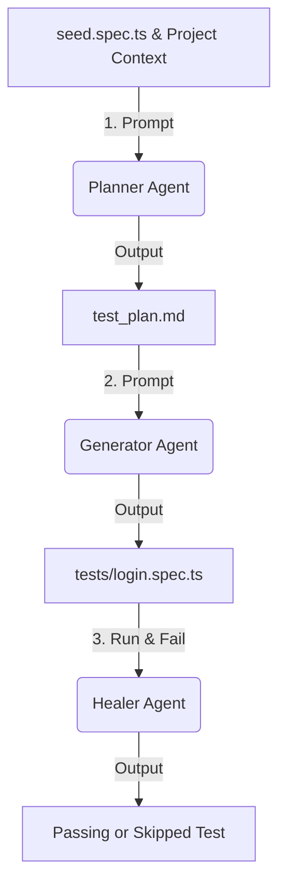

# User Guide

## 1. Introduction

### What is Web Automation Testing?
Web Automation Testing is the process of using software tools to automatically control a web browser, execute predefined actions (such as clicking buttons, entering text, and navigating pages), and verify that the web application behaves correctly. It replaces manual, repetitive testing workflows with automated scripts that run consistently and quickly.

### What is Playwright?
Playwright is an open-source, modern end-to-end (E2E) testing library developed by Microsoft. It allows developers and testers to automate web interactions across different browsers using a unified API. Playwright supports multiple programming languages, including JavaScript, TypeScript, Python, Java, and C#. In this guide, we use JavaScript/TypeScript.

### Why Playwright was Selected
For this seminar, Playwright is selected over older frameworks (such as Selenium) and alternative frontend testing tools (such as Cypress) due to the following advantages:
1. **Multi-Browser Support**: It can test applications on Chromium (Chrome, Edge), Firefox, and WebKit (Safari) using a single API.
2. **Auto-Waiting**: Playwright automatically waits for elements to be actionable (visible, enabled, stable) before performing operations. This eliminates the need for manual sleep/wait commands and drastically reduces test flakiness.
3. **Trace Viewer**: It records test executions (screenshots, console logs, network requests, DOM snapshots) to make debugging simple when tests fail.
4. **Parallel Execution**: Playwright runs tests in parallel natively, significantly reducing execution time.
5. **API Mocking**: It allows easy interception and mocking of network requests, which is crucial for testing UI states in isolation.

### What Problem This Tool Solves
Web applications are dynamic and asynchronous. Traditional tools often suffer from "flakiness" (tests failing randomly due to timing differences, network delays, or slow rendering). Playwright solves this issue with its **auto-waiting mechanisms** and **Web-First Assertions**. It also reduces test maintenance efforts and simplifies diagnosing errors through visual and detailed reports.

### Who Should Use This Guide
This guide is designed for undergraduate Software Engineering students who have a basic understanding of JavaScript/TypeScript and web applications but have never used automated web testing tools before.

### Learning Objectives
By the end of this guide, you will be able to:
- Clone the EShop System Under Test (SUT) and configure the local environment.
- Install and configure Playwright in a JavaScript/TypeScript project.
- Write and run functional E2E tests for the EShop login workflow.
- Apply API mocking in Playwright tests.
- Configure browser targets, parallel execution, and headless/headed modes.
- Debug test failures using HTML reports and Trace Viewer.
- Identify common testing failure modes and troubleshooting steps.

---

## 2. Installation

### Prerequisites
Before installing the tools, make sure your computer has the following software installed:
- **Node.js**: Version 18.x or higher. Verify with `node -v`.
- **npm**: Usually comes with Node.js. Verify with `npm -v`.
- **Git**: For cloning the repository. Verify with `git --version`.
- **VS Code**: Recommended text editor.
- **Browsers**: You do not need to install Chrome, Firefox, or Safari manually. Playwright will download local binaries of Chromium, Firefox, and WebKit during installation.

### Clone EShop
Open your terminal and run the following command to clone the EShop SUT repository:

```bash
git clone https://github.com/ttbhanh/eshop-sut.git
```

> **[TO BE COMPLETED BY THE TEAM]**
> If you are using a team fork or a specific branch, please update the repository URL above.
> 📷 Screenshot 1:
> **[TO BE CAPTURED BY THE TEAM]**
> Show the terminal command and output after successfully cloning the repository.

### Install Dependencies
EShop consists of a backend and frontends. Navigate to the cloned folder and install dependencies for the backend and web frontend.

1. Install dependencies for the Backend:
   ```bash
   cd eshop-sut/backend
   npm install
   ```

2. Initialize the backend database:
   ```bash
   node database.js
   ```

3. Install dependencies for the Frontend Web:
   ```bash
   cd ../frontend-web
   npm install
   ```

> **[TO BE COMPLETED BY THE TEAM]**
> Verify if the paths match your workspace layout. If the EShop source code is located in the `src/` directory of the repository (e.g. `src/backend`, `src/frontend-web`), update the commands above accordingly.
> 📷 Screenshot 2:
> **[TO BE CAPTURED BY THE TEAM]**
> Show the terminal after running `npm install` inside the frontend-web folder.

### Install Playwright
To install Playwright in your test project folder (for example, the student folder [23127430](file:///c:/Code/SoftwareTesting/ST-Group/Seminar/23127430) or a new directory), follow these steps:

1. Navigate to your test project directory:
   ```bash
   cd ../..
   ```

2. Install the Playwright Test package:
   ```bash
   npm install -D @playwright/test
   ```

3. Install the browser binaries:
   ```bash
   npx playwright install
   ```

Alternatively, you can initialize a new Playwright project structure interactively:
```bash
npm init playwright@latest
```
During the prompt, select TypeScript, use the default `tests` folder, and choose to download browsers.

> 📷 Screenshot 3:
> **[TO BE CAPTURED BY THE TEAM]**
> Show the terminal output after running `npx playwright install` or `npm init playwright@latest`.

### Verify Installation
To confirm that Playwright is installed correctly, run the default test suite:

```bash
npx playwright test
```

If it executes without errors, the installation is successful.

> 📷 Screenshot 4:
> **[TO BE CAPTURED BY THE TEAM]**
> Show the terminal output of a successful test run showing passed tests.

### OS Notes
- **Windows**: If you run into execution policy issues in PowerShell, run PowerShell as Administrator and run the command:
  ```powershell
  Set-ExecutionPolicy RemoteSigned -Scope CurrentUser
  ```
- **macOS**: Make sure Xcode Command Line Tools are installed:
  ```bash
  xcode-select --install
  ```
- **Linux**: If you are running tests on Linux (such as inside a CI/CD runner or headless server), you might need to install system dependencies for the browsers using:
  ```bash
  npx playwright install-deps
  ```

---

## 3. First Test

This section demonstrates how to write and execute a Playwright E2E test targeting the EShop login page.

### Test Environment Context
- **SUT Web Address**: `http://localhost:5173/login`
- **Default User Credentials**:
  - **Username/Email**: `test@eshop.com`
  - **Password**: `Test1234!`
- **Expected Outcome**: Successful login redirects the user to the home page (`http://localhost:5173/`) and displays a greeting `"Chào, test"` or the user's name on the navbar.

### Step-by-Step Test Implementation

Create a new file named `login.spec.ts` under your `tests` folder. A reference implementation is available in [login.spec.ts](file:///c:/Code/SoftwareTesting/ST-Group/Seminar/23127430/tests/login.spec.ts).

#### Option A: Real E2E Test Workflow
The following test script performs an actual login interaction.

```typescript
import { test, expect } from '@playwright/test';

test('should login successfully with valid credentials (Real E2E)', async ({ page }) => {
  // 1. Open the login page
  await page.goto('http://localhost:5173/login');

  // 2. Assert page header is visible using a semantic locator
  await expect(page.getByRole('heading', { name: 'Đăng Nhập' })).toBeVisible();

  // 3. Fill in the Email address
  await page.getByRole('textbox', { name: 'Username' }).fill('test@eshop.com');

  // 4. Fill in the Password
  await page.getByLabel('Mật khẩu').fill('Test1234!');

  // 5. Click the login button
  await page.getByRole('button', { name: 'Sign In' }).click();

  // 6. Verify URL is redirected to the home page
  await page.waitForURL('http://localhost:5173/');
  await expect(page).toHaveURL('http://localhost:5173/');

  // 7. Verify the user welcome text is displayed in the navigation bar
  const welcomeText = page.getByRole('link', { name: 'Chào, test' });
  await expect(welcomeText).toBeVisible();
});
```

#### Option B: API Mocking Test Workflow
If you want to isolate the frontend from the backend (useful for testing independent UI logic or simulating network failures), you can mock the API endpoints as shown in [login.spec.ts](file:///c:/Code/SoftwareTesting/ST-Group/Seminar/23127430/tests/login.spec.ts):

```typescript
import { test, expect } from '@playwright/test';

test('should login successfully with valid credentials (Mocked API)', async ({ page }) => {
  // 1. Intercept POST /api/login and mock response
  await page.route('**/api/login', async (route) => {
    await route.fulfill({
      status: 200,
      contentType: 'application/json',
      body: JSON.stringify({
        token: 'mock-jwt-token-12345',
        user: {
          id: 1,
          name: 'Nguyen Van A',
          email: 'test@example.com',
        },
      }),
    });
  });

  // 2. Intercept GET /api/users/me (runs after login to load user profile)
  await page.route('**/api/users/me', async (route) => {
    await route.fulfill({
      status: 200,
      contentType: 'application/json',
      body: JSON.stringify({
        id: 1,
        name: 'Nguyen Van A',
        email: 'test@example.com',
      }),
    });
  });

  // 3. Go to the login page
  await page.goto('http://localhost:5173/login');

  // 4. Enter credentials and submit
  await page.getByRole('textbox', { name: 'Username' }).fill('test@example.com');
  await page.getByRole('textbox', { name: 'Mật khẩu' }).fill('password123');
  await page.getByRole('button', { name: 'Sign In' }).click();

  // 5. Assert redirection and mocked profile display
  await page.waitForURL('http://localhost:5173/');
  await expect(page).toHaveURL('http://localhost:5173/');
  await expect(page.getByRole('link', { name: 'Chào, Nguyen Van A' })).toBeVisible();
});
```

### Running the Test
Execute the test file specifically from the terminal:

```bash
npx playwright test tests/login.spec.ts --headed
```

> **[TO BE COMPLETED BY THE TEAM]**
> Confirm the local port used. If EShop is running on another port, update `http://localhost:5173` to the appropriate URL.
> 📷 Screenshot 5:
> **[TO BE CAPTURED BY THE TEAM]**
> Show the browser execution window displaying the login page and input text automatically typed.

---

## 4. Advanced Usage

This section explains configuration options and design patterns for building professional-grade automated suites.

### configuration file: `playwright.config.ts`
The file [playwright.config.ts](file:///c:/Code/SoftwareTesting/ST-Group/Seminar/23127430/playwright.config.ts) defines how tests are executed. Key parameters include:
- `testDir`: The directory containing test scripts (e.g. `./tests`).
- `fullyParallel`: If set to `true`, tests in the same file run in parallel on separate browser instances.
- `reporter`: Output formats (e.g., `'html'`, `'list'`, `'dot'`).
- `use`: Global browser settings (e.g. `baseURL: 'http://localhost:5173'`, viewport size, trace capturing rules).
- `webServer`: Automatically starts the local backend and frontend servers before tests run and shuts them down when finished.

### Browser Projects
Playwright configures browser targets in the `projects` array. You can define multiple browsers to run the same tests across platforms:
```typescript
projects: [
  {
    name: 'chromium',
    use: { ...devices['Desktop Chrome'] },
  },
  {
    name: 'firefox',
    use: { ...devices['Desktop Firefox'] },
  },
  {
    name: 'webkit',
    use: { ...devices['Desktop Safari'] },
  },
]
```

### Parallel Execution
By default, Playwright runs test files in parallel.
- You can configure the number of worker processes:
  ```bash
  npx playwright test --workers=4
  ```
- Disable parallel execution during debugging:
  ```bash
  npx playwright test --workers=1
  ```

### Headless vs. Headed Mode
- **Headless mode** (default): Tests run in the background without opening a browser GUI. This is fast and suited for CI/CD pipelines.
- **Headed mode**: Opens the browser GUI so you can watch actions live. Use the `--headed` flag:
  ```bash
  npx playwright test --headed
  ```

### Trace Viewer
The Trace Viewer captures full timeline data of a test run.
1. Enable trace recording in [playwright.config.ts](file:///c:/Code/SoftwareTesting/ST-Group/Seminar/23127430/playwright.config.ts):
   ```typescript
   use: {
     trace: 'on-first-retry', // Options: 'on', 'off', 'retain-on-failure'
   }
   ```
2. Run tests. If they fail, a trace zip file is stored in `test-results/`.
3. Open the trace file to inspect:
   ```bash
   npx playwright show-trace test-results/failed-test-dir/trace.zip
   ```

### HTML Report
Playwright automatically outputs a readable HTML page summarizing the execution results.
- Open the report after running tests:
  ```bash
  npx playwright show-report
  ```
- Double-click on any failed test inside the report to view the line that threw the error, screenshots, and trace data.

### Page Object Model (POM)
The Page Object Model is a design pattern that creates classes to encapsulate page-specific elements and actions. This prevents code repetition and simplifies test maintenance.

#### 1. Define the Page Object Class (`LoginPage.ts`):
```typescript
import { Page, Locator } from '@playwright/test';

export class LoginPage {
  readonly page: Page;
  readonly emailInput: Locator;
  readonly passwordInput: Locator;
  readonly submitButton: Locator;

  constructor(page: Page) {
    this.page = page;
    this.emailInput = page.getByRole('textbox', { name: 'Username' });
    this.passwordInput = page.getByLabel('Mật khẩu');
    this.submitButton = page.getByRole('button', { name: 'Sign In' });
  }

  async goto() {
    await this.page.goto('http://localhost:5173/login');
  }

  async login(email: string, pass: string) {
    await this.emailInput.fill(email);
    await this.passwordInput.fill(pass);
    await this.submitButton.click();
  }
}
```

#### 2. Write the Test Script Using POM:
```typescript
import { test, expect } from '@playwright/test';
import { LoginPage } from './pages/LoginPage';

test('should login using Page Object Model', async ({ page }) => {
  const loginPage = new LoginPage(page);
  await loginPage.goto();
  await loginPage.login('test@eshop.com', 'Test1234!');
  await expect(page).toHaveURL('http://localhost:5173/');
});
```

### Useful VS Code Extensions
- **Playwright Test for VS Code**: Developed by Microsoft, this extension allows you to run and debug tests directly from the VS Code sidebar, write new assertions interactively, and record tests (codegen) directly into your editor.

---

## 5. Troubleshooting

This section details common configuration and script issues you will encounter, along with their solutions.

### Problem 1: Executable doesn't exist / Browser binaries missing
- **Symptoms**: Running `npx playwright test` fails with an error indicating browser binaries (Chromium, Firefox, WebKit) are not found.
- **Cause**: Playwright dependency was installed in `package.json`, but the binary browsers were not downloaded.
- **Solution**: Execute the browser installer command in the project terminal:
  ```bash
  npx playwright install
  ```

### Problem 2: TimeoutError: waiting for locator(...) to be visible
- **Symptoms**: The test fails after 30 seconds (default timeout) with an message like `TimeoutError: waiting for locator('button[name="Submit"]')`.
- **Cause**: 
  - The locator selector is wrong, or the element is inside an iframe.
  - The SUT frontend is loading content too slowly due to network delay.
- **Solution**:
  - Double check the target elements using the browser inspection tools.
  - Use resilient selectors like Roles or Test-IDs.
  - For slow APIs, increase the action timeout parameter in `playwright.config.ts` or add an explicit assertion timeout:
    ```typescript
    await expect(page.locator('.result')).toBeVisible({ timeout: 10000 });
    ```

### Problem 3: Network Connection Refused / Vite Dev Server Offline
- **Symptoms**: Test starts, but immediately fails with `net::ERR_CONNECTION_REFUSED` when trying to open `http://localhost:5173/`.
- **Cause**: The EShop SUT frontend web application is not running locally.
- **Solution**:
  - Ensure you started the frontend web application in a separate terminal:
    ```bash
    npm run dev
    ```
  - Verify that the URL matches the address printed in the frontend terminal. If Vite runs on `http://localhost:5174` because port `5173` was busy, update your test scripts or your `baseURL` config.

---

## 6. Failure Modes

Automated tools can sometimes hide bugs or create a false sense of security. Here are 3 situations where Playwright can mislead testers, along with how to avoid them.

### Failure Mode 1: False Confidence due to Mocked APIs
- **Why it happens**: When tests rely on API Mocking (`page.route()`), the browser acts on simulated server responses rather than calling the real backend database. While this isolates UI testing, if the backend team updates the REST endpoints (e.g. changes `email` to `username` in the JSON request schema), the mocked tests will still pass because they use simulated payloads.
- **Example**: A mocked login test succeeds, but users in production get `500 Server Error` because the database schema was modified.
- **Best Practice**: Implement a hybrid testing strategy. Run unit/mocked UI tests for quick development, but always run full E2E integration tests (against a real, non-mocked staging database) before releasing code to production.

### Failure Mode 2: Brittle Locators leading to Maintenance Overhead
- **Why it happens**: Copilot or code generator tools often write CSS paths or XPath selectors that map to volatile layout coordinates (e.g. `.container > div:nth-child(2) > span > button`). If a developer wraps the button inside a new `div` for layout padding, the test script breaks immediately even though the application functionality is unchanged.
- **Example**:
  ```typescript
  // BRITTLE: Breaks if layout or styles change
  await page.locator('.btn-primary-blue-large').click();
  ```
- **Best Practice**: Use semantic locators (Roles, Labels, Placeholders) that reflect what a human user sees on the screen, or use dedicated test tags:
  ```typescript
  // RESILIENT: Focuses on user interaction and accessibility
  await page.getByRole('button', { name: 'Sign In' }).click();
  ```

### Failure Mode 3: Flaky Test Execution from Hardcoded Wait Times
- **Why it happens**: When dealing with asynchronous loading, testers often insert static timeouts (e.g., `page.waitForTimeout(3000)`) to let the page catch up. However, under heavy load, the page might take 3.5 seconds, causing the test to fail. Conversely, on fast systems, the script waits unnecessarily, slowing down the test run.
- **Example**:
  ```typescript
  // BAD PRACTICE: Hard wait of 3 seconds
  await page.getByRole('button', { name: 'Search' }).click();
  await page.waitForTimeout(3000); 
  await expect(page.locator('.results-list')).toBeVisible();
  ```
- **Best Practice**: Rely on Web-First Assertions which automatically retry querying elements up to a timeout limit, or wait for specific network events:
  ```typescript
  // GOOD PRACTICE: Playwright waits dynamically and assertions verify state
  await page.getByRole('button', { name: 'Search' }).click();
  await expect(page.locator('.results-list')).toBeVisible(); // Auto-retries automatically
  ```

---

## 7. AI-Augmented Testing with Playwright Agent and OpenCode

AI-augmented testing integrates autonomous agents with Playwright to accelerate test design, code generation, and test healing. By combining Playwright's specialized agent loop with **OpenCode** and **OpenRouter**, you can automate end-to-end testing workflows.

### Installation & Setup

Follow these steps to set up the AI-augmented testing environment:

1. **Download and Install OpenCode**:
   Download the OpenCode application from the official site: [https://opencode.ai/](https://opencode.ai/).

2. **Generate an OpenRouter API Key**:
   Go to OpenRouter and create an API key at [https://openrouter.ai/](https://openrouter.ai/).

3. **Connect OpenCode to OpenRouter**:
   - Launch OpenCode.
   - Select **Connect Provider**.
   - Choose **OpenRouter** and enter your generated API key.

4. **Select an LLM Model**:
   Choose a model in OpenCode (it is highly recommended to select a free model such as **Hy3 free** for cost efficiency).

5. **Install Playwright**:
   Ensure Playwright is installed in your test project. See [https://playwright.dev/](https://playwright.dev/) for more details.

6. **Initialize Playwright**:
   If starting from scratch, initialize a new Playwright project with:
   ```bash
   npm init playwright@latest
   ```

7. **Initialize Playwright Agents**:
   Launch the agent setup connected to OpenCode by running:
   ```bash
   npx playwright init-agents --loop=opencode
   ```

8. **Create a Seed File**:
   Create a basic `seed.spec.ts` in your tests directory to serve as the baseline template/context for the agents.

---

### The Three Playwright Agents

The Playwright AI setup utilizes a multi-agent architecture consisting of three specialized agents: **Planner**, **Generator**, and **Healer**. You prompt them step-by-step to automate your testing lifecycle:



#### 1. Planner Agent
* **Purpose**: Analyzes the application context and design requirements to output a detailed test plan.
* **Usage**: Provide the agent with context files (like `README.md` and `seed.spec.ts`) and describe the features/functions you wish to test.
* **Example Prompt**: 
  > *"Create a test plan for the login feature. Read README.md and seed.spec.ts for context."*
* **Output**: A Markdown test plan file outlining the scenarios and assertions to be built.

#### 2. Generator Agent
* **Purpose**: Converts the test plan into executable Playwright test scripts.
* **Usage**: Provide the newly generated test plan markdown file and request the test suite generation.
* **Example Prompt**: 
  > *"Generate tests for the Login feature based on the test plan."*
* **Output**: An executable test suite generated under the `tests/` directory.

#### 3. Healer Agent
* **Purpose**: Automatically diagnoses and fixes test scripts when they fail during execution.
* **Usage**: Point the healer to the failing test suite and request a fix.
* **Example Prompt**: 
  > *"Fix the test."*
* **Output**: A corrected, passing test suite (or a skipped test with notes if the healer determines the application functionality is fundamentally broken).

---

## 8. References

To learn more about the technologies used in this guide, check the following official resources:

- **Playwright Official Documentation**:
  [https://playwright.dev](https://playwright.dev)
- **Playwright GitHub Repository**:
  [https://github.com/microsoft/playwright](https://github.com/microsoft/playwright)
- **Node.js Official Documentation**:
  [https://nodejs.org](https://nodejs.org)
- **GitHub Copilot Documentation**:
  [https://docs.github.com/en/copilot](https://docs.github.com/en/copilot)
- **EShop SUT GitHub Repository**:
  [https://github.com/ttbhanh/eshop-sut](https://github.com/ttbhanh/eshop-sut)

