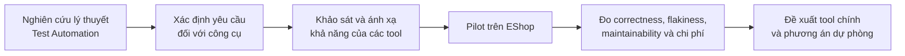
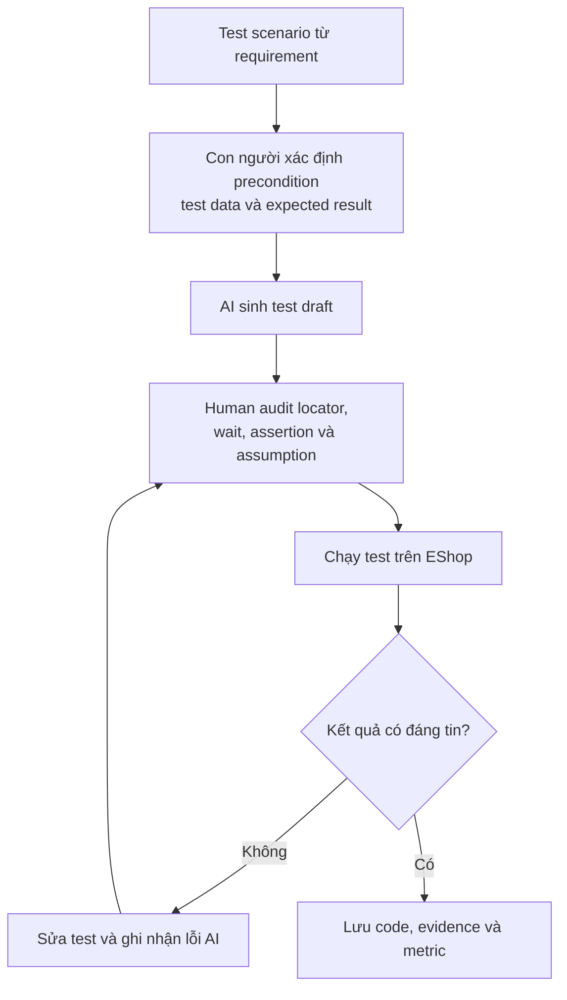

# T02 — Web Automation Testing: Theory-Driven Tool Selection Proposal

> **SUT:** EShop — <https://github.com/ttbhanh/eshop-sut>  
> **Mục đích tài liệu:** Trình bày cơ sở lý thuyết của kiểm thử tự động, từ đó xây dựng tiêu chí khảo sát và đề xuất công cụ phù hợp cho seminar T02.

---

## 1. Cách tiếp cận của nhóm

Theo góp ý của giảng viên, nhóm không lựa chọn công cụ chỉ dựa trên mức độ phổ biến hoặc số lượng tính năng. Quy trình lựa chọn được điều chỉnh theo hướng:

Nhóm sẽ thực hiện một pilot nhỏ trước khi đưa ra kết luận cuối cùng, thay vì xem thông tin quảng bá của nhà cung cấp là bằng chứng đầy đủ.

---

## 2. Cơ sở lý thuyết về kiểm thử tự động

### 2.1 Khái niệm và mục tiêu

**Test automation** là việc sử dụng phần mềm để:

- thiết lập điều kiện kiểm thử;
- điều khiển System Under Test;
- cung cấp test data;
- quan sát kết quả;
- so sánh actual result với expected result;
- ghi nhận bằng chứng và báo cáo kết quả.

Kiểm thử tự động phù hợp nhất với các kiểm thử có tính lặp lại, có expected result xác định và cần phản hồi nhanh, ví dụ:

- smoke test;
- regression test;
- data-driven test;
- kiểm thử nhiều trình duyệt hoặc nhiều cấu hình;
- các luồng nghiệp vụ quan trọng cần chạy thường xuyên.

Test automation **không thay thế hoàn toàn manual testing**. Exploratory testing, usability testing, đánh giá trải nghiệm và các tình huống chưa có test oracle rõ ràng vẫn cần con người tham gia.

### 2.2 Vòng đời triển khai test automation

Một quy trình automation cơ bản gồm:

1. **Feasibility analysis:** xác định mục tiêu, phạm vi và test case phù hợp để tự động hóa.
2. **Tool evaluation and selection:** lựa chọn công cụ dựa trên yêu cầu kỹ thuật, chi phí và khả năng tích hợp.
3. **Architecture and framework design:** thiết kế cấu trúc test, data, fixture, abstraction và reporting.
4. **Test implementation:** xây dựng locator, action, assertion và test data.
5. **Execution:** chạy local, cross-browser, lặp lại, song song hoặc trong CI/CD.
6. **Result analysis:** phân tích pass/fail, trace, screenshot, log và nguyên nhân lỗi.
7. **Maintenance and improvement:** cập nhật test khi SUT thay đổi, loại bỏ flaky test và giảm duplication.

### 2.3 Các thành phần cốt lõi của một giải pháp Web Automation

| Mã | Nội dung lý thuyết | Yêu cầu đối với công cụ |
|---|---|---|
| **R1** | Test execution và browser interaction | Có test runner hoặc cơ chế điều khiển trình duyệt, chạy được luồng end-to-end |
| **R2** | Locator / object identification | Xác định đúng phần tử UI bằng role, label, test-id, CSS hoặc cơ chế object repository |
| **R3** | Synchronization | Chờ đúng trạng thái của UI/network, hạn chế race condition và hard wait |
| **R4** | Test oracle và assertion | So sánh actual với expected bằng assertion có khả năng retry hoặc báo lỗi rõ |
| **R5** | Test data, fixture và isolation | Quản lý account, dữ liệu đầu vào, setup/teardown và trạng thái độc lập giữa các lần chạy |
| **R6** | Reuse và maintainability | Hỗ trợ Page Object, component abstraction, keyword/module hoặc cấu trúc tái sử dụng |
| **R7** | Cross-browser, repeat và parallel execution | Chạy nhiều browser, lặp lại và có thể thực thi song song |
| **R8** | Observability và failure analysis | Có report, screenshot, video, log, trace hoặc dashboard để điều tra lỗi |
| **R9** | CI/CD integration | Chạy được qua CLI/API và tích hợp pipeline |
| **R10** | AI augmentation và human control | AI có thể hỗ trợ sinh test, locator, assertion hoặc healing nhưng phải audit được |

### 2.4 Các thuộc tính chất lượng cần đánh giá

Một automation suite tốt không chỉ có nhiều test case mà còn cần:

- **Correctness:** test phản ánh đúng requirement và assertion kiểm tra đúng hành vi.
- **Reliability:** cùng điều kiện thì kết quả ổn định; không fail ngẫu nhiên.
- **Maintainability:** dễ đọc, sửa và mở rộng khi UI hoặc requirement thay đổi.
- **Reusability:** giảm duplication bằng fixture, helper, Page Object hoặc component.
- **Portability:** có thể chạy trên các browser/môi trường cần thiết.
- **Scalability:** hỗ trợ chạy nhiều test, song song hoặc trong CI.
- **Diagnosability:** khi fail có đủ evidence để xác định nguyên nhân.
- **Security:** không hard-code secret hoặc để lộ dữ liệu nhạy cảm trong log/report.

### 2.5 Các rủi ro thường gặp

| Rủi ro | Biểu hiện | Hướng kiểm soát |
|---|---|---|
| Brittle locator | UI đổi nhẹ làm test fail | Ưu tiên role, label, test-id hoặc locator ổn định |
| Synchronization issue | Test lúc pass lúc fail do UI/network chưa sẵn sàng | Dùng auto-wait, explicit condition, web-first assertion |
| Weak test oracle | Test pass dù nghiệp vụ sai | Assertion theo requirement và state nghiệp vụ |
| Test data pollution | Lần chạy sau bị ảnh hưởng bởi dữ liệu cũ | Fixture, setup/teardown, dữ liệu độc lập |
| High maintenance cost | Sửa một UI phải sửa nhiều test | Abstraction, Page Object, reusable helper |
| False positive/negative | Kết quả automation không phản ánh lỗi thật | Review test, trace và đối chiếu manual |
| Self-healing masks defect | Tool tự chọn phần tử khác và vẫn pass | Ghi nhận healing, review evidence, thêm assertion nghiệp vụ/visual |
| AI hallucination | AI sinh route, locator hoặc assertion không tồn tại | Human review, chạy thực tế và ghi số lần chỉnh sửa |

---

## 3. Tiêu chí dùng để khảo sát công cụ

Từ phần lý thuyết trên, nhóm đánh giá tool theo hai lớp tiêu chí.

### 3.1 Khả năng kỹ thuật bắt buộc

Một tool chính phải hỗ trợ phần lớn các yêu cầu **R1–R9**:

- chạy được E2E test;
- locator và synchronization ổn định;
- assertion rõ ràng;
- fixture/test data;
- kiến trúc dễ bảo trì;
- repeat, cross-browser và parallel khi cần;
- evidence khi test fail;
- chạy được trong CI/CD.

### 3.2 Tiêu chí lựa chọn trong bối cảnh seminar

Ngoài tính năng kỹ thuật, tool còn được đánh giá theo:

- licence và tổng chi phí;
- learning curve;
- mức độ phù hợp với EShop;
- khả năng cài đặt và tái hiện trên máy của sinh viên;
- khả năng hoàn thành hands-on activity trong 25 phút;
- tài liệu và community;
- khả năng AI;
- mức độ phụ thuộc cloud, trial hoặc enterprise plan.

---

## 4. Tool Survey Summary

| Tool | Type | Licence / Cost | Learning Curve | EShop Fit | AI Capability | Community / Ecosystem |
|---|---|---|---|---|---|---|
| **Playwright** | Traditional, code-first | Free, open-source | Medium | Very High: phù hợp kiểm thử E2E cho web app hiện đại | Có codegen/locator generator; AI cần công cụ ngoài | Strong: multi-browser, trace viewer, npm ecosystem |
| **Cypress** | Traditional, code-first | Free core; một số cloud features trả phí | Easy–Medium | High: dễ debug frontend và UI flow | Có thể kết hợp AI bên ngoài | Strong: cộng đồng frontend lớn |
| **Selenium 4** | Traditional, code-first | Free, open-source | Medium–Hard | High: browser support và ecosystem rộng | Không có AI tích hợp mặc định | Very Strong: tiêu chuẩn lâu năm |
| **GitHub Copilot** | AI coding assistant | Free/student hoặc paid tùy tài khoản | Easy–Medium | High khi kết hợp framework automation | Hỗ trợ sinh/review test, locator và assertion | Very Strong; tích hợp IDE và GitHub |
| **OpenAI Codex / Google Antigravity** | AI coding agent / agentic IDE | Phụ thuộc tài khoản và gói sử dụng | Medium | Có thể hỗ trợ tạo, chạy và chỉnh test qua repository/terminal | Agentic code generation và test assistance | Đang phát triển nhanh; cần kiểm soát quyền thực thi |
| **Testim AI** | AI-augmented platform | Commercial, có trial | Medium | High | Smart Locator, locator auto-improve/self-healing | Medium–Strong; phụ thuộc account/licence |
| **Katalon Studio** | Traditional + AI-augmented | Có free tier; một số execution/enterprise features trả phí | Easy–Medium | High: Web/API/Mobile/Desktop | Smart Locator và AI self-healing | Strong; tích hợp Selenium/Appium và CI/CD |
| **mabl** | AI-native, low-code SaaS | Commercial SaaS, có trial | Easy–Medium | High: Web/API/Mobile, CI/CD | Auto-healing, AI authoring/assertion và failure analysis | Medium–Strong; phụ thuộc cloud/licence |
| **Virtuoso QA** | AI-native, low-code SaaS | Commercial SaaS, có trial | Easy–Medium | High: UI/E2E/cross-browser | Natural-language authoring, self-healing và AI support | Medium; ít tài nguyên miễn phí hơn |
| **ACCELQ** | AI-native, no-code platform | Commercial SaaS, có trial | Easy–Medium | Very High cho flow end-to-end đa nền tảng | AI generation, object identification và self-healing | Medium; tập trung enterprise |

---

## 5. Ánh xạ tool với nội dung lý thuyết

### 5.1 Ký hiệu

- **●:** hỗ trợ native hoặc là chức năng chính.
- **◐:** hỗ trợ một phần, cần cấu hình, thư viện hoặc sản phẩm bổ sung.
- **△:** chủ yếu hỗ trợ gián tiếp.
- **—:** không phải chức năng của tool đó.

### 5.2 Capability Mapping

| Tool | R1 Execution | R2–R3 Locator & Sync | R4 Assertion | R5–R6 Data & Maintainability | R7 Cross-browser / Parallel | R8–R9 Report / CI | R10 AI |
|---|:---:|:---:|:---:|:---:|:---:|:---:|:---:|
| **Playwright** | ● | ● | ● | ● | ● | ● | ◐ |
| **Cypress** | ● | ● | ● | ● | ◐ | ● | ◐ |
| **Selenium 4** | ● | ◐ | ◐ | ◐ | ● | ◐ | — |
| **Katalon Studio** | ● | ● | ● | ● | ◐ | ◐ | ● |
| **Testim AI** | ● | ● | ● | ● | ● | ● | ● |
| **mabl** | ● | ● | ● | ● | ● | ● | ● |
| **Virtuoso QA** | ● | ● | ● | ● | ● | ● | ● |
| **ACCELQ** | ● | ● | ● | ● | ● | ● | ● |
| **Copilot / Codex / Antigravity** | — | △ | △ | △ | — | △ | ● |

### 5.3 Nhận xét từ bảng ánh xạ

1. **AI coding assistant không phải test automation framework.**  
   Copilot, Codex hoặc Antigravity có thể hỗ trợ tạo và chỉnh code, nhưng bản thân chúng không thay thế test runner, browser driver, assertion engine, report hoặc CI configuration. Vì vậy, AI assistant phải được ghép với Playwright, Cypress hoặc Selenium.

2. **Selenium là browser automation library mạnh nhưng cần hệ sinh thái bổ sung.**  
   Test runner, assertion, data management và reporting thường cần JUnit/TestNG/PyTest hoặc thư viện khác. Điều này tăng tính linh hoạt nhưng cũng làm setup và maintenance phức tạp hơn cho seminar ngắn.

3. **Các nền tảng AI-native hỗ trợ nhiều nội dung lý thuyết trong một sản phẩm.**  
   Testim, mabl, Virtuoso và ACCELQ có locator intelligence, dashboard, CI/CD và self-healing. Tuy nhiên, tính tái hiện có thể bị ảnh hưởng bởi trial, cloud, quota và licence.

4. **Playwright bao phủ tốt phần lõi của automation bằng code.**  
   Tool hỗ trợ test runner, locator, auto-wait, web-first assertion, fixture, multi-browser, parallel execution, report và trace. Các nội dung này phù hợp để giải thích trực tiếp lý thuyết automation thay vì che giấu phần lớn cơ chế bên dưới nền tảng low-code.

5. **Self-healing không đồng nghĩa với correctness.**  
   Self-healing có thể giảm lỗi locator nhưng vẫn phải kết hợp assertion nghiệp vụ, screenshot/trace và human review để tránh thao tác nhầm element.

---

## 6. Proposed Direction

### 6.1 Main Stack

| Role | Proposed Tool |
|---|---|
| Traditional automation framework | **Playwright** |
| AI-augmented assistant chính | **GitHub Copilot** |
| AI assistant để khảo sát/backup | **OpenAI Codex hoặc Google Antigravity** |
| Traditional backup | **Cypress** |
| AI-native backup | **Testim AI hoặc mabl** |

### 6.2 Rationale dựa trên lý thuyết

1. **Bao phủ các thành phần cốt lõi R1–R9:**  
   Playwright có khả năng điều khiển browser, locator và synchronization, assertion, fixture, reusable structure, multi-browser, parallel execution, report, trace và CI.

2. **Phù hợp để nghiên cứu maintainability và flakiness trên đúng các luồng đang có rủi ro của EShop:**  
   Nhóm có thể chủ động tạo locator tốt/xấu, thay đổi DOM, giảm tốc độ network, chạy lặp lại và sử dụng trace để phân tích failure mode trên các luồng như login, quên mật khẩu, giỏ hàng, checkout, coupon và admin.

3. **Phân tách rõ framework và AI layer:**  
   Playwright chịu trách nhiệm thực thi và xác minh; Copilot chịu trách nhiệm hỗ trợ sinh hoặc review code. Cách phân tách này giúp đánh giá đúng AI hỗ trợ phần nào và phần nào vẫn phải do framework/con người đảm nhiệm.

4. **Dễ tái hiện trong lớp:**  
   Playwright chạy local và open-source, giảm phụ thuộc vào commercial trial. Audience có thể cài bằng npm và chạy một flow trong thời gian hoạt động, trong khi các luồng đối chiếu của EShop vẫn đủ cụ thể để quan sát lỗi thật.

5. **Có đối chứng:**  
   Cypress được giữ làm traditional backup; Testim/mabl được giữ làm đối chứng AI-native/self-healing nếu tài khoản và trial cho phép.

---

## 7. Pilot trên EShop trước khi chốt tool

Nhóm dự kiến triển khai cùng một flow **Login → Add to Cart → Assert cart state** bằng:

1. Playwright viết thủ công.
2. Playwright có GitHub Copilot hỗ trợ.
3. Một tool đối chứng nếu khả thi: Cypress hoặc Testim/mabl.

### 7.1 Nội dung kiểm chứng

| Nhóm tiêu chí | Nội dung đo |
|---|---|
| Functional correctness | Test có kiểm tra đúng requirement và cart state không |
| Locator quality | Role/label/test-id hay CSS/XPath/index |
| Synchronization | Có dùng auto-wait/condition hay hard wait |
| Assertion quality | Có kiểm tra business result hay chỉ kiểm tra element visible |
| Repeatability | Pass rate qua 10 lần chạy |
| Flakiness | Số lần fail không do defect của SUT |
| Debuggability | Evidence từ report, screenshot, video hoặc trace |
| Maintainability | Số vị trí phải sửa sau một thay đổi DOM nhỏ |
| AI effort | Thời gian sinh draft và số lần phải chỉnh output AI |
| Reproducibility | Thành viên khác có setup và chạy lại được không |

### 7.2 Điểm lệch hiện trạng của EShop cần đưa vào pilot

Để proposal bám sát project hơn, pilot nên kiểm tra trực tiếp các điểm sau vì chúng là nơi EShop hiện tại có nguy cơ lệch so với đặc tả:

- Reset password hiện tạo token 4 chữ số thay vì 6 chữ số và chưa có step indicator rõ ràng.
- Luồng profile cho phép client gửi thêm `role`, nên cần xác minh ràng buộc không tự đổi role.
- Checkout hiện nhận `total_amount` từ client và giao diện cho phép sửa tổng tiền, nên cần kiểm tra tính đúng đắn của server-side recalculation.
- Giỏ hàng hiện đang lưu theo kiểu append item, nên cùng một sản phẩm có thể sinh nhiều dòng thay vì gộp số lượng.
- Huỷ đơn hiện cần xác minh đúng state machine, vì backend/UI hiện chưa khóa chặt theo toàn bộ ràng buộc của đặc tả.
- Admin endpoints cần được kiểm tra role enforcement, vì token hợp lệ chưa chắc đã đồng nghĩa với quyền admin ở mọi API.
- Import CSV cần kiểm tra tính all-or-nothing, vì hiện trạng import có thể dừng ở mức partial success thay vì rollback toàn bộ.

### 7.3 Các flow EShop sau khi pilot thành công

1. **Login + Account Lockout**
2. **Add to Cart**
3. **Checkout / Coupon**

### 7.4 Acceptance criteria cho tool chính

Playwright được chốt làm tool chính nếu:

- chạy được các flow đã chọn trên môi trường local;
- có pass rate ổn định khi chạy lặp;
- cung cấp evidence đủ để điều tra lỗi;
- hỗ trợ cấu trúc test dễ bảo trì;
- mọi thành viên có thể cài đặt và chạy lại;
- activity cho audience hoàn thành trong tối đa 25 phút.

---

## 8. AI Usage and Audit

Nhóm sử dụng AI như một **lớp hỗ trợ**, không xem AI là test oracle hoặc nguồn kết luận cuối cùng.

Quy trình AI-assisted testing:

Nhóm cam kết:

- review và chạy thực tế mọi code do AI tạo;
- không dùng AI để tự tạo kết quả execution, flakiness metric hoặc feedback;
- ghi nhận prompt, output, thay đổi của con người và kết quả cuối;
- không cung cấp secret, token hoặc dữ liệu nhạy cảm cho AI;
- kiểm tra false positive, false negative và hallucination;
- xem xét rủi ro khi agent có quyền sửa file hoặc chạy command.

---

## 9. Approval Request

Nhóm xin giảng viên/TA duyệt hướng nghiên cứu theo thứ tự:

> **Lý thuyết Test Automation → xác định requirements R1–R10 → survey và mapping tool → pilot trên EShop → chốt tool chính.**

Đề xuất hiện tại:

> **Playwright** là traditional framework chính; **GitHub Copilot** là AI-augmented assistant chính. **Cypress** được giữ làm traditional backup; **Codex/Antigravity** là AI assistant backup; **Testim AI/mabl** là phương án AI-native để đối chứng nếu điều kiện licence cho phép.

Nhóm chưa kết luận rằng Playwright là công cụ “tốt nhất” nói chung. Kết luận cuối cùng sẽ giới hạn trong bối cảnh EShop, seminar 45 phút, hands-on activity 25 phút, các metric đã định nghĩa ở phần pilot và các điểm lệch hiện trạng đã nêu ở mục 7.3.

---

## 10. References

1. ISTQB — *Certified Tester Advanced Level Test Automation Engineering Syllabus v2.0*:  
   <https://www.istqb.org/wp-content/uploads/2024/11/ISTQB_CTAL-TAE_Syllabus_v2.0.pdf>
2. Playwright — Overview:  
   <https://playwright.dev/>
3. Playwright — Locators:  
   <https://playwright.dev/docs/locators>
4. Playwright — Trace Viewer:  
   <https://playwright.dev/docs/trace-viewer-intro>
5. Cypress — Best Practices:  
   <https://docs.cypress.io/app/core-concepts/best-practices>
6. Cypress — Retry-ability:  
   <https://docs.cypress.io/app/core-concepts/retry-ability>
7. Selenium — Waiting Strategies:  
   <https://www.selenium.dev/documentation/webdriver/waits/>
8. Selenium — Grid:  
   <https://www.selenium.dev/documentation/grid/>
9. GitHub Copilot — Writing Tests with Copilot:  
   <https://docs.github.com/en/copilot/using-github-copilot/guides-on-using-github-copilot/writing-tests-with-github-copilot>
10. GitHub Copilot — Responsible Use of Code Review:  
    <https://docs.github.com/en/copilot/responsible-use/code-review>
11. Katalon — Self-healing Tests:  
    <https://docs.katalon.com/katalon-studio/maintain-tests/self-healing-tests-in-katalon-studio>
12. Testim — Smart Locators / Web and Mobile Testing:  
    <https://help.testim.io/docs/testim-automate>
13. mabl — How Auto-heal Works:  
    <https://help.mabl.com/hc/en-us/articles/19078583792404-How-auto-heal-works>
14. Virtuoso QA — Platform Overview:  
    <https://docs.virtuoso.qa/guide/>
15. ACCELQ — Product Overview:  
    <https://www.accelq.com/>
